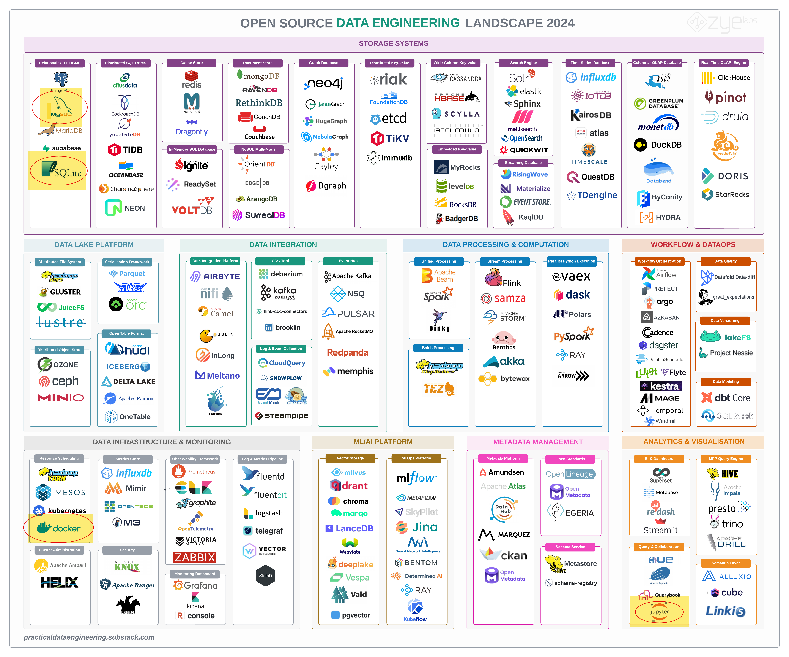

# Welcome to CMSC408

Wednesday - Aug 21, 2024

## Housekeeping

### Discussion items

- Complete the pre-class survey

- Introduce yourself on the discussion group

- Join the discord

- Form your project team

### Lecture topics

- Course overview

- Intro to databases

 

    
    

|  Module   | Week | Date | Day | Lectures                            | Deliverables/Notes                       |
|:---------:|:----:|:----:|:---:|-------------------------------------|------------------------------------------|
| ER Models |  1   | 8/21 | Wed | MTG1: L1 (Welcome to CMSC408)       | Quiz 1 due (Pre-class Survey)            |
| ER Models |  1   | 8/23 | Fri |                                     | PrjDel 1 due (Student introductions)     |
| ER Models |  1   | 8/25 | Sun |                                     | PrjDel 2 due (Team formation)            |
| ER Models |  2   | 8/26 | Mon | MTG2: L2 (Entity-relation models 1) | Last day to add/drop                     |
| ER Models |  2   | 8/28 | Wed | MTG3: L3 (Entity-relation models 2) |                                          |
| ER Models |  2   | 8/30 | Fri |                                     | PrjDel 3 due (Team reflection)           |
| ER Models |  2   | 9/1  | Sun |                                     | HW1 due (DE Tool Review)                 |
| ER Models |  3   | 9/2  | Mon |                                     | NO CLASS - University closed (Labor day) |

## You are here

## I’m glad you’re here!!!!

 

### CMSC 508 - Database Theory

- Semester course;
- 3 lecture hours. 3 credits.
- Prerequisite: CMSC 303 with a minimum grade of C.

Design and implementation of relational database systems. Emphasis is
placed on entity-relationship diagrams, relational algebra, normal forms
and normalization. Introduction to SQL. Discussion of physical level
issues.

Students will be required to complete a design project and give an oral
presentation of the project.

## Recommended Textbooks

> [!NOTE]
>
> ### Do I need really need a text book?
>
> No, you don’t. These textbooks are *really good* and package lots of
> information into a single place.
>
> *Life is a database* and from my perspective it’s all about speed of
> retrieval. When I’m building databases, I can’t EVER recall pulling
> out a text book to look something up!

## Canvas is the OFFICIAL platform

- YOU are responsible for your own LEARNING. My role is GUIDE and
  CURATOR.

- WE are working together as a TEAM so that at completion of the course,
  you are comfortable with designing and building databases.

- ANYTHING posted to the course canvas is FAIR GAME to be tested. If I
  think it’s important enough to be shared as part of the course
  materials on Canvas, I believe that it’s important enough for you to
  be familiar with it and possibly tested on it.

- I will OFTEN not be able to cover all the material relevant to a
  specific topic in class. That does NOT mean that it isn’t important.
  Even if I don’t complete the lecture slides during a class session,
  you should be familiar with ALL the material in the slides. ANYTHING
  in the lecture slides is FAIR GAME for testing.

## Statement on Generative AI

- Grades for the course are assigned based on YOUR work, not the work of
  chatgpt, bard or some other generative AI tool. Grades help YOU
  understand where you are on the journey towards mastery of any pile of
  material.

- Generative AI can be a real asset in computing. You don’t need to
  memorize syntax, or struggle to hunt around to find some arcane code
  necessary to make your program work. But remember, it is supposed to
  be YOUR program.

- Homework assignments are designed to give you practice using the tools
  to create programs. The focus of the homework assignments is on the
  higher level cognitive skills - designing, comparing, judging,
  analyzing, assessing. **Use of Generative AI IS permitted on homework
  assignments and the semester project**, in so much as it can help the
  coding go faster. YOU are responsible for the design and should be
  able to explain it to anyone that asks.

- Quizzes are designed to test your knowledge of the course material.
  **Use of Generative AI is NOT permitted on any of the quizzes.**

- See [this
  document](https://virginiacommonwealth.instructure.com/courses/105097/files/12032089?wrap=1)
  to learn more!

## ABET Student Learning Outcomes

SLO1 - *Analyze a complex computing problem and apply principles of
computing and other relevant disciplines to identify solutions;*

SLO2 - *Design, implement and evaluate a computing-based solution to
meet a given set of computing requirements in the context of the
program’s discipline;*

SLO3 - *Communicate effectively in a variety of professional contexts;*

SLO4 - *Recognize professional responsibilities and make informed
judgments in computing practice based on legal and ethical principles;*

SLO5 - *Function effectively as a member or leader of a team engaged in
activities appropriate to the program’s discipline;*

SLO6 - *Apply computer science theory and software development
fundamentals to produce computing-based solutions;*

SLO7 - *Acquire and apply new knowledge as needed, using appropriate
learning strategies.*

## CMSC 408 - Learning Outcomes

1.  Demonstrate an understanding of the concepts underlying database
    design. *(ABET SLO 1, SLO 7)*

2.  Analyze problems to identify data requirements, types and relations.
    *(SLO 1)*

3.  Create E-R and relational designs from problem statements. *(SLO 2)*

4.  Design data structures and functions to store and process the
    information. *(SLO 2)*

5.  Design and implement databases using SQL language. *(SLO 6)*

6.  Query and manipulate data using SQL language. *(SLO 6)*

7.  Design and implement reports using data queried from a database.
    *(SLO 3, SLO 6)*

8.  Work effectively as part of a team to design, implement and deploy a
    database-driven web application *(SLO 5)*

9.  Communicate project requirements, design decisions, and progress
    effectively to team members and stakeholder *(SLO 3)*

10. Incorporate strategies to ensure safe and secure storage and access
    to the database. *(SLO 4)*

## CMSC 408 - Tool sets and rationale

### Tool sets we’ll be using …

- SQL, MySQL, and SQLITE

- VSCODE and various extensions

- Quarto, mermaid and graphviz

- GIT, GH and GITHUB

- Python, Pyenv and Poetry

- Docker and docker compose

### What you should expect …

This is a programming class. Be prepared for TONS of coding.

We’ll be learning and improving through practice and repitition. There
will be LOTS of opportunity to practice.

We’ll be learning to *code* documentation and graphics using Quarto with
markdown, mermaid and graphviz.

We’ll be learning how to communicate designs using ER diagrams and
crows-feet diagrams.

We’ll be learning to create, retrieve, update and delete database
objects using SQL.

We’ll be learning docker to containerize a database and application and
automate the reptition.

## CMSC 408 - Topics over time

The class is organized in modules. The GANNT chart below highlights the
topics and their order.

- Homework assignments introduce and reinforce topics discussed in
  class.
- Quizzes test understanding of the topics where appropriate.
- Lectures, homeworks and quizzes are organized in a way that
  complements the successful completion of the semester-long project.

## CMSC 408 - Assessment and Grading

This will be a busy semester! There will be items due each week.

### There will be a mix of activities

 

| Deliverable | Pct | Number of items                         |
|:-----------:|:---:|:----------------------------------------|
|  Homework   | 40% | 9 submissions done individually         |
|   Quizzes   | 30% | 5 quizzes taken on-line using respondus |
|   Project   | 30% | 12 submissions as part of a team        |

## CMSC 408 - Assessment and Grading

This will be a busy semester! There will be items due each week.

### Homework Assignments

Homework assignments are done individually. Homeworks will be
distributed using GITHUB classroom; a link will be provided in the
Canvas assignment page. Homework repos will be submitted to Gradescope.
Homework HTML reports will be submitted to Canvas. Rubrics will be
provided. *REVIEW EACH RUBRIC CAREFULLY!*

## CMSC 408 - Assessment and Grading

This will be a busy semester! There will be items due each week.

### Homework assignment policies

- I observe [flexible deadlines](https://eric.ed.gov/?id=EJ1367855) for
  homework, NOT FOR QUIZZES OR DELIVERABLES!

- Each homework has a *timeliness* score in the rubric. *On-time* gets
  full credit. The *timeliness score* is reduced slowly past the
  submission date.

- You will ALWAYS get credit for submitting assignments. ALWAYS turn
  something in! I want you to get the practice and LEARN!

- I realize this is NOT your only class. But don’t get too far behind!

- READ homework rubrics to see expectations for each assignment. The
  rubrics will help you understand what’s important and where you should
  spend your time.

- The homework assignments are generally aligned with the semester
  project, so that one reinforces the other. It pays to keep up!

## CMSC 408 - Assessment and Grading

This will be a busy semester! There will be items due each week.

### Quizzes

Quizzes will be administered on-line using the Respondus lockdown
browser. It is the responsibility of the student to ensure that
Respondus works. Quizzes will be adminstered outside of class. NO LATE
QUIZZES.

Practice quizzes will be available. You can take practice quiz as many
times as you like. Practice quiz will look exactly like the actual quiz.
Expect each quiz to take 30-minutes or less.

## CMSC 408 - Assessment and Grading

This will be a busy semester! There will be items due each week.

### Semester-long project

Students will work in teams of 2 on a semester-long project. The project
will require the students design, build and deploy a database driven web
application. *Team Update* deliverables are brief surveys reflecting on
project status, and should only take about 5-min to complete.

## CMSC 408 - Assessment and Grading

This will be a busy semester! There will be items due each week.

### Summary and grading schedule

Below are tables presenting the grading scheme and deliverable list for
the class.

 

### Deliverables

| Deliverable | Pct | Number of items                         |
|:-----------:|:---:|:----------------------------------------|
|  Homework   | 40% | 9 submissions done individually         |
|   Quizzes   | 30% | 5 quizzes taken on-line using respondus |
|   Project   | 30% | 12 submissions as part of a team        |

### Grading

|     Score      | Grade | Fall 2023 |
|:--------------:|:-----:|:---------:|
|    90 \<= X    |   A   |    112    |
| 80 \<= X \< 90 |   B   |    13     |
| 70 \<= X \< 80 |   C   |     2     |
| 60 \<= X \< 70 |   D   |     1     |
|    X \< 60     |   F   |     3     |

## Advice from your peers

 

### From course evaluation responses, Fall 2023:

*Discuss the level of difficulty of this course, the pace of the course,
and the level of effort required to complete the work in this course.*

## Advice from your peers

*This course is easy if you keep up with the work. Having assignments
due every week along with the semester-long project is a lot to take
on.*

 

*I think there is a lot of work involved with this course, but so long
as you stay on top of the assignments, you will be sucessful, as they
are not really difficult, more so there is just a large quantity of
them.*

 

*The course was definitely difficult if not well prepared but the
professor gives every single tool one needs to succeed. The pace was
perfect and there is nothing I would change about it.*

*The pace was quick and the work was not easy. Each week the homework
presented new concepts that were progressively more difficult, and it
was very easy to fall behind. Not the class with the sort of work you
can leave till the last minute, minimum, a couple hours per assignment.*

 

*Lot of the material that was covered in this class was all very new to
me, but Professor Leonard designed the course in a way that wasn’t too
overwhelming. I felt like the pace of the course was just right. Even
the times I was falling behind a little bit, I was able to pick myself
back up pretty quickly since the deadlines weren’t super strict. *

## Advice from your peers

*I found the course difficulty to be well balanced. If a student goes to
class, asks questions, and makes an effort to do their assignment they
should have no problem at all passing. The pace of the course was
perfect and allowed enough time for each unit to be processed before
moving on to the next one. *

 

*The workload for this course is very challenging to manage. Having to
create a whole database and then do weekly homework assignments is very
difficult.*

 

*This course required an intense amount of coding. However, given the
clear expectations and due dates, I was able to plan ahead to meet
deadlines. *

*This course is pretty easy, but I don’t think it needs to be harder. It
takes not much effort but still I feel like I am very good with
databases, api’s, even better at using python. I am still not good at
writing queries though.*

 

*There is a large level of effort required to this course. Especially
towards the end of the semester the assignments and projects can be time
consuming. That being said the professor gives more than enough time to
complete them and he is very helpful if a section ends up being
confusing for the class.*

 

*This course was fairly difficult, but the professor made it very
doable. The course pace was good, except by the end of the semester the
pace gets really fast. 10/10 professor*

### *In summary: Don’t panic, you got this!*

# A long time ago … in a galaxy far, far away …

## Early history

### 1950s and early 1960s:

- Data processing using [magnetic tapes for
  storage](https://en.wikipedia.org/wiki/Magnetic-tape_data_storage)
- Tapes provided only sequential access
- [Punched cards for
  input](https://en.wikipedia.org/wiki/Punched_card_input/output)

<em>The history of databases tracks the history of computers</em>

## Early history

### Late 1960s and 1970s:

- [Hard disks
  allowed](https://en.wikipedia.org/wiki/History_of_hard_disk_drives)
  direct access to data
- [Network and hierarchical data
  models](https://en.wikipedia.org/wiki/Database_model) in widespread
  use
- [Edgar “Ted” Codd](https://en.wikipedia.org/wiki/Edgar_F._Codd)
  defines the Relational data model
- [High-performance (for the era) transaction
  processing](https://en.wikipedia.org/wiki/Transaction_processing)

<em>The history of databases tracks the history of computers</em>

## Modern systems

### 1980s:

- Research relational prototypes evolve into commercial systems
  - SQL becomes industrial standard
- Parallel and distributed database systems
- Object-oriented database systems

### 1990s:

- Large decision support and data-mining applications
- Large multi-terabyte data warehouses
- Emergence of Web commerce

<em>The history of databases tracks the history of computers</em>

## Modern systems

### Early 2000s:

- XML and XQuery standards
- Automated database administration

### Later 2000s:

- Giant data storage systems
- Google BigTable, Yahoo PNuts, Amazon, …

### 2022 and Beyond:

<https://cacm.acm.org/magazines/2022/8/262905-the-seattle-report-on-database-research/fulltext#body-4>

## <a
href="https://practicaldataengineering.substack.com/p/open-source-data-engineering-landscape"
target="_blank">Open Source Data Engineering Landscape 2024</a>

## <a
href="https://practicaldataengineering.substack.com/p/open-source-data-engineering-landscape"
target="_blank">Open Source Data Engineering Landscape 2024</a>

## Why not use spreadsheets?

### Spreadsheets DO work and they ARE viable!

[Here is spreadsheet driven web
site](https://vcu-ssg.github.io/ssg-quarto-cmsc-courses/)

[Here is the
spreadsheet](https://docs.google.com/spreadsheets/d/1qrN3L7eRLsM-aVMHYaLQN-FMYtrTJf0_h6dLKlUdPkk/edit#gid=107368023)

### On the surface spreadsheets share many common elements with databases

### Entities

- *Worksheets* are *Tables*
- *Rows* are sometimes *Records*
- *Columns* are sometimes *Fields*
- *Workbooks* are *Databases* (collections of tables)

### Operations

- find rows, insert rows, delete rows, update rows,
- add columns, remove columns
- create worksheets, delete worksheets
- create workbooks, delete workbooks

## Why not use spreadsheets?

- Suppose that to add a new person, you need to make changes to three
  tabs (e.g., ‘Personal Info,’ ‘Contact Info,’ and ‘Employment Info’).

  - *What happens if you are interrupted in the middle of the change and
    forget where you are? (Atomicity)*

- Imagine that one of the tabs in your spreadsheet has a formula that
  automatically updates totals or averages when new data are entered.

  - *What would happen if, during an update, the formula fails to
    recalculate properly? (Consistency)*

- Consider a scenario where two people are editing the spreadsheet at
  the same time, both trying to add new rows to the same tab.

  - *How might their changes conflict, and what issues could arise?
    (Isolation)*

- Suppose you have made all the necessary changes to add a new person in
  your spreadsheet and then your computer crashes before you can save
  the file.

  - *What happens to the changes? (Durability)*

## Why not use spreadsheets?

- Imagine your spreadsheet contains sensitive information, such as
  personal or financial data.

  - *What controls could you put in place to ensure that only authorized
    users can view or edit specific parts of the data (Security)*

- Imagine that your spreadsheet currently manages a few hundred rows of
  data.

  - *What would happen if you needed to scale this to millions of rows?
    How would performance be affected, and what challenges might you
    face in managing such large volumes of data? (Scalability)*

- Imagine that your spreadsheet contains phone numbers across different
  tabs.

  - *What would happen if a home phone number was changed on one tab but
    not another? (Normalization and redundancy)*

## On Line Transaction Processing (OLTP) databases

- This semester we’ll be exploring Relational, [On Line Transaction
  Processing
  (OLTP)](https://en.wikipedia.org/wiki/Online_transaction_processing)
  Database Management Systems (DBMS), like MySQL, Postgres, SQLITE,
  Oracle, DB2 and SQLServer.

- A [Database Management System
  (DBMS)](https://en.wikipedia.org/wiki/Database#Database_management_system)
  is the software that enables users to define, create, manage, and
  interact with databases. It serves as an intermediary between the end
  users, applications, and the database, ensuring that data is
  organized, stored, retrieved, and modified efficiently and securely.

- [There are many ways to store data in a
  DBMS](https://en.wikipedia.org/wiki/Database_model).

- We’ll be focusing on the [*Relational*
  model](https://en.wikipedia.org/wiki/Database_model#Relational_model),
  where the DBMS stores entities and the relationships between these
  entities inside a single database (called a
  [schema](https://en.wikipedia.org/wiki/Database_schema)).

- These databases bundle multiple changes to the database as a
  [transaction](https://en.wikipedia.org/wiki/Database_transaction).
  Transactions can be reviewed and rolled back (reversed).

- [ACID (atomicity, consistency, isolation,
  durability)](https://en.wikipedia.org/wiki/ACID) is a set of
  properties of transactions intended to guarantee data validity despite
  errors, power failures, and other mishaps.

- Changes to the database are communicated to the DBMS using a language
  called [*SQL*, a *structured query
  language*](https://en.wikipedia.org/wiki/SQL). How does one [pronounce
  SQL?](https://www.youtube.com/watch?v=S9C8PNX72Ms)

## On Line Transaction Processing (OLTP) databases

- **Fast Query Processing:** These databases prioritize quick query
  response times to ensure efficient and prompt processing of individual
  transactions, making them ideal for applications like banking,
  e-commerce, and order management systems.

- **High Transaction Volume:** OLTP databases are designed to handle a
  large number of short, atomic transactions, such as inserting,
  updating, or deleting records, which are typically initiated by
  end-users in real-time.

- **Data Integrity and Consistency:** OLTP systems implement ACID
  (Atomicity, Consistency, Isolation, Durability) properties to ensure
  that all transactions are processed reliably, maintaining the
  integrity and consistency of the data even in the event of system
  failures.

- **Normalized Data Structure:** OLTP databases typically use a highly
  normalized schema to minimize data redundancy, optimize storage
  efficiency, and reduce the complexity of data manipulation during
  frequent transactions.

## CMSC 408 - in a nutshell

- We’ll apply *entity-relation* models to design and describe the
  contents of a database.

- We’ll apply *relational algebra* to formally describe how we query the
  database.

- We’ll apply *normalization* to ensure that we minimize redundant
  information in the database.

- We’ll tie everything together using SQL.

## Housekeeping

### Discussion items

- Complete the pre-class survey

- Introduce yourself on the discussion group

- Join the discord

- Form your project team

### Lecture topics

- Course overview

- Intro to databases

 

    
    

|  Module   | Week | Date | Day | Lectures                            | Deliverables/Notes                       |
|:---------:|:----:|:----:|:---:|-------------------------------------|------------------------------------------|
| ER Models |  1   | 8/21 | Wed | MTG1: L1 (Welcome to CMSC408)       | Quiz 1 due (Pre-class Survey)            |
| ER Models |  1   | 8/23 | Fri |                                     | PrjDel 1 due (Student introductions)     |
| ER Models |  1   | 8/25 | Sun |                                     | PrjDel 2 due (Team formation)            |
| ER Models |  2   | 8/26 | Mon | MTG2: L2 (Entity-relation models 1) | Last day to add/drop                     |
| ER Models |  2   | 8/28 | Wed | MTG3: L3 (Entity-relation models 2) |                                          |
| ER Models |  2   | 8/30 | Fri |                                     | PrjDel 3 due (Team reflection)           |
| ER Models |  2   | 9/1  | Sun |                                     | HW1 due (DE Tool Review)                 |
| ER Models |  3   | 9/2  | Mon |                                     | NO CLASS - University closed (Labor day) |

