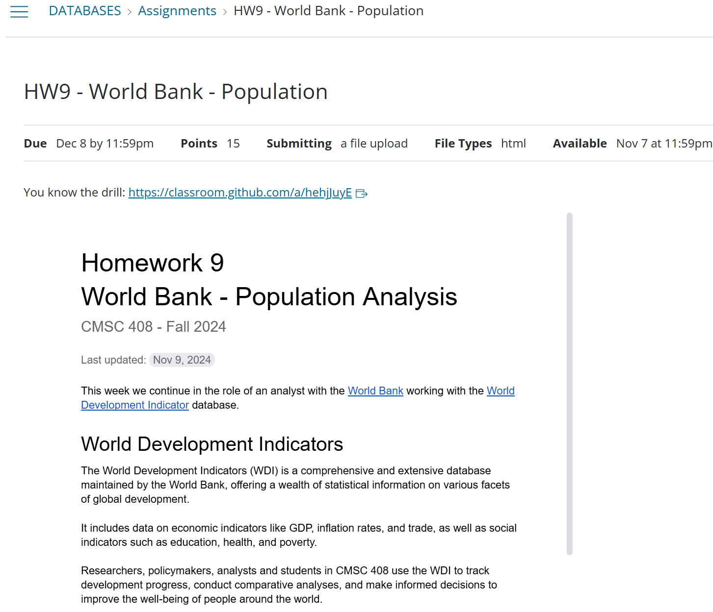
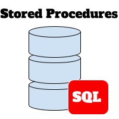

# Procedures and Functions

Monday - Dec 2, 2024

## Housekeeping

<div class="columns">

<div class="column" width="9%">

</div>

<div class="column" width="45%">

### Discussion items

- CMSC 427 - User Interfaces - Spring 2025

- <a
  href="https://virginiacommonwealth.instructure.com/courses/105097/assignments/1047918"
  target="_blank">Homework 9 - WB Population Analysis - due 12/8</a>

- <a
  href="https://virginiacommonwealth.instructure.com/courses/105097/assignments/969453"
  target="_blank">Homework 10 - Course evaluation - due 12/8</a>

- <a
  href="https://virginiacommonwealth.instructure.com/courses/105097/assignments/966535"
  target="_blank">Deliverable 12 - Semester Project - due 12/9</a>

- Catch up on other assignments …

</div>

<div class="column" width="40%">

### Lecture topics

- [Homework 9 discussion](#homework-9---discussion)

- [Review deliverable 12 rubric](#deliverable-12---semester-project)

- [SQL - Stored Procedures](#sql---stored-procedures)

</div>

</div>

<div style="margin-top:25px">

 

</div>

    <style></style>
    <div class='upcoming-calendar'>

| Module | Week | Date | Day | Lectures | Deliverables/Notes |
|:--:|:--:|:--:|:--:|----|----|
| Adv. SQL | 16 | 12/2 | Mon | MTG27: L27 (Procedures and Functions) |  |
| Adv. SQL | 16 | 12/4 | Wed | MTG28: L28 (Triggers) |  |
| Adv. SQL | 16 | 12/8 | Sun |  | HW9 due (Even more on SQL) |
| Adv. SQL | 17 | 12/9 | Mon | MTG29: L29 (Security) | PrjDel 12 due (Phase 2 submission); HW10 due (Course evaluation); Last day of class |
| Adv. SQL | 17 | 12/14 | Sat |  | Commencement |
|  | 18 | 12/18 | Wed |  | Grades due by Noon |

</div>

## We are here


# Homework 9 - discussion

## Homework 9 - discussion

<div class="columns">

<div class="column" width="60%">

<a
href="https://virginiacommonwealth.instructure.com/courses/105097/assignments/1047918"
target="_blank"></a>

</div>

<div class="column" width="40%">

### HW9 Learning Objectives

- Deeper understand of `SELECT`

- Deeper exploration of `CTS`s

- More data analysis

### Data Source

- <a href="https://data.worldbank.org/indicator" target="_blank">World
  Bank Indicators</a>

### Solution (without SQL)

- <a href="./assets/homework9-solution.html" target="_blank">HW9 -
  solution</a>

### Potential issue:

Set `show_size=True` in your code. This will ensure that the rows and
columns count is included in your code!

``` python

def run_sql_and_return_html( cnx, sql, show_size=True):
```

</div>

</div>

# Deliverable 12 - Semester Project

## Deliverable 12 - Semester Project

<div class="columns">

<div class="column">

### Discussion items

- Review project docs

- [Review
  rubric](https://virginiacommonwealth.instructure.com/courses/105097/assignments/966535)

### Learning Objective

One learning objective for this project is for you to demonstrate that
you can chase down what you need to complete a project!

</div>

<div class="column">

### Potential resources

There is TONS of stuff available on-line.

- [Programming Knowledge
  (video)](https://www.youtube.com/watch?v=ah5M4Umuf9w)
- [Tutorial Republic
  (tutorial)](https://www.tutorialrepublic.com/php-tutorial/php-mysql-crud-application.php)
- [Medium article
  (article)](https://medium.com/@omer_14630/building-a-simple-crud-api-with-php-and-mysql-a-step-by-step-guide-aa31f9ab5a3b)

</div>

</div>

# SQL - Stored Procedures

## SQL Procedures - Introduction

<div class="columns">

<div class="column">

### What is a SQL subprogram?

- A SQL subprogram is a set of SQL statements that can be executed as a
  single unit.
- FUNCTIONS are used to encapsulate logic for later use inside a SELECT
  statement.
- PROCEDURES are used to encapsulate a series of SQL commands for
  reusability and ease of maintenance.
- CREATE PROCEDURE and CREATE FUNCTION are a DDL statements and belongs
  in the DDLs file.
- Functions and procedures are later used inside the DML file.

</div>

<div class="column">



</div>

</div>

## SQL subprograms - Motivation (1)

SQL subprograms should be used in various situations to improve code
organization, reusability, security, and performance. Here are some
common scenarios when you should consider using SQL procedures:

<div class="columns">

<div class="column">

1.  **Code Reusability and Maintenance:** Subprograms allow you to
    encapsulate a series of SQL statements into a single unit. This
    makes it easier to reuse the same logic across multiple parts of
    your application, reducing code duplication.

2.  **Complex Queries:** When dealing with complex queries involving
    multiple tables, joins, conditions, or calculations, subprograms can
    simplify the code and make it more manageable.

3.  **Security:** Subprograms can help enhance security by allowing you
    to control who has access to execute specific procedures rather than
    granting direct table access. This can be useful for enforcing
    security policies and limiting potential risks.

</div>

<div class="column">

4.  **Transaction Management:** Procedures can be used to wrap a series
    of SQL statements within a transaction, ensuring data integrity.
    This is crucial when you need to perform multiple database
    operations as a single unit, and all must succeed or fail together.

5.  **Performance Optimization:** By using procedures, you can
    precompile and optimize SQL statements, which can improve query
    execution performance. This is particularly beneficial for
    frequently executed queries.

6.  **Parameterized Queries:** Procedures and functions can accept input
    parameters, making them versatile for handling various data
    scenarios without changing the underlying SQL code. This
    parameterization helps prevent SQL injection attacks and promotes
    code stability.

</div>

</div>

## SQL Subprograms - Motivation (2)

SQL procedures and functions should be used in various situations to
improve code organization, reusability, security, and performance. Here
are some common scenarios when you should consider using SQL procedures:

<div class="columns">

<div class="column">

7.  **Version Control and Maintenance:** Procedures and functions
    provide a modular structure that simplifies version control and
    maintenance of database logic. Changes can be made to procedures
    without affecting the application code that calls them.

8.  **Business Logic Separation:** Procedures and functions allow you to
    separate business logic from application code. This can make your
    codebase more maintainable and facilitate collaboration between
    database developers and application developers.

</div>

<div class="column">

9.  **Scheduled Jobs:** Procedures and functions can be scheduled to run
    at specific intervals using database scheduling mechanisms. This is
    useful for automating routine tasks, data cleanup, or generating
    reports.

10. **Audit Trails:** Procedures and functions can be used to implement
    audit trails, recording changes made to the database for tracking
    and compliance purposes.

</div>

</div>

## Comparision - Functions and Procedures

| Aspect | Procedure | Function |
|----|----|----|
| Return Value | Does not return a value directly (uses `OUT` parameters or `SELECT`). | Must return a single value using `RETURN`. |
| Use in SQL Statements | Cannot be used in SQL statements. | Can be used directly in `SELECT`, `WHERE`, etc. |
| Typical Use Case | Perform complex tasks, including multiple queries and updates. | Perform calculations or return a single value. |

## SQL Functions - CREATE FUNCTION

<div class="columns">

<div class="column">

### Example FUNCTION

``` sql
DELIMITER //
CREATE FUNCTION CalculateTotalPrice
    (ProductID INT, Quantity INT)
    RETURNS DECIMAL(10, 2) DETERMINISTIC
BEGIN
    DECLARE unit_price DECIMAL(10, 2);

    -- Get unit price for input ProductID
    SELECT unit_price INTO unit_price
    FROM products
    WHERE product_id = ProductID;

    -- Return the calculated total price
    RETURN unit_price * Quantity;
END //
DELIMETER ;
```

- Procedures can accept arguments on INPUT and arguments for OUTPUT
- In the example above, the procedure accepts 2 arguments on input and
  returns a table.

</div>

<div class="column">

### Explanation

1.  **`RETURNS DECIMAL(10, 2)`**:
    - Specifies that the function returns a value of type `DECIMAL` with
      up to 10 digits and 2 decimal places. Adjust this as needed based
      on your price data.
2.  **`DETERMINISTIC`**:
    - Indicates that the function always returns the same result for the
      same input. This is required if the function is deterministic
      (e.g., no randomness or time-based calculations).
3.  **`DECLARE` Statement**:
    - Used to define a variable `unit_price` to temporarily store the
      product’s unit price.
4.  **`RETURN` Statement**:
    - Calculates and returns the total price.

- Procedures can contain multiple SQL statements. Statements executed in
  order and the results of one may feed the next.
- Procedures can contain WHILE LOOP and other control statements.

</div>

</div>

## SQL Functions - Examples

``` sql
-- Get the total price for ProductID 1 and Quantity 10
SELECT CalculateTotalPrice(1, 10) AS total_price;

-- Use the function in a SELECT statement
SELECT product_id, CalculateTotalPrice(product_id, 5) AS total_price
FROM products
WHERE product_id IN (1, 2, 3);

-- Insert the result into another table
INSERT INTO order_summary (product_id, total_price)
VALUES (1, CalculateTotalPrice(1, 10));
```

## SQL Procedures - CREATE PROCEDURE

FUNCTIONS are handy to streamline and cleanup SELECT statements.

PROCEDURES encapsulate broader workflows. For example we might write a
new PROCEDURE to encapsulate the CalculateTotalPrice FUNCTION.

For example, a procedure could:

1.  **Place an Order**: Insert an order into an `orders` table using the
    calculated total price.
2.  **Generate a Summary**: Log or return a detailed breakdown of an
    order, including the product name, quantity, and total price.
3.  **Handle Multiple Items**: Work with multiple products in one
    transaction and use the function to calculate totals for each.

## SQL PROCEDURES

<div class="columns">

<div class="column" width="60%">

### Example: CREATE PROCEDURE

``` sql
DELIMITER //

CREATE PROCEDURE PlaceOrder(
    IN ProductID INT,
    IN Quantity INT
)
BEGIN
    DECLARE TotalPrice DECIMAL(10, 2);

    -- Use the CalculateTotalPrice function to get the total price
    SET TotalPrice = CalculateTotalPrice(ProductID, Quantity);

    -- Insert the order into the orders table
    INSERT INTO orders (product_id, quantity, total_price)
    VALUES (ProductID, Quantity, TotalPrice);

    -- Optionally print a confirmation message
    SELECT CONCAT('Order placed successfully for ProductID ', ProductID, 
                  ' with Quantity ', Quantity, 
                  ' and Total Price ', TotalPrice) AS confirmation_message;
END //

DELIMITER ;
```

</div>

<div class="column" width="40%">

### Assumptions:

- We’ve got two tables:
  - `orders`: To record order details (`order_id`, `product_id`,
    `quantity`, `total_price`).
  - `products`: To look up product details (as used in the
    `CalculateTotalPrice` function).

### How It Works:

1.  **Uses the `CalculateTotalPrice` Function**:
    - The procedure calls the function to compute the total price
      dynamically.
2.  **Records the Order**:
    - Inserts the order into the `orders` table.
3.  **Provides Feedback**:
    - Returns a confirmation message to the user about the order.

</div>

</div>

## SQL PROCEDURES

Suppose that you have a web application that gathers items and
quantities. These data could be passed to SQL and a single procedure can
be responsible for doing all the work

<div class="columns">

<div class="column">

### Example Usage

To place an order for product ID `1` with a quantity of `5`:

``` sql

CALL PlaceOrder(1, 5);
```

<p>
 
</p>

### `orders` Table Example

After placing the order, the `orders` table might look like this:

| order_id | product_id | quantity | total_price |
|----------|------------|----------|-------------|
| 1        | 1          | 5        | 50.00       |

</div>

<div class="column">

### Variations:

- **Order Summary**: Enhance the procedure to return an order summary
  with product details.
- **Handle Stock**: Extend the procedure to decrement the stock quantity
  in the `products` table after an order.
- **Error Handling**: Add logic to check if the product exists or has
  sufficient stock before placing the order.

</div>

</div>

## SQL Procedures - Who might use them

<div class="columns">

<div class="column">

### Roles That Typically Use Stored Procedures

1.  **Database Administrators (DBAs):** DBAs use stored procedures for
    database maintenance, security, backup, and performance
    optimization.

2.  **Application Developers:** Application developers use stored
    procedures to encapsulate database logic within applications for
    CRUD operations and business logic.

3.  **Database Developers:** Database developers specialize in creating
    and optimizing database objects, including stored procedures.

4.  **Data Analysts:** Data analysts may use stored procedures for ETL
    processes, data transformations, and reporting.

5.  **System Administrators:** System administrators use stored
    procedures for scheduling and monitoring tasks, such as backups and
    maintenance.

</div>

<div class="column">

### Roles That Typically Don’t Use Stored Procedures

1.  **Quality Assurance (QA) Testers:** QA testers focus on testing
    applications and typically do not create or manage stored
    procedures.

2.  **Business Analysts:** Business analysts define business
    requirements and provide input but do not typically interact with
    stored procedures directly.

3.  **End Users:** End users of applications or reporting tools usually
    have no direct involvement with the creation or execution of stored
    procedures.

</div>

</div>

## SQL Procedures - Summary

- Stored procedures are a handy tool for the tool belt.
- They’re usually written to help with DB adminstration and maintenance.
- In general, procedures and functions can streamline your code, making
  it more readible and module.
- However, exercise caution when using functions and procedures - they
  can KILL your performance if implemented incorrectly!

## Housekeeping

<div class="columns">

<div class="column" width="9%">

</div>

<div class="column" width="45%">

### Discussion items

- CMSC 427 - User Interfaces - Spring 2025

- <a
  href="https://virginiacommonwealth.instructure.com/courses/105097/assignments/1047918"
  target="_blank">Homework 9 - WB Population Analysis - due 12/8</a>

- <a
  href="https://virginiacommonwealth.instructure.com/courses/105097/assignments/969453"
  target="_blank">Homework 10 - Course evaluation - due 12/8</a>

- <a
  href="https://virginiacommonwealth.instructure.com/courses/105097/assignments/966535"
  target="_blank">Deliverable 12 - Semester Project - due 12/9</a>

- Catch up on other assignments …

</div>

<div class="column" width="40%">

### Lecture topics

- [Homework 9 discussion](#homework-9---discussion)

- [Review deliverable 12 rubric](#deliverable-12---semester-project)

- [SQL - Stored Procedures](#sql---stored-procedures)

</div>

</div>

<div style="margin-top:25px">

 

</div>

    <style></style>
    <div class='upcoming-calendar'>

| Module | Week | Date | Day | Lectures | Deliverables/Notes |
|:--:|:--:|:--:|:--:|----|----|
| Adv. SQL | 16 | 12/2 | Mon | MTG27: L27 (Procedures and Functions) |  |
| Adv. SQL | 16 | 12/4 | Wed | MTG28: L28 (Triggers) |  |
| Adv. SQL | 16 | 12/8 | Sun |  | HW9 due (Even more on SQL) |
| Adv. SQL | 17 | 12/9 | Mon | MTG29: L29 (Security) | PrjDel 12 due (Phase 2 submission); HW10 due (Course evaluation); Last day of class |
| Adv. SQL | 17 | 12/14 | Sat |  | Commencement |
|  | 18 | 12/18 | Wed |  | Grades due by Noon |

</div>
