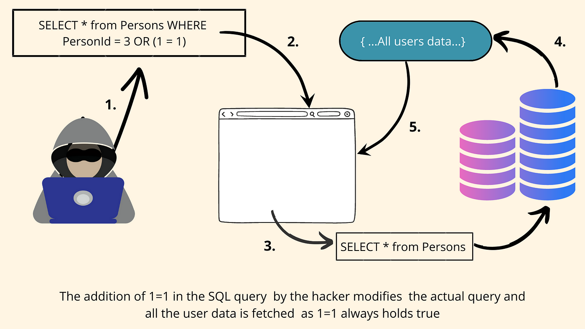

# Triggers, Views and Security

Wednesday - Dec 4, 2024

## Housekeeping

<div class="columns">

<div class="column" width="9%">

</div>

<div class="column" width="45%">

### Discussion items

- CMSC 427 - User Interfaces - Spring 2025

- <a
  href="https://virginiacommonwealth.instructure.com/courses/105097/assignments/1047918"
  target="_blank">Homework 9 - WB Population Analysis - due 12/8</a>

- <a
  href="https://virginiacommonwealth.instructure.com/courses/105097/assignments/969453"
  target="_blank">Homework 10 - Course evaluation - due 12/8</a>

- <a
  href="https://virginiacommonwealth.instructure.com/courses/105097/assignments/966535"
  target="_blank">Deliverable 12 - Semester Project - due 12/9</a>

- Catch up on other assignments …

- Next Monday - work session …

</div>

<div class="column" width="40%">

### Lecture topics

- [Triggers](#triggers-in-sql)

- [Views](#views-in-sql)

- [SQL Injection](#sql-injection)

</div>

</div>

<div style="margin-top:25px">

 

</div>

    <style></style>
    <div class='upcoming-calendar'>

| Module | Week | Date | Day | Lectures | Deliverables/Notes |
|:--:|:--:|:--:|:--:|----|----|
| Adv. SQL | 16 | 12/4 | Wed | MTG28: L28 (Triggers, Views and Security) |  |
| Adv. SQL | 16 | 12/8 | Sun |  | HW9 due (Even more on SQL) |
| Adv. SQL | 17 | 12/9 | Mon | MTG29: L29 (Work session) | PrjDel 12 due (Phase 2 submission); HW10 due (Course evaluation); Last day of class |
| Adv. SQL | 17 | 12/14 | Sat |  | Commencement |
|  | 18 | 12/18 | Wed |  | Grades due by Noon |

</div>

## We are here


## 

<div style="font-size:3.0em; text-align:center; font-weight:bold;">

Submission Deadline

This Monday - 12/9 - by Midnight

No late work will be accepted.

</div>

# TRIGGERS in SQL

## TRIGGERS in SQL

<div class="columns">

<div class="column" width="60%">

### What is a TRIGGER?

- A Trigger is a stored program in SQL that automatically executes in
  response to specified events on a table or view.  
- It is event-driven and tied to a specific table or event like
  `INSERT`, `UPDATE`, or `DELETE`.

### Why Use TRIGGERS?

- Enforce business rules automatically at the database level.  
- Maintain data integrity and consistency across tables.  
- Automate tasks like logging changes or generating audit records.  
- Perform validation or cascading updates without requiring manual
  intervention.

</div>

<div class="column" width="40%">


</div>

</div>

## Create a TRIGGER

<div style="font-size:0.95em;">

<div class="columns">

<div class="column">

### Syntax

``` sql
DELIMITER //
CREATE
    [DEFINER = user]
    TRIGGER [IF NOT EXISTS] trigger_name
    trigger_time trigger_event
    ON tbl_name FOR EACH ROW
    [trigger_order]
    BEGIN
    trigger_body
    END;
//
DELIMITER ;
trigger_time: { BEFORE | AFTER }

trigger_event: { INSERT | UPDATE | DELETE }

trigger_order: { FOLLOWS | PRECEDES } other_trigger_name
```

</div>

<div class="column">

### Example

``` sql
DELIMITER //

CREATE TRIGGER update_stock_after_order  
AFTER INSERT ON orders  
FOR EACH ROW  
BEGIN  
  UPDATE products  
  SET stock_quantity = stock_quantity - NEW.quantity  
  WHERE product_id = NEW.product_id;  
END; //

DELIMITER ;
```

- CREATE TRIGGER is a DDL statement
- TRIGGERS follow same rules as stored procedures

</div>

</div>

</div>

## TRIGGERS in SQL: When and When NOT

<div class="columns">

<div class="column" width="50%">

### When to Use a Trigger

- **Automating Tasks**: Use triggers to automate repetitive or
  administrative tasks, such as maintaining audit logs, tracking
  changes, or updating related tables.

- **Enforcing Business Rules**: Triggers are ideal for enforcing complex
  business rules that cannot be implemented with constraints alone, like
  ensuring data consistency across related tables.

- **Data Validation**: Use triggers to validate or modify data before it
  is inserted, updated, or deleted, preventing invalid or incomplete
  data from being stored.

- **Reacting to Data Changes**: Triggers are helpful when you need to
  execute specific actions automatically in response to data
  modifications, such as sending notifications or recalculating
  aggregated values.

</div>

<div class="column" width="50%">

### When NOT to Use a Trigger

- **Performance-Sensitive Scenarios**: Avoid triggers in scenarios with
  high transaction volume, as they can introduce overhead and impact
  database performance.

- **Complex Logic**: Do not use triggers for complex business logic that
  could be better handled in the application layer, where debugging and
  maintenance are easier.

- **Cross-System Dependencies**: Triggers are unsuitable when actions
  depend on external systems or APIs, as this can cause reliability and
  latency issues.

- **Frequent Schema Changes**: Avoid using triggers if the table schema
  is subject to frequent changes, as this can make maintenance
  cumbersome and error-prone.

</div>

</div>

## TRIGGERS in SQL: Benefits and Considerstaions

<div class="columns">

<div class="column" width="50%">

### Other DDL Commands for Triggers

- CREATE TRIGGER  
- DROP TRIGGER

### Benefits of Triggers

- Automation of database operations.  
- Enforcing business rules and data integrity.  
- Maintaining audit trails for data changes.  
- Reducing application-level logic by embedding functionality directly
  in the database.

</div>

<div class="column" width="50%">

### Considerations

- Triggers can simplify automation but may make debugging and
  maintenance more complex.  
- Excessive use of triggers can lead to performance overhead, especially
  with frequent table modifications.  
- Triggers are NOT intended to replace application logic but to
  complement it for database-specific tasks.  
- Triggers execute silently, which may lead to unintended consequences
  if not carefully designed.  
- WARNING – cascading effects from triggers can create unexpected or
  recursive behavior.  

</div>

</div>

# VIEWS in SQL

## VIEWS in SQL

<div class="columns">

<div class="column">

### What is a VIEW?

- A View is a virtual table in SQL.
- It does not store data itself but retrieves data from one or more
  underlying tables.

### Why Use VIEWS?

- Simplify complex queries.
- Provide an abstraction layer for security.
- Hide the complexity of underlying database schema.
- Very useful with API development

</div>

<div class="column">


</div>

</div>

## VIEWS - Creating a VIEW

<div class="columns">

<div class="column">

### Syntax

``` sql
CREATE VIEW view_name AS
SELECT column1, column2, ...
FROM table_name
WHERE condition;
```

- CREATE VIEW is a DDL statement
- VIEWS should be defined in same DDL file that creates your database
- VIEWS should be designed with API to simplify API queries.

</div>

<div class="column">

### Example

``` sql
CREATE VIEW customer_orders AS
  SELECT 
    customers.customer_name, orders.order_date
  FROM
    customers
    JOIN orders ON 
    customers.customer_id = orders.customer_id;
```

</div>

</div>

## VIEWS in SQL: When and When NOT

<div class="columns">

<div class="column">

### When to Use a View

- **Simplify Complex Queries**: Use views to encapsulate complex SQL
  logic, making it easier for developers and users to work with
  pre-defined query results.

- **Enhance Security**: Views can restrict access to specific columns or
  rows in a table, providing a controlled way to expose data without
  granting direct table access.

- **Abstract Schema Complexity**: Use views to present a simplified
  version of the database schema, especially when the underlying schema
  is complex or frequently changing.

- **Enable Reusability**: Views allow you to reuse commonly used query
  patterns, reducing duplication and improving maintainability across
  your database applications.

</div>

<div class="column">

### When NOT to Use a View

- **Performance-Critical Scenarios**: Avoid views when they involve
  complex queries or large datasets, as they can negatively impact query
  performance, especially if not indexed appropriately.

- **Dynamic Data Needs**: Do not use views if the data requires frequent
  real-time updates or parameterized filtering, as views are static by
  nature and cannot accept parameters.

- **Data Manipulation Requirements**: Views are unsuitable when you need
  to frequently update, delete, or insert data, as not all views are
  updatable and may cause unexpected behavior.

- **Overabstraction**: Avoid creating too many nested or layered views,
  as this can lead to confusion, reduced readability, and maintenance
  challenges.

</div>

</div>

## VIEWS in SQL: Benefits and Considerations

<div class="columns">

<div class="column">

### Other DDL commands

- CREATE VIEW
- DROP VIEW
- CREATE OR REPLACE VIEW

### Benefits of Views

- Data abstraction and security.
- Reusability of complex queries.
- Performance optimization by precomputing results.

</div>

<div class="column">

### Considerations

- Views can hide underlying schema complexity, but overuse can lead to
  confusion.
- Views may impact query performance if they involve complex operations
  or large datasets.
- Views are NOT tables, they are reevaluated every time they’re called.
- Views are NOT a substitute for a well-structured WITH query.
- WARNING - changes in underlying tables can affect view results.

</div>

</div>

# SQL Injection

## SQL Injection - Introduction

<div class="columns">

<div class="column" width="50%">

### SQL Injection: What is it?

- A common security vulnerability in web and API applications.
- Enabled by lazy or immature SQL coding practices.
- Occurs when an attacker manipulates input to execute malicious SQL
  queries.
- Common in older web and api applications

</div>

<div class="column" width="50%">



</div>

</div>

## SQL Injection - Examples

<div class="columns">

<div class="column" width="50%">

### The Problem: Unsanitized User Input

- Web applications often take user input through forms or query strings.
- If not properly validated and sanitized, user input can be used to
  alter SQL queries.

</div>

<div class="column" width="50%">

### Example 1: Unauthorized Access

- **Scenario**: Login Page
- **Vulnerable Code**:

``` python
query = """
SELECT * FROM users 
WHERE username='{inputUsername}' 
AND password='{inputPassword}';"
"""
```

- **Attack**: Input as `inputUsername = ' OR '1'='1'--`
- **Result**: Successful login bypassing password.

</div>

</div>

## SQL Injection - Examples

<div class="columns">

<div class="column" width="50%">

### Example 2: Data Leakage

- **Scenario**: Search Feature
- **Vulnerable Code**:

``` python
query = """
SELECT * FROM products 
WHERE name LIKE '%{searchKeyword}%';
"""
```

- **Attack**: Input as
  `searchKeyword = ' UNION SELECT username, password FROM users--`
- **Result**: Returns user credentials alongside product data.

</div>

<div class="column" width="50%">

### Example 3: Database Deletion

- **Scenario**: Delete Account Feature
- **Vulnerable Code**:

``` python
query = """
DELETE FROM users WHERE id={userID};
"""
```

- **Attack**: Input as `userID = '1; DROP TABLE users--`
- **Result**: Deletes the entire ‘users’ table.

</div>

</div>

## SQL Injection - Mitigation

It’s pretty simple, *NEVER* build a query *raw*. Here are a few
suggestions.
<p>

 
</p>

<div class="columns">

<div class="column" width="50%">

### Solution 1: Prepared Statements

- Parameterized queries that separate SQL code from user input.
- Example (Python):

``` python
cursor.execute("""
SELECT * FROM users 
WHERE username = ? AND password = ?
""", (inputUsername, inputPassword))
```

</div>

<div class="column" width="50%">

### Solution 2: Input Validation

- Validate and sanitize user input.
- Reject input that doesn’t meet expected criteria.
- Examples:
  - Ensure email input is a valid email address.
  - Remove extra spaces from user names.
  - Remove comment “–” strings from query.
  - Remove semicolons “;” from inputs.

</div>

</div>

## SQL Injection - Mitigation

<div class="columns">

<div class="column" width="50%">

### Solution 3: Least Privilege Principle

- Avoid using highly privileged accounts in application code.
  - Create a unique user for the web application,
  - Don’t use your developer account or other account.
- Limit the web application user permissions in database.
  - Allow web app INSERT, UPDATE, and DELETE
  - Disallow web app DROP, CREATE, GRANT, others.

</div>

<div class="column" width="50%">

### Solution 4: [Web Application Firewalls (WAFs)](https://www.cloudflare.com/learning/ddos/glossary/web-application-firewall-waf/)

- Implement a
  [WAF](https://www.cloudflare.com/learning/ddos/glossary/web-application-firewall-waf/)
  to detect and block SQL injection attempts.
- Regularly update and configure the
  [WAF](https://www.cloudflare.com/learning/ddos/glossary/web-application-firewall-waf/).

</div>

</div>

## SQL Injection - Summary

<div class="columns">

<div class="column" width="50%">

### Best practices

1.  Use prepared statements or parameterized queries.
2.  Implement input validation.
3.  Follow the least privilege principle.
4.  Use a Web Application Firewall (WAF).

</div>

<div class="column" width="50%">

### Recap

- SQL Injection is a serious security threat.
- Prevention is essential through proper coding practices.
- Stay updated on security best practices and vulnerabilities.

</div>

</div>

## 

<div style="font-size:3.0em; text-align:center; font-weight:bold;">

Submission Deadline

This Monday - 12/9 - by Midnight

No late work will be accepted.

</div>

## Housekeeping

<div class="columns">

<div class="column" width="9%">

</div>

<div class="column" width="45%">

### Discussion items

- CMSC 427 - User Interfaces - Spring 2025

- <a
  href="https://virginiacommonwealth.instructure.com/courses/105097/assignments/1047918"
  target="_blank">Homework 9 - WB Population Analysis - due 12/8</a>

- <a
  href="https://virginiacommonwealth.instructure.com/courses/105097/assignments/969453"
  target="_blank">Homework 10 - Course evaluation - due 12/8</a>

- <a
  href="https://virginiacommonwealth.instructure.com/courses/105097/assignments/966535"
  target="_blank">Deliverable 12 - Semester Project - due 12/9</a>

- Catch up on other assignments …

- Next Monday - work session …

</div>

<div class="column" width="40%">

### Lecture topics

- [Triggers](#triggers-in-sql)

- [Views](#views-in-sql)

- [SQL Injection](#sql-injection)

</div>

</div>

<div style="margin-top:25px">

 

</div>

    <style></style>
    <div class='upcoming-calendar'>

| Module | Week | Date | Day | Lectures | Deliverables/Notes |
|:--:|:--:|:--:|:--:|----|----|
| Adv. SQL | 16 | 12/4 | Wed | MTG28: L28 (Triggers, Views and Security) |  |
| Adv. SQL | 16 | 12/8 | Sun |  | HW9 due (Even more on SQL) |
| Adv. SQL | 17 | 12/9 | Mon | MTG29: L29 (Work session) | PrjDel 12 due (Phase 2 submission); HW10 due (Course evaluation); Last day of class |
| Adv. SQL | 17 | 12/14 | Sat |  | Commencement |
|  | 18 | 12/18 | Wed |  | Grades due by Noon |

</div>
