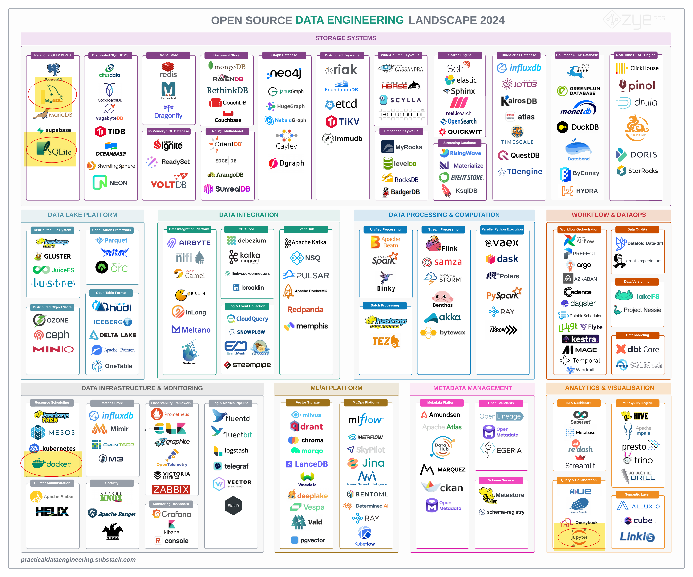
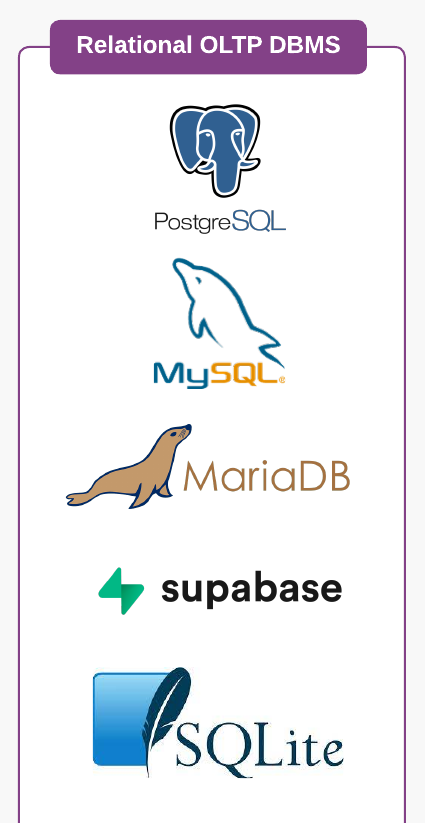

# Intro to Databases

Thursday - Jan 16, 2025

## Housekeeping

### Discussion items

- [Complete the pre-class
  survey](https://virginiacommonwealth.instructure.com/courses/113813/quizzes/216510)

- [Introduce yourself on the discussion
  group](https://virginiacommonwealth.instructure.com/courses/113813/assignments/1072356)

- [Join the
  discord](https://virginiacommonwealth.instructure.com/courses/113813/pages/resource-course-discord)

- [Review the semester
  project](https://virginiacommonwealth.instructure.com/courses/113813/pages/resource-week-1-course-project)

### Lecture topics

- [Intro to databases](#a-long-time-ago-in-a-galaxy-far-far-away)

- [Homework 1](#homework-1)

- [Intro to DB design](#database-design-process)

 

    
    

| Module | Week | Date | Day | Notes and Lectures | Activities and due dates |
|:--:|:--:|:--:|:--:|----|----|
| ER Models | 1 | 1/16 | Thu | L2:Intro to Databases | Srv1:Pre-class survey |
| ER Models | 1 | 1/19 | Sun | Last day to add/drop | Prj1:Intros |
| ER Models | 2 | 1/20 | Mon | NO CLASS - University Closed (MLK) |  |
| ER Models | 2 | 1/21 | Tue | L3:Entity-relation models |  |
| ER Models | 2 | 1/23 | Thu | L4:ER Models | PQ1:Entity-relation models |
| ER Models | 2 | 1/26 | Sun |  | HW1:DE Tool Review; Prj2:Team formation; Dis1:ER modeling |
| ER Models | 3 | 1/28 | Tue | L5:Relational models 1 |  |
| ER Models | 3 | 1/30 | Thu | L6:Relational models 2 | Q1:Entity-relation models |

<!-- lecture-block-begin -->

# A long time ago in a galaxy far, far away …

<!-- # A long time ago ... in a galaxy far, far away ... -->

## Early history

### 1950s and early 1960s:

- Data processing using [magnetic tapes for
  storage](https://en.wikipedia.org/wiki/Magnetic-tape_data_storage)
- Tapes provided only sequential access
- [Punched cards for
  input](https://en.wikipedia.org/wiki/Punched_card_input/output)

<em>The history of databases tracks the history of computers</em>

## Early history

### Late 1960s and 1970s:

- [Hard disks
  allowed](https://en.wikipedia.org/wiki/History_of_hard_disk_drives)
  direct access to data
- [Network and hierarchical data
  models](https://en.wikipedia.org/wiki/Database_model) in widespread
  use
- [Edgar “Ted” Codd](https://en.wikipedia.org/wiki/Edgar_F._Codd)
  defines the Relational data model
- [High-performance (for the era) transaction
  processing](https://en.wikipedia.org/wiki/Transaction_processing)

<em>The history of databases tracks the history of computers</em>

## Modern systems

### 1980s:

- Research relational prototypes evolve into commercial systems
  - SQL becomes industrial standard
- Parallel and distributed database systems
- Object-oriented database systems

### 1990s:

- Large decision support and data-mining applications
- Large multi-terabyte data warehouses
- Emergence of Web commerce

<em>The history of databases tracks the history of computers</em>

## Modern systems

### Early 2000s:

- XML and XQuery standards
- Automated database administration

### Later 2000s:

- Giant data storage systems
- Google BigTable, Yahoo PNuts, Amazon, …

### 2022 and Beyond:

<https://cacm.acm.org/magazines/2022/8/262905-the-seattle-report-on-database-research/fulltext#body-4>

## <a
href="https://practicaldataengineering.substack.com/p/open-source-data-engineering-landscape"
target="_blank">Open Source Data Engineering Landscape 2024</a>

## <a
href="https://practicaldataengineering.substack.com/p/open-source-data-engineering-landscape"
target="_blank">Open Source Data Engineering Landscape 2024</a>

## Why not use spreadsheets?

### Spreadsheets DO work and they ARE viable!

[Here is spreadsheet driven web
site](https://vcu-ssg.github.io/ssg-quarto-cmsc-courses/)

[Here is the
spreadsheet](https://docs.google.com/spreadsheets/d/1qrN3L7eRLsM-aVMHYaLQN-FMYtrTJf0_h6dLKlUdPkk/edit#gid=107368023)

### On the surface spreadsheets share many common elements with databases

### Entities

- *Worksheets* are *Tables*
- *Rows* are sometimes *Records*
- *Columns* are sometimes *Fields*
- *Workbooks* are *Databases* (collections of tables)

### Operations

- find rows, insert rows, delete rows, update rows,
- add columns, remove columns
- create worksheets, delete worksheets
- create workbooks, delete workbooks

## Why not use spreadsheets?

- Suppose that to add a new person, you need to make changes to three
  tabs (e.g., ‘Personal Info,’ ‘Contact Info,’ and ‘Employment Info’).

  - *What happens if you are interrupted in the middle of the change and
    forget where you are? (Atomicity)*

- Imagine that one of the tabs in your spreadsheet has a formula that
  automatically updates totals or averages when new data are entered.

  - *What would happen if, during an update, the formula fails to
    recalculate properly? (Consistency)*

- Consider a scenario where two people are editing the spreadsheet at
  the same time, both trying to add new rows to the same tab.

  - *How might their changes conflict, and what issues could arise?
    (Isolation)*

- Suppose you have made all the necessary changes to add a new person in
  your spreadsheet and then your computer crashes before you can save
  the file.

  - *What happens to the changes? (Durability)*

## Why not use spreadsheets?

- Imagine your spreadsheet contains sensitive information, such as
  personal or financial data.

  - *What controls could you put in place to ensure that only authorized
    users can view or edit specific parts of the data (Security)*

- Imagine that your spreadsheet currently manages a few hundred rows of
  data.

  - *What would happen if you needed to scale this to millions of rows?
    How would performance be affected, and what challenges might you
    face in managing such large volumes of data? (Scalability)*

- Imagine that your spreadsheet contains phone numbers across different
  tabs.

  - *What would happen if a home phone number was changed on one tab but
    not another? (Normalization and redundancy)*

## On Line Transaction Processing (OLTP) databases

- This semester we’ll be exploring Relational, [On Line Transaction
  Processing
  (OLTP)](https://en.wikipedia.org/wiki/Online_transaction_processing)
  Database Management Systems (DBMS), like MySQL, Postgres, SQLITE,
  Oracle, DB2 and SQLServer.

- A [Database Management System
  (DBMS)](https://en.wikipedia.org/wiki/Database#Database_management_system)
  is the software that enables users to define, create, manage, and
  interact with databases. It serves as an intermediary between the end
  users, applications, and the database, ensuring that data is
  organized, stored, retrieved, and modified efficiently and securely.

- [There are many ways to store data in a
  DBMS](https://en.wikipedia.org/wiki/Database_model).

- We’ll be focusing on the [*Relational*
  model](https://en.wikipedia.org/wiki/Database_model#Relational_model),
  where the DBMS stores entities and the relationships between these
  entities inside a single database (called a
  [schema](https://en.wikipedia.org/wiki/Database_schema)).

- These databases bundle multiple changes to the database as a
  [transaction](https://en.wikipedia.org/wiki/Database_transaction).
  Transactions can be reviewed and rolled back (reversed).

- [ACID (atomicity, consistency, isolation,
  durability)](https://en.wikipedia.org/wiki/ACID) is a set of
  properties of transactions intended to guarantee data validity despite
  errors, power failures, and other mishaps.

- Changes to the database are communicated to the DBMS using a language
  called [*SQL*, a *structured query
  language*](https://en.wikipedia.org/wiki/SQL). How does one [pronounce
  SQL?](https://www.youtube.com/watch?v=S9C8PNX72Ms)

## On Line Transaction Processing (OLTP) databases

- **Fast Query Processing:** These databases prioritize quick query
  response times to ensure efficient and prompt processing of individual
  transactions, making them ideal for applications like banking,
  e-commerce, and order management systems.

- **High Transaction Volume:** OLTP databases are designed to handle a
  large number of short, atomic transactions, such as inserting,
  updating, or deleting records, which are typically initiated by
  end-users in real-time.

- **Data Integrity and Consistency:** OLTP systems implement ACID
  (Atomicity, Consistency, Isolation, Durability) properties to ensure
  that all transactions are processed reliably, maintaining the
  integrity and consistency of the data even in the event of system
  failures.

- **Normalized Data Structure:** OLTP databases typically use a highly
  normalized schema to minimize data redundancy, optimize storage
  efficiency, and reduce the complexity of data manipulation during
  frequent transactions.

## CMSC 408 - in a nutshell

- We’ll apply *entity-relation* models to design and describe the
  contents of a database.

- We’ll apply *relational algebra* to formally describe how we query the
  database.

- We’ll apply *normalization* to ensure that we minimize redundant
  information in the database.

- We’ll tie everything together using SQL.

# Homework 1

<!-- # Homework 1 - Spring 2025 -->

## Homework 1

### Overview

- Homeworks 1, 2 and 3 focus on ER diagrams
- Homework 1 focuses on the tools and workflow.
- [Link to Homework
  1](https://virginiacommonwealth.instructure.com/courses/113813/assignments/1072333)

### General homework workflow

- Download assignment repository
- Edit files using VS code
- Commit and push changes to GITHUB
  - Submit HTML to Canvas
  - Submit repo to Gradescope

### Notes

- The focus of this assignment is on *installing* and *testing* the
  tools.
- Please allow plenty of time!
- Don’t get frustrated. Use *Discord* to get help.
- Break away from your GUI and try the command line.
- All future assignments will use these same tools.

## Homework 1 - Tools

### Tools used

Below is a list of tools for HW1 and download URLs.

- [Visual Studio Code](https://code.visualstudio.com/download)
- [GIT](https://git-scm.com/downloads)
- [GH CLI](https://cli.github.com/)
- [Quarto](https://quarto.org/docs/get-started/)

When installed properly, all these tools should run directly from the
command line!

### My tool versions

> [!NOTE]
>
> If the tools don’t run from CLI, you need to update your PATH
> environment variable. Ask [ChatGPT](https://chatgpt.com/)!

## Homework 1 - Command line interface

### Windows (Powershell)

<https://www.youtube.com/watch?v=FpRGRLI8Fy8> 
<https://www.youtube.com/watch?v=FpRGRLI8Fy8>

 

### Mac (zsh)

<https://www.youtube.com/watch?v=FfT8OfMpARM> 
<https://www.youtube.com/watch?v=FfT8OfMpARM>

> [!TIP]
>
> *Invest the time to get comfy with the CLI!* Direct use of the command
> line will save you *tons* of confusion in the long run!

## Homework 1 - Quarto and rendering

Quarto is a *document compiler*, MUCH like compiling a source file to
create an executable file. Quarto is a wrapper around *Jupyter* and
*Pandoc*.

For this assignment, you’ll be modifying an existing *qmd* file, adding
your content, rendering the qmd to html and uploading the HTML to
Canvas.

> [!TIP]
>
> I definitely recommend the [Quarto getting started
> tutorial](https://quarto.org/docs/get-started/hello/vscode.html)!
> Don’t forget to *render* the samples I provide in the *repository*.

## Homework 1 - Walkthrough

Use this as a checklist to complete the assignment. Try ALL of the
activities.

### Install the tools

- [Visual Studio Code](https://code.visualstudio.com/download)
- [GIT](https://git-scm.com/downloads)
- [GH CLI](https://cli.github.com/)
- [Quarto](https://quarto.org/docs/get-started/)

### Work the CLI

- Run each tool from the CLI
- Verify versions
- Clone repo using GH
- *cd* into repository
- Render sample QMD files.
- Edit README.md
- Edit *report.qmd* and *render*
- Commit and push changes

### Inside VS code

- Install Quarto extension
- Make a change
- Commit and push changes within VSC
- Render document within VSC

> [!TIP]
>
> ***Spend time experimenting!*** This assignment allows you to focus on
> the tools and workflow. You’ll save time later by investing time now.

# Database design process

<!-- # Database design process -->

## Database design process - overview

### Database design process

1.  Understanding requirements

2.  Conceptual design

3.  Logical design

4.  Physical design

5.  Implementation

### Notes

- The basic steps are listed on the left.
- There are many different approaches, some more complicated than
  others.
- Watch the videos, you’ll see different approaches, but also see what’s
  similar.
- Don’t overthink it.
- Iterate and spiralize the process. Don’t expect perfection.

> [!NOTE]
>
> These steps map nicely with the [Semester
> Project](https://virginiacommonwealth.instructure.com/courses/105097/pages/resource-week-2-semester-project?module_item_id=3767574)
> deliverables! *Deliverable 8* represents the first three steps of the
> design.

## Database design process - some details

1.  Understanding requirements
    - Problem domain,
    - Need,
    - Context, scope and perspective,
    - Uses cases, user roles
    - Security, privacy
    - Use cases, specific queries
2.  Conceptual design
    - Entities, attributes, relationships
    - ER diagrams
3.  Logical design
    - converting entities, attributes and relations, and other odd
      features to tables.
    - Normalization and functional analysis

4.  Physical design
    - Explicitly defining tables
    - Adding integrity constraints, triggers
    - Reporting: adding views
    - Maintenance: adding procedures
    - Considering access: defining an API layer
5.  Implementation and iteration
    - code it up,
    - load it up,
    - test it up,
    - see where you screwed it up,
    - iterate it up.

## Database design process - sharing your design

Understanding requirements  
We’ll be using *quarto* to describe in words the various attributes.
We’ll get practice creating requirements. These can get more complicated
as one iterates.

Conceptual design  
We’ll be using [Chen
diagrams](https://dl.acm.org/doi/10.1145/320434.320440) to document our
conceptual design. In Quarto we’ll be using *graphviz* to describe and
render these diagrams.

Logical design  
We’ll be using \[Crows-foot diagrams\] to document our logical design.
In Quarto we’ll be using *mermaid* to describe and render these
diagrams.

Physical design  
We’ll be using SQL to document our physical design.

<!-- lecture-block-end -->

## Housekeeping

### Discussion items

- [Complete the pre-class
  survey](https://virginiacommonwealth.instructure.com/courses/113813/quizzes/216510)

- [Introduce yourself on the discussion
  group](https://virginiacommonwealth.instructure.com/courses/113813/assignments/1072356)

- [Join the
  discord](https://virginiacommonwealth.instructure.com/courses/113813/pages/resource-course-discord)

- [Review the semester
  project](https://virginiacommonwealth.instructure.com/courses/113813/pages/resource-week-1-course-project)

### Lecture topics

- [Intro to databases](#a-long-time-ago-in-a-galaxy-far-far-away)

- [Homework 1](#homework-1)

- [Intro to DB design](#database-design-process)

 

    
    

| Module | Week | Date | Day | Notes and Lectures | Activities and due dates |
|:--:|:--:|:--:|:--:|----|----|
| ER Models | 1 | 1/16 | Thu | L2:Intro to Databases | Srv1:Pre-class survey |
| ER Models | 1 | 1/19 | Sun | Last day to add/drop | Prj1:Intros |
| ER Models | 2 | 1/20 | Mon | NO CLASS - University Closed (MLK) |  |
| ER Models | 2 | 1/21 | Tue | L3:Entity-relation models |  |
| ER Models | 2 | 1/23 | Thu | L4:ER Models | PQ1:Entity-relation models |
| ER Models | 2 | 1/26 | Sun |  | HW1:DE Tool Review; Prj2:Team formation; Dis1:ER modeling |
| ER Models | 3 | 1/28 | Tue | L5:Relational models 1 |  |
| ER Models | 3 | 1/30 | Thu | L6:Relational models 2 | Q1:Entity-relation models |

