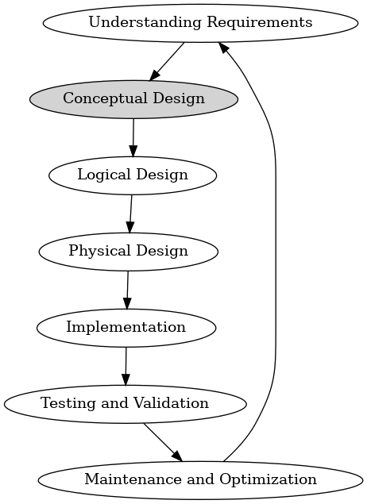
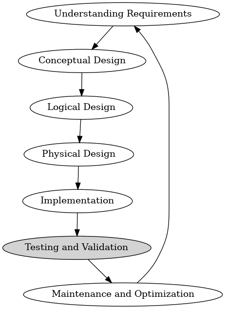

# Entity-relation models

Tuesday - Jan 21, 2025

## Housekeeping

### Discussion items

- [Deliverable 1 -
  Intros](https://virginiacommonwealth.instructure.com/courses/113813/assignments/1072356) -
  Find a partner! (past due!)

- [Deliverable 2 - Team
  Formation](https://virginiacommonwealth.instructure.com/courses/113813/quizzes/218307) -
  Tell me your team (Due Sun)

- [Discussion 1 - ER
  Modeling](https://virginiacommonwealth.instructure.com/courses/113813/assignments/1075913) -
  Talking ER models (due Sun)

- [Homework 1 - DE Tool
  Review](https://virginiacommonwealth.instructure.com/courses/113813/assignments/1072333) -
  Practice with Quarto (due Sun)

- [Practice Quiz 1 - ER
  Models](https://virginiacommonwealth.instructure.com/courses/113813/quizzes/211170) -
  (Due Wed … but …)

- [Quiz 1 - ER
  Models](https://virginiacommonwealth.instructure.com/courses/113813/quizzes/211165) -
  (Due Next Thu)

- [Study
  Guide](https://lowkeylabs.github.io/cmsc408-course-admin/guide/er-models/) -
  Lecture notes and study guide.

### Lecture topics

- [Practice Quiz 1 Walkthrough](#practice-quiz-1-walkthrough)

- [Homework 1 - DE Tool Review](#homework-1---de-tool-review)

- [Overview of DB design](#overview-of-database-design)

 

    
    

| Module | Week | Date | Day | Notes and Lectures | Activities and due dates |
|:--:|:--:|:--:|:--:|----|----|
| ER Models | 2 | 1/21 | Tue | L3:Entity-relation models |  |
| ER Models | 2 | 1/23 | Thu | L4:ER Models | PQ1:Entity-relation models |
| ER Models | 2 | 1/26 | Sun |  | HW1:DE Tool Review; Prj2:Team formation; Dis1:ER modeling |
| ER Models | 3 | 1/28 | Tue | L5:Relational models 1 |  |
| ER Models | 3 | 1/30 | Thu | L6:Relational models 2 | Q1:Entity-relation models |
| ER Models | 3 | 2/2 | Sun |  | Prj3:Ideation |
| Relational Alg. | 4 | 2/4 | Tue | L7:Relational Algebra 1 | PQ2:Relational Algebra; HW2:Entity Relation Models |
| Relational Alg. | 4 | 2/6 | Thu | L8:Relational Algebra 2 |  |

<!-- lecture-block-begin -->

# Practice 1 Quiz Walkthrough

<!-- # practice-quiz-1-walkthrough-sp2025 -->

## Practice and Quiz 1 - ER Modeling

### Quiz basics

- Quizzes are all about vocabulary and background info.

- Quizzes are multiple-choice on Canvas.

- Quizzes REQUIRE the lockdown browser.

- Practice Quizzes and Real Quizzes use the same question bank.

- Take practice quiz as many times as you like!

- Take real quiz ONLY ONCE.

### ER Modeling

- Quiz 1 focuses on Entity Relation Modeling.
- See this [study
  guide](https://lowkeylabs.github.io/cmsc408-course-admin/guide/er-models/)
- Goal is to get familiar with vocabulary.
- Lectures will use the vocabulary, you can refer to study guide to
  review terms you don’t understand.
- Another way to learn and reinforce!

# Homework 1 - DE Tool Review

<!-- # Homework 1 - Spring 2025 -->

## Homework 1 - Data Engineering Tool Review

### Overview

- Homework 1 focuses on the tools and workflow.
- [Link to Homework
  1](https://virginiacommonwealth.instructure.com/courses/113813/assignments/1072333)

### General homework workflow

- Download assignment repository
- Edit files using VS code
- Commit and push changes to GITHUB
  - Submit HTML to Canvas
  - Submit repo to Gradescope

### Notes

- The focus of this assignment is on *installing* and *testing* the
  tools.
- Please allow plenty of time!
- Don’t get frustrated. Use *Discord* to get help.
- Break away from your GUI and try the command line.
- All future assignments will use these same tools.

## Homework 1 - Tools

### Tools used

Below is a list of tools for HW1 and download URLs.

- [Visual Studio Code](https://code.visualstudio.com/download)
- [GIT](https://git-scm.com/downloads)
- [GH CLI](https://cli.github.com/)
- [Quarto](https://quarto.org/docs/get-started/)

When installed properly, all these tools should run directly from the
command line!

### My tool versions

> [!NOTE]
>
> If the tools don’t run from CLI, you need to update your PATH
> environment variable. Ask [ChatGPT](https://chatgpt.com/)!

## Homework 1 - Command line interface

### Windows (Powershell)

<https://www.youtube.com/watch?v=FpRGRLI8Fy8> 
<https://www.youtube.com/watch?v=FpRGRLI8Fy8>

 

### Mac (zsh)

<https://www.youtube.com/watch?v=FfT8OfMpARM> 
<https://www.youtube.com/watch?v=FfT8OfMpARM>

> [!TIP]
>
> *Invest the time to get comfy with the CLI!* Direct use of the command
> line will save you *tons* of confusion in the long run!

## Homework 1 - Quarto and rendering

Quarto is a *document compiler*, MUCH like compiling a source file to
create an executable file. Quarto is a wrapper around *Jupyter* and
*Pandoc*.

For this assignment, you’ll be modifying an existing *qmd* file, adding
your content, rendering the qmd to html and uploading the HTML to
Canvas.

> [!TIP]
>
> I definitely recommend the [Quarto getting started
> tutorial](https://quarto.org/docs/get-started/hello/vscode.html)!
> Don’t forget to *render* the samples I provide in the *repository*.

## Homework 1 - Walkthrough

Use this as a checklist to complete the assignment. Try ALL of the
activities.

### Install the tools

- [Visual Studio Code](https://code.visualstudio.com/download)
- [GIT](https://git-scm.com/downloads)
- [GH CLI](https://cli.github.com/)
- [Quarto](https://quarto.org/docs/get-started/)

### Work the CLI

- Run each tool from the CLI
- Verify versions
- Clone repo using GH
- *cd* into repository
- Render sample QMD files.
- Edit README.md
- Edit *report.qmd* and *render*
- Commit and push changes

### Inside VS code

- Install Quarto extension
- Make a change
- Commit and push changes within VSC
- Render document within VSC

> [!TIP]
>
> ***Spend time experimenting!*** This assignment allows you to focus on
> the tools and workflow. You’ll save time later by investing time now.

# Overview of Database Design

<!-- # Overview of Database Design -->

## Overview of Database Design

- **Understanding Requirements**
- Conceptual Design
- Logical Design
- Physical Design
- Implementation
- Testing and Validation
- Maintenance and Optimization

Gathering and analyzing business requirements to define the purpose and
scope of the database.

## Overview of Database Design

- Understanding Requirements
- **Conceptual Design**
- Logical Design
- Physical Design
- Implementation
- Testing and Validation
- Maintenance and Optimization

Creating high-level data models, such as ER diagrams, to visualize the
structure and relationships of the data.

## Overview of Database Design

- Understanding Requirements
- Conceptual Design
- **Logical Design**
- Physical Design
- Implementation
- Testing and Validation
- Maintenance and Optimization

Translating the conceptual model into a logical structure that defines
tables, fields, and relationships without concern for physical
implementation.

## Overview of Database Design

- Understanding Requirements
- Conceptual Design
- Logical Design
- **Physical Design**
- Implementation
- Testing and Validation
- Maintenance and Optimization

Deciding on the physical storage of the data, including indexing,
partitioning, and optimization strategies for performance.

## Overview of Database Design

- Understanding Requirements
- Conceptual Design
- Logical Design
- Physical Design
- **Implementation**
- Testing and Validation
- Maintenance and Optimization

Actual creation of the database using SQL, setting up tables,
constraints, and relationships as defined in the logical and physical
design stages.

## Overview of Database Design

- Understanding Requirements
- Conceptual Design
- Logical Design
- Physical Design
- Implementation
- **Testing and Validation**
- Maintenance and Optimization

Ensuring the database meets the requirements through testing,
validation, and adjustments as necessary.

## Overview of Database Design

- Understanding Requirements
- Conceptual Design
- Logical Design
- Physical Design
- Implementation
- Testing and Validation
- **Maintenance and Optimization**

Ongoing tuning and maintenance to ensure the database performs
efficiently and scales with business needs.

## Understanding Requirements

- **Business Requirements**
- User Requirements
- Data Requirements
- Functional Requirements
- Non-functional Requirements
- Scope Definition

Identifying what the business needs from the database, including what
data to store and how it will be used.

## Understanding Requirements

- Business Requirements
- **User Requirements**
- Data Requirements
- Functional Requirements
- Non-functional Requirements
- Scope Definition

Understanding who will use the database and their specific needs.

## Understanding Requirements

- Business Requirements
- User Requirements
- **Data Requirements**
- Functional Requirements
- Non-functional Requirements
- Scope Definition

Determining what data is necessary to fulfill the business and user
requirements.

## Understanding Requirements

- Business Requirements
- User Requirements
- Data Requirements
- **Functional Requirements**
- Non-functional Requirements
- Scope Definition

Identifying operations that the database must support, such as queries,
updates, and reporting.

## Understanding Requirements

- Business Requirements
- User Requirements
- Data Requirements
- Functional Requirements
- **Non-functional Requirements**
- Scope Definition

Considering performance, security, and scalability needs.

## Understanding Requirements

- Business Requirements
- User Requirements
- Data Requirements
- Functional Requirements
- Non-functional Requirements
- **Scope Definition**

Clearly defining the boundaries of what the database will and will not
cover.

## Conceptual Design

- **ER Modeling**
- Identifying Entities
- Defining Relationships
- Attributes Identification
- Conceptual Schema
- Validation

Creating Entity-Relationship (ER) diagrams to represent entities,
attributes, and relationships.

## Conceptual Design

- ER Modeling
- **Identifying Entities**
- Defining Relationships
- Attributes Identification
- Conceptual Schema
- Validation

Defining major objects in the business domain (e.g., customer, order,
product).

## Conceptual Design

- ER Modeling
- Identifying Entities
- **Defining Relationships**
- Attributes Identification
- Conceptual Schema
- Validation

Establishing how entities are related to each other (e.g., a customer
places an order).

## Conceptual Design

- ER Modeling
- Identifying Entities
- Defining Relationships
- **Attributes Identification**
- Conceptual Schema
- Validation

Listing key attributes for each entity to capture necessary details.

## Conceptual Design

- ER Modeling
- Identifying Entities
- Defining Relationships
- Attributes Identification
- **Conceptual Schema**
- Validation

Developing a schema that visually represents the data model.

## Conceptual Design

- ER Modeling
- Identifying Entities
- Defining Relationships
- Attributes Identification
- Conceptual Schema
- **Validation**

Reviewing the conceptual model with stakeholders to ensure accuracy.

## Logical Design

- **Relational Model**
- Normalization
- Defining Tables and Columns
- Primary and Foreign Keys
- Constraints
- Logical Schema

Converting ER diagrams into relational tables.

## Logical Design

- Relational Model
- **Normalization**
- Defining Tables and Columns
- Primary and Foreign Keys
- Constraints
- Logical Schema

Applying normalization techniques to reduce data redundancy and improve
integrity.

## Logical Design

- Relational Model
- Normalization
- **Defining Tables and Columns**
- Primary and Foreign Keys
- Constraints
- Logical Schema

Specifying tables, columns, and data types based on entities and
attributes.

## Logical Design

- Relational Model
- Normalization
- Defining Tables and Columns
- **Primary and Foreign Keys**
- Constraints
- Logical Schema

Establishing primary keys for unique identification and foreign keys for
relationships.

## Logical Design

- Relational Model
- Normalization
- Defining Tables and Columns
- Primary and Foreign Keys
- **Constraints**
- Logical Schema

Defining rules for data validation (e.g., NOT NULL, UNIQUE).

## Logical Design

- Relational Model
- Normalization
- Defining Tables and Columns
- Primary and Foreign Keys
- Constraints
- **Logical Schema**

Creating a detailed schema that outlines the logical structure of the
database.

## Physical Design

- **Storage Management**
- Indexing
- Partitioning
- Data Compression
- Hardware Considerations
- Backup and Recovery

Deciding how and where to store data physically on the storage medium.

## Physical Design

- Storage Management
- **Indexing**
- Partitioning
- Data Compression
- Hardware Considerations
- Backup and Recovery

Creating indexes to speed up data retrieval operations.

## Physical Design

- Storage Management
- Indexing
- **Partitioning**
- Data Compression
- Hardware Considerations
- Backup and Recovery

Dividing large tables into smaller, manageable pieces to improve
performance.

## Physical Design

- Storage Management
- Indexing
- Partitioning
- **Data Compression**
- Hardware Considerations
- Backup and Recovery

Using techniques to reduce storage space and improve efficiency.

## Physical Design

- Storage Management
- Indexing
- Partitioning
- Data Compression
- **Hardware Considerations**
- Backup and Recovery

Selecting appropriate hardware resources (e.g., SSDs, memory) for
optimal performance.

## Physical Design

- Storage Management
- Indexing
- Partitioning
- Data Compression
- Hardware Considerations
- **Backup and Recovery**

Planning for data protection and recovery in case of failures.

## Implementation

- **Schema Creation**
- Data Population
- Database Configuration
- User Accounts and Permissions
- Trigger and Stored Procedures
- Testing Environment

Defining tables, columns, and relationships using SQL.

## Implementation

- Schema Creation
- **Data Population**
- Database Configuration
- User Accounts and Permissions
- Trigger and Stored Procedures
- Testing Environment

Loading initial data into the database.

## Implementation

- Schema Creation
- Data Population
- **Database Configuration**
- User Accounts and Permissions
- Trigger and Stored Procedures
- Testing Environment

Setting up configuration parameters (e.g., memory allocation, cache
size).

## Implementation

- Schema Creation
- Data Population
- Database Configuration
- **User Accounts and Permissions**
- Trigger and Stored Procedures
- Testing Environment

Creating user accounts and assigning appropriate permissions.

## Implementation

- Schema Creation
- Data Population
- Database Configuration
- User Accounts and Permissions
- **Trigger and Stored Procedures**
- Testing Environment

Implementing business logic at the database level.

## Implementation

- Schema Creation
- Data Population
- Database Configuration
- User Accounts and Permissions
- Trigger and Stored Procedures
- **Testing Environment**

Setting up a testing environment to validate the database
implementation.

## Testing and Validation

- **Unit Testing**
- Integration Testing
- Performance Testing
- Security Testing
- Data Validation
- Feedback and Iteration

Checking individual components (e.g., tables, queries) for correctness.

## Testing and Validation

- Unit Testing
- **Integration Testing**
- Performance Testing
- Security Testing
- Data Validation
- Feedback and Iteration

Ensuring different parts of the database work together as expected.

## Testing and Validation

- Unit Testing
- Integration Testing
- **Performance Testing**
- Security Testing
- Data Validation
- Feedback and Iteration

Measuring response time, throughput, and scalability.

## Testing and Validation

- Unit Testing
- Integration Testing
- Performance Testing
- **Security Testing**
- Data Validation
- Feedback and Iteration

Verifying that the database is protected against unauthorized access and
vulnerabilities.

## Testing and Validation

- Unit Testing
- Integration Testing
- Performance Testing
- Security Testing
- **Data Validation**
- Feedback and Iteration

Ensuring data integrity and accuracy by validating inputs and outputs.

## Testing and Validation

- Unit Testing
- Integration Testing
- Performance Testing
- Security Testing
- Data Validation
- **Feedback and Iteration**

Gathering feedback and making necessary adjustments to the design or
implementation.

## Maintenance and Optimization

- **Performance Tuning**
- Monitoring
- Backup and Recovery
- Security Updates
- Data Archiving
- Scalability

Regularly reviewing and optimizing queries, indexing, and storage
strategies.

## Maintenance and Optimization

- Performance Tuning
- **Monitoring**
- Backup and Recovery
- Security Updates
- Data Archiving
- Scalability

Using monitoring tools to track database performance and detect issues.

## Maintenance and Optimization

- Performance Tuning
- Monitoring
- **Backup and Recovery**
- Security Updates
- Data Archiving
- Scalability

Implementing regular backups and testing recovery procedures.

## Maintenance and Optimization

- Performance Tuning
- Monitoring
- Backup and Recovery
- **Security Updates**
- Data Archiving
- Scalability

Applying security patches and updates to protect against
vulnerabilities.

## Maintenance and Optimization

- Performance Tuning
- Monitoring
- Backup and Recovery
- Security Updates
- **Data Archiving**
- Scalability

Implementing strategies to archive old or unused data to free up space
and improve performance.

## Maintenance and Optimization

- Performance Tuning
- Monitoring
- Backup and Recovery
- Security Updates
- Data Archiving
- **Scalability**

Planning and implementing changes to handle growing amounts of data and
users.

## Summary of the Database Design Process

- **Iterative Process**
- Alignment with Business Goals
- Focus on Data Integrity
- Performance Optimization
- Scalability and Flexibility
- Security and Compliance

Design, implementation, testing, and maintenance are ongoing and
iterative.

## Summary of the Database Design Process

- Iterative Process
- **Alignment with Business Goals**
- Focus on Data Integrity
- Performance Optimization
- Scalability and Flexibility
- Security and Compliance

The design should align with and support business objectives.

## Summary of the Database Design Process

- Iterative Process
- Alignment with Business Goals
- **Focus on Data Integrity**
- Performance Optimization
- Scalability and Flexibility
- Security and Compliance

Ensuring accuracy, consistency, and reliability of data is paramount.

## Summary of the Database Design Process

- Iterative Process
- Alignment with Business Goals
- Focus on Data Integrity
- **Performance Optimization**
- Scalability and Flexibility
- Security and Compliance

Design choices should consider efficiency and speed of data retrieval.

## Summary of the Database Design Process

- Iterative Process
- Alignment with Business Goals
- Focus on Data Integrity
- Performance Optimization
- **Scalability and Flexibility**
- Security and Compliance

A good design allows for future growth and changes.

## Summary of the Database Design Process

- Iterative Process
- Alignment with Business Goals
- Focus on Data Integrity
- Performance Optimization
- Scalability and Flexibility
- **Security and Compliance**

Protecting data from unauthorized access and ensuring compliance with
regulations.

<!-- lecture-block-end -->

## Housekeeping

### Discussion items

- [Deliverable 1 -
  Intros](https://virginiacommonwealth.instructure.com/courses/113813/assignments/1072356) -
  Find a partner! (past due!)

- [Deliverable 2 - Team
  Formation](https://virginiacommonwealth.instructure.com/courses/113813/quizzes/218307) -
  Tell me your team (Due Sun)

- [Discussion 1 - ER
  Modeling](https://virginiacommonwealth.instructure.com/courses/113813/assignments/1075913) -
  Talking ER models (due Sun)

- [Homework 1 - DE Tool
  Review](https://virginiacommonwealth.instructure.com/courses/113813/assignments/1072333) -
  Practice with Quarto (due Sun)

- [Practice Quiz 1 - ER
  Models](https://virginiacommonwealth.instructure.com/courses/113813/quizzes/211170) -
  (Due Wed … but …)

- [Quiz 1 - ER
  Models](https://virginiacommonwealth.instructure.com/courses/113813/quizzes/211165) -
  (Due Next Thu)

- [Study
  Guide](https://lowkeylabs.github.io/cmsc408-course-admin/guide/er-models/) -
  Lecture notes and study guide.

### Lecture topics

- [Practice Quiz 1 Walkthrough](#practice-quiz-1-walkthrough)

- [Homework 1 - DE Tool Review](#homework-1---de-tool-review)

- [Overview of DB design](#overview-of-database-design)

 

    
    

| Module | Week | Date | Day | Notes and Lectures | Activities and due dates |
|:--:|:--:|:--:|:--:|----|----|
| ER Models | 2 | 1/21 | Tue | L3:Entity-relation models |  |
| ER Models | 2 | 1/23 | Thu | L4:ER Models | PQ1:Entity-relation models |
| ER Models | 2 | 1/26 | Sun |  | HW1:DE Tool Review; Prj2:Team formation; Dis1:ER modeling |
| ER Models | 3 | 1/28 | Tue | L5:Relational models 1 |  |
| ER Models | 3 | 1/30 | Thu | L6:Relational models 2 | Q1:Entity-relation models |
| ER Models | 3 | 2/2 | Sun |  | Prj3:Ideation |
| Relational Alg. | 4 | 2/4 | Tue | L7:Relational Algebra 1 | PQ2:Relational Algebra; HW2:Entity Relation Models |
| Relational Alg. | 4 | 2/6 | Thu | L8:Relational Algebra 2 |  |

