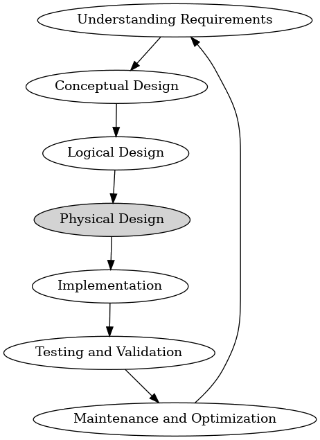
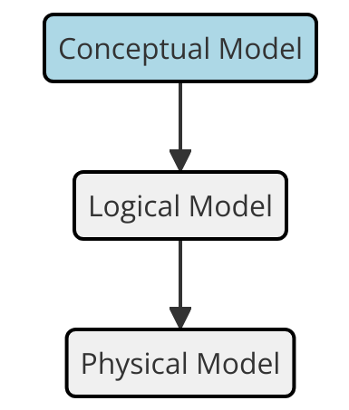
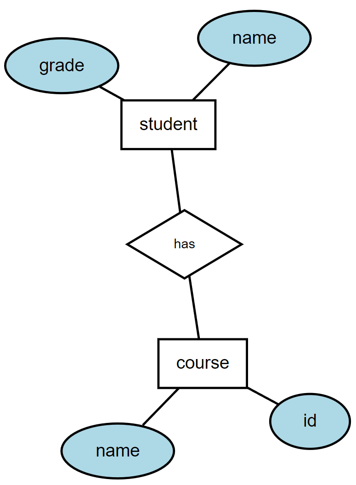

# Entity-relation models

Tuesday - Jan 21, 2025

## Housekeeping

### Discussion items

- This is a placeholder Lecture.

### Lecture topics

- [Overview of DB design](#overview-of-database-design)

- [Intro to ER Models](#introduction-to-er-models)

 

    
    

| Module | Week | Date | Day | Notes and Lectures | Activities and due dates |
|:--:|:--:|:--:|:--:|----|----|
| ER Models | 2 | 1/21 | Tue | L3:Entity-relation models |  |
| ER Models | 2 | 1/23 | Thu | L4:ER Models | PQ1:Entity-relation models |
| ER Models | 2 | 1/26 | Sun |  | HW1:DE Tool Review; Prj2:Team formation; Dis1:ER modeling |
| ER Models | 3 | 1/28 | Tue | L5:Relational models 1 |  |
| ER Models | 3 | 1/30 | Thu | L6:Relational models 2 | Q1:Entity-relation models |
| ER Models | 3 | 2/2 | Sun |  | Prj3:Ideation |
| Relational Alg. | 4 | 2/4 | Tue | L7:Relational Algebra 1 | PQ2:Relational Algebra; HW2:Entity Relation Models |
| Relational Alg. | 4 | 2/6 | Thu | L8:Relational Algebra 2 |  |

<!-- lecture-block-begin -->

# Overview of Database Design

<!-- # Overview of Database Design -->

## Overview of Database Design

- **Understanding Requirements**
- Conceptual Design
- Logical Design
- Physical Design
- Implementation
- Testing and Validation
- Maintenance and Optimization

Gathering and analyzing business requirements to define the purpose and
scope of the database.

## Overview of Database Design

- Understanding Requirements
- **Conceptual Design**
- Logical Design
- Physical Design
- Implementation
- Testing and Validation
- Maintenance and Optimization

Creating high-level data models, such as ER diagrams, to visualize the
structure and relationships of the data.

## Overview of Database Design

- Understanding Requirements
- Conceptual Design
- **Logical Design**
- Physical Design
- Implementation
- Testing and Validation
- Maintenance and Optimization

Translating the conceptual model into a logical structure that defines
tables, fields, and relationships without concern for physical
implementation.

## Overview of Database Design

- Understanding Requirements
- Conceptual Design
- Logical Design
- **Physical Design**
- Implementation
- Testing and Validation
- Maintenance and Optimization

Deciding on the physical storage of the data, including indexing,
partitioning, and optimization strategies for performance.

## Overview of Database Design

- Understanding Requirements
- Conceptual Design
- Logical Design
- Physical Design
- **Implementation**
- Testing and Validation
- Maintenance and Optimization

Actual creation of the database using SQL, setting up tables,
constraints, and relationships as defined in the logical and physical
design stages.

## Overview of Database Design

- Understanding Requirements
- Conceptual Design
- Logical Design
- Physical Design
- Implementation
- **Testing and Validation**
- Maintenance and Optimization

Ensuring the database meets the requirements through testing,
validation, and adjustments as necessary.

## Overview of Database Design

- Understanding Requirements
- Conceptual Design
- Logical Design
- Physical Design
- Implementation
- Testing and Validation
- **Maintenance and Optimization**

Ongoing tuning and maintenance to ensure the database performs
efficiently and scales with business needs.

## Understanding Requirements

- **Business Requirements**
- User Requirements
- Data Requirements
- Functional Requirements
- Non-functional Requirements
- Scope Definition

Identifying what the business needs from the database, including what
data to store and how it will be used.

## Understanding Requirements

- Business Requirements
- **User Requirements**
- Data Requirements
- Functional Requirements
- Non-functional Requirements
- Scope Definition

Understanding who will use the database and their specific needs.

## Understanding Requirements

- Business Requirements
- User Requirements
- **Data Requirements**
- Functional Requirements
- Non-functional Requirements
- Scope Definition

Determining what data is necessary to fulfill the business and user
requirements.

## Understanding Requirements

- Business Requirements
- User Requirements
- Data Requirements
- **Functional Requirements**
- Non-functional Requirements
- Scope Definition

Identifying operations that the database must support, such as queries,
updates, and reporting.

## Understanding Requirements

- Business Requirements
- User Requirements
- Data Requirements
- Functional Requirements
- **Non-functional Requirements**
- Scope Definition

Considering performance, security, and scalability needs.

## Understanding Requirements

- Business Requirements
- User Requirements
- Data Requirements
- Functional Requirements
- Non-functional Requirements
- **Scope Definition**

Clearly defining the boundaries of what the database will and will not
cover.

## Conceptual Design

- **ER Modeling**
- Identifying Entities
- Defining Relationships
- Attributes Identification
- Conceptual Schema
- Validation

Creating Entity-Relationship (ER) diagrams to represent entities,
attributes, and relationships.

## Conceptual Design

- ER Modeling
- **Identifying Entities**
- Defining Relationships
- Attributes Identification
- Conceptual Schema
- Validation

Defining major objects in the business domain (e.g., customer, order,
product).

## Conceptual Design

- ER Modeling
- Identifying Entities
- **Defining Relationships**
- Attributes Identification
- Conceptual Schema
- Validation

Establishing how entities are related to each other (e.g., a customer
places an order).

## Conceptual Design

- ER Modeling
- Identifying Entities
- Defining Relationships
- **Attributes Identification**
- Conceptual Schema
- Validation

Listing key attributes for each entity to capture necessary details.

## Conceptual Design

- ER Modeling
- Identifying Entities
- Defining Relationships
- Attributes Identification
- **Conceptual Schema**
- Validation

Developing a schema that visually represents the data model.

## Conceptual Design

- ER Modeling
- Identifying Entities
- Defining Relationships
- Attributes Identification
- Conceptual Schema
- **Validation**

Reviewing the conceptual model with stakeholders to ensure accuracy.

## Logical Design

- **Relational Model**
- Normalization
- Defining Tables and Columns
- Primary and Foreign Keys
- Constraints
- Logical Schema

Converting ER diagrams into relational tables.

## Logical Design

- Relational Model
- **Normalization**
- Defining Tables and Columns
- Primary and Foreign Keys
- Constraints
- Logical Schema

Applying normalization techniques to reduce data redundancy and improve
integrity.

## Logical Design

- Relational Model
- Normalization
- **Defining Tables and Columns**
- Primary and Foreign Keys
- Constraints
- Logical Schema

Specifying tables, columns, and data types based on entities and
attributes.

## Logical Design

- Relational Model
- Normalization
- Defining Tables and Columns
- **Primary and Foreign Keys**
- Constraints
- Logical Schema

Establishing primary keys for unique identification and foreign keys for
relationships.

## Logical Design

- Relational Model
- Normalization
- Defining Tables and Columns
- Primary and Foreign Keys
- **Constraints**
- Logical Schema

Defining rules for data validation (e.g., NOT NULL, UNIQUE).

## Logical Design

- Relational Model
- Normalization
- Defining Tables and Columns
- Primary and Foreign Keys
- Constraints
- **Logical Schema**

Creating a detailed schema that outlines the logical structure of the
database.

## Physical Design

- **Storage Management**
- Indexing
- Partitioning
- Data Compression
- Hardware Considerations
- Backup and Recovery

Deciding how and where to store data physically on the storage medium.

## Physical Design

- Storage Management
- **Indexing**
- Partitioning
- Data Compression
- Hardware Considerations
- Backup and Recovery

Creating indexes to speed up data retrieval operations.

## Physical Design

- Storage Management
- Indexing
- **Partitioning**
- Data Compression
- Hardware Considerations
- Backup and Recovery

Dividing large tables into smaller, manageable pieces to improve
performance.

## Physical Design

- Storage Management
- Indexing
- Partitioning
- **Data Compression**
- Hardware Considerations
- Backup and Recovery

Using techniques to reduce storage space and improve efficiency.

## Physical Design

- Storage Management
- Indexing
- Partitioning
- Data Compression
- **Hardware Considerations**
- Backup and Recovery

Selecting appropriate hardware resources (e.g., SSDs, memory) for
optimal performance.

## Physical Design

- Storage Management
- Indexing
- Partitioning
- Data Compression
- Hardware Considerations
- **Backup and Recovery**

Planning for data protection and recovery in case of failures.

## Implementation

- **Schema Creation**
- Data Population
- Database Configuration
- User Accounts and Permissions
- Trigger and Stored Procedures
- Testing Environment

Defining tables, columns, and relationships using SQL.

## Implementation

- Schema Creation
- **Data Population**
- Database Configuration
- User Accounts and Permissions
- Trigger and Stored Procedures
- Testing Environment

Loading initial data into the database.

## Implementation

- Schema Creation
- Data Population
- **Database Configuration**
- User Accounts and Permissions
- Trigger and Stored Procedures
- Testing Environment

Setting up configuration parameters (e.g., memory allocation, cache
size).

## Implementation

- Schema Creation
- Data Population
- Database Configuration
- **User Accounts and Permissions**
- Trigger and Stored Procedures
- Testing Environment

Creating user accounts and assigning appropriate permissions.

## Implementation

- Schema Creation
- Data Population
- Database Configuration
- User Accounts and Permissions
- **Trigger and Stored Procedures**
- Testing Environment

Implementing business logic at the database level.

## Implementation

- Schema Creation
- Data Population
- Database Configuration
- User Accounts and Permissions
- Trigger and Stored Procedures
- **Testing Environment**

Setting up a testing environment to validate the database
implementation.

## Testing and Validation

- **Unit Testing**
- Integration Testing
- Performance Testing
- Security Testing
- Data Validation
- Feedback and Iteration

Checking individual components (e.g., tables, queries) for correctness.

## Testing and Validation

- Unit Testing
- **Integration Testing**
- Performance Testing
- Security Testing
- Data Validation
- Feedback and Iteration

Ensuring different parts of the database work together as expected.

## Testing and Validation

- Unit Testing
- Integration Testing
- **Performance Testing**
- Security Testing
- Data Validation
- Feedback and Iteration

Measuring response time, throughput, and scalability.

## Testing and Validation

- Unit Testing
- Integration Testing
- Performance Testing
- **Security Testing**
- Data Validation
- Feedback and Iteration

Verifying that the database is protected against unauthorized access and
vulnerabilities.

## Testing and Validation

- Unit Testing
- Integration Testing
- Performance Testing
- Security Testing
- **Data Validation**
- Feedback and Iteration

Ensuring data integrity and accuracy by validating inputs and outputs.

## Testing and Validation

- Unit Testing
- Integration Testing
- Performance Testing
- Security Testing
- Data Validation
- **Feedback and Iteration**

Gathering feedback and making necessary adjustments to the design or
implementation.

## Maintenance and Optimization

- **Performance Tuning**
- Monitoring
- Backup and Recovery
- Security Updates
- Data Archiving
- Scalability

Regularly reviewing and optimizing queries, indexing, and storage
strategies.

## Maintenance and Optimization

- Performance Tuning
- **Monitoring**
- Backup and Recovery
- Security Updates
- Data Archiving
- Scalability

Using monitoring tools to track database performance and detect issues.

## Maintenance and Optimization

- Performance Tuning
- Monitoring
- **Backup and Recovery**
- Security Updates
- Data Archiving
- Scalability

Implementing regular backups and testing recovery procedures.

## Maintenance and Optimization

- Performance Tuning
- Monitoring
- Backup and Recovery
- **Security Updates**
- Data Archiving
- Scalability

Applying security patches and updates to protect against
vulnerabilities.

## Maintenance and Optimization

- Performance Tuning
- Monitoring
- Backup and Recovery
- Security Updates
- **Data Archiving**
- Scalability

Implementing strategies to archive old or unused data to free up space
and improve performance.

## Maintenance and Optimization

- Performance Tuning
- Monitoring
- Backup and Recovery
- Security Updates
- Data Archiving
- **Scalability**

Planning and implementing changes to handle growing amounts of data and
users.

## Summary of the Database Design Process

- **Iterative Process**
- Alignment with Business Goals
- Focus on Data Integrity
- Performance Optimization
- Scalability and Flexibility
- Security and Compliance

Design, implementation, testing, and maintenance are ongoing and
iterative.

## Summary of the Database Design Process

- Iterative Process
- **Alignment with Business Goals**
- Focus on Data Integrity
- Performance Optimization
- Scalability and Flexibility
- Security and Compliance

The design should align with and support business objectives.

## Summary of the Database Design Process

- Iterative Process
- Alignment with Business Goals
- **Focus on Data Integrity**
- Performance Optimization
- Scalability and Flexibility
- Security and Compliance

Ensuring accuracy, consistency, and reliability of data is paramount.

## Summary of the Database Design Process

- Iterative Process
- Alignment with Business Goals
- Focus on Data Integrity
- **Performance Optimization**
- Scalability and Flexibility
- Security and Compliance

Design choices should consider efficiency and speed of data retrieval.

## Summary of the Database Design Process

- Iterative Process
- Alignment with Business Goals
- Focus on Data Integrity
- Performance Optimization
- **Scalability and Flexibility**
- Security and Compliance

A good design allows for future growth and changes.

## Summary of the Database Design Process

- Iterative Process
- Alignment with Business Goals
- Focus on Data Integrity
- Performance Optimization
- Scalability and Flexibility
- **Security and Compliance**

Protecting data from unauthorized access and ensuring compliance with
regulations.

# Intro to ER Models

<!-- # Introduction to ER Models -->

## Conceptual, Logical, and Physical Data Models

- **Conceptual Model**
- Logical Model
- Physical Model

High-level, abstract model focusing on the entities and relationships.
Conceptual models are often created during the initial database design
phase.

## Conceptual, Logical, and Physical Data Models

- Conceptual Model
- **Logical Model**
- Physical Model

Translates the conceptual model into a more detailed structure,
specifying entities, attributes, and relationships without considering
physical storage. Logical models help in the creation of relational
schemas.

## Conceptual, Logical, and Physical Data Models

- Conceptual Model
- Logical Model
- **Physical Model**

Focuses on the actual implementation, including tables, columns, and
data types. Physical models are usually coded in SQL and include
commands for fine tuning, optimization, and storage strategies.

## Importance of ER Models in Database Design

Entity-Relationship (ER) models are essential tools for designing
databases as they provide a clear structure of data and its
relationships. ER models help in organizing data and ensuring that
databases are efficient, accurate, and scalable.

- ER models offer a visual representation of the database structure.
- They help in identifying and organizing data requirements.
- ER models reduce the complexity of database design.
- They support the identification of entities, attributes, and
  relationships.
- ER models guide the transition from conceptual design to logical
  design.

*Understanding ER models is crucial for effective database design and
implementation.*

## Components of Entity-Relationship Models

Entities  
These represent real-world objects, concepts, or things that have data
stored about them. Each entity is depicted as a rectangle in the ER
diagram.

Attributes  
Attributes are properties or characteristics that describe the entities.
For example, if you’re modeling a *Customer* entity, attributes could
include *CustomerID,* *Name,* *Email,* etc.

Relationships  
Relationships illustrate how entities are related to each other.
Relationships can be one-to-one, one-to-many, or many-to-many, and they
help define how data is interconnected.

<!-- code used to create ER diagram above
graph ER {
    fontname="Helvetica,Arial,sans-serif"
    fontsize=8;  // Reduced font size for the entire graph
    node [fontname="Helvetica,Arial,sans-serif", fontsize=8, width=0.5, height=0.3, style=filled, fillcolor=white] // Default: smaller font size, reduced node size, shaded
    edge [fontname="Helvetica,Arial,sans-serif", fontsize=8] // Reduced font size for edges
    layout=neato
    nodesep=2.0;  // Increased separation between nodes on the same level
    ranksep=1.5;  // Increased separation between nodes on different levels
    size="6,6";   // Specify desired size in inches
    ratio=compress; // Allow Graphviz to compress the layout to fit the size
    dpi=60;  // Set DPI for higher resolution output
    center=false;
    &#10;    node [shape=box,style=filled,color=black,fillcolor=lightblue]; course; student;
&#10;    node [shape=ellipse,style=filled,color=black,fillcolor=white]; {node [label="name"] name0; name2;}
    id; grade;
&#10;    // Define the "S-C" node with smaller size, white fill color, black border, and label "has"
    node [shape=diamond, style=filled, color=black, fillcolor=white width=0.3, height=0.2, fontsize=6, label="has"]; 
    "S-C"
&#10;    { rank=same; course; student; } // Place course and student on the same rank
&#10;    name0 -- course [len=0.7];  // Set edge length between name0 and course
    id -- course [len=0.7];     // Set edge length between id and course
    student -- grade [len=0.7]; // Set edge length between student and grade
    student -- name2 [len=0.7]; // Set edge length between student and name2
    student -- "S-C" [len=0.7]; // Set edge length between student and S-C
    "S-C" -- course [len=0.7];  // Set edge length between S-C and course
}
&#10;-->

## *Entities* in ER Models

Entities represent real-world objects or concepts that are stored in the
database. Identifying entities correctly is vital for the success of the
database design.

- Entities are things that can be distinctly identified.
- Examples of entities include people, products, events, and locations.
- Entities have attributes that provide details about them.
- Each entity type is represented by a set of instances in the database.
- Entity types are often mapped to tables in the relational model.

*Entities form the core of the database, representing key objects or
concepts in the system.*

## *Attributes* in ER Models

Attributes describe the properties or characteristics of entities and
relationships. They are fundamental to defining the structure and
constraints of the database.

- Attributes provide specific details about entities, such as name, ID,
  or age.
- They can be simple (indivisible), composite (consisting of multiple
  components), or derived (calculated from other attributes).
- Each attribute belongs to a specific domain, which defines the set of
  possible values.
- Attributes are represented as ovals connected to their respective
  entities or relationships in ER diagrams.
- Proper attribute selection is crucial for accurate data
  representation.

*Attributes are key to defining the details and constraints of entities
and relationships in the database.*

## *Relationships* in ER Models

Relationships define how entities interact with each other within the
database. Understanding these connections is critical to accurately
modeling real-world interactions.

- Relationships represent associations between two or more entities.
- They can be categorized as one-to-one, one-to-many, or many-to-many.
- Relationships have attributes that describe the nature of the
  association.
- In ER diagrams, relationships are depicted as diamonds connecting
  entities.
- Properly defining relationships helps in maintaining data integrity.

*Relationships ensure that the database reflects the interactions
between different entities in the system.*

## *Cardinality* in Relationships

*Cardinality* defines the number of instances of one entity that can be
associated with instances of another entity. Accurately determining
cardinality is essential for representing real-world relationships in
the database.

- Cardinality types include one-to-one, one-to-many, and many-to-many.
- One-to-one: Each instance of one entity relates to a single instance
  of another entity.
- One-to-many: One entity instance relates to multiple instances of
  another entity.
- Many-to-many: Multiple instances of one entity relate to multiple
  instances of another entity.
- Cardinality constraints are depicted in ER diagrams by numerical
  notation or Crow’s Foot symbols.

*Cardinality is critical to ensuring that database relationships
accurately reflect real-world scenarios.*

## *Participation* in Relationships

*Participation* indicates whether all or only some instances of an
entity are involved in a relationship. Understanding participation is
crucial for accurately modeling the mandatory or optional nature of
relationships in a database.

- Participation types include total participation and partial
  participation.
- Total Participation (Mandatory): Every instance of an entity must be
  involved in a relationship with instances of another entity.
- Partial Participation (Optional): Some instances of an entity may not
  be involved in a relationship with instances of another entity.
- Participation constraints are often represented in ER diagrams by
  solid lines (for total participation) or dashed lines (for partial
  participation).

*Participation helps define the essential and optional relationships,
ensuring the integrity and accuracy of the database model.*

## ER Diagram Notations

ER diagrams use specific notations to represent entities, relationships,
and attributes. Understanding these notations is essential for creating
and interpreting ER models effectively.

- **Chen’s Notation:** Uses rectangles for entities, diamonds for
  relationships, and ovals for attributes.
- **Crow’s Foot Notation:** Represents relationships with lines and
  ‘crow’s feet’ to indicate cardinality.
- Entities are often depicted with their primary keys underlined.
- Relationships may include roles and participation constraints.
- Notations help in communicating the structure and details of the ER
  model.

*Mastering ER diagram notations is key to effectively designing and
interpreting database models.*

## *Chen* notation

<figure class=''>

</figure>

<a href="https://dreampuf.github.io/GraphvizOnline/"
target="_blank">Link to graphviz on-line editor</a>

## *Crows Foot* notation

<a href="https://mermaid.live/edit" target="_blank">Link to mermaid
live</a>

## *Specialization* and *Generalization* in ER Models

*Specialization* and *generalization* are advanced ER modeling
techniques used to represent inheritance and hierarchy among entities.
These techniques enhance the expressiveness of ER models.

- **Specialization:** Process of defining a set of subclasses from a
  superclass based on distinguishing attributes.
- **Generalization:** The reverse process, where multiple subclasses are
  combined into a single superclass.
- Both techniques help in modeling inheritance and shared
  characteristics.
- These concepts are depicted in ER diagrams using triangle symbols.
- Proper use of specialization and generalization can simplify complex
  ER models.

*Specialization and generalization are powerful tools for managing
complexity in ER models.*

## Translating ER Models to Relational Schema

The final step in ER modeling is translating the ER model into a
relational schema. This process involves mapping entities,
relationships, and attributes into tables, columns, and keys.

- Entities are typically mapped to tables, with attributes becoming
  columns.
- Relationships may result in foreign keys or separate join tables.
- Primary keys ensure each table has a unique identifier for its rows.
- Mapping complex relationships may require additional tables or
  constraints.
- The translation process ensures that the conceptual design is
  accurately implemented in the database.

*Translating ER models to relational schemas is essential for
implementing the database design in a relational database system.*

<!-- lecture-block-end -->

## Housekeeping

### Discussion items

- This is a placeholder Lecture.

### Lecture topics

- [Overview of DB design](#overview-of-database-design)

- [Intro to ER Models](#introduction-to-er-models)

 

    
    

| Module | Week | Date | Day | Notes and Lectures | Activities and due dates |
|:--:|:--:|:--:|:--:|----|----|
| ER Models | 2 | 1/21 | Tue | L3:Entity-relation models |  |
| ER Models | 2 | 1/23 | Thu | L4:ER Models | PQ1:Entity-relation models |
| ER Models | 2 | 1/26 | Sun |  | HW1:DE Tool Review; Prj2:Team formation; Dis1:ER modeling |
| ER Models | 3 | 1/28 | Tue | L5:Relational models 1 |  |
| ER Models | 3 | 1/30 | Thu | L6:Relational models 2 | Q1:Entity-relation models |
| ER Models | 3 | 2/2 | Sun |  | Prj3:Ideation |
| Relational Alg. | 4 | 2/4 | Tue | L7:Relational Algebra 1 | PQ2:Relational Algebra; HW2:Entity Relation Models |
| Relational Alg. | 4 | 2/6 | Thu | L8:Relational Algebra 2 |  |

