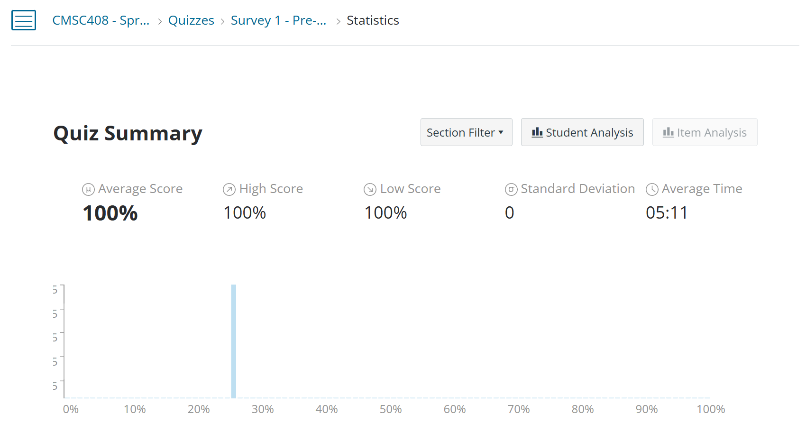

# Relational models 1

Tuesday - Jan 28, 2025

## Housekeeping

### Discussion items

- Homeworks and README files

- [Deliverable 3 - Harmonize
  Ideation](https://virginiacommonwealth.instructure.com/courses/113813/assignments/1072358) -
  due Sun, 2/2

- [Deliverable 4 - Video
  Pitch](https://virginiacommonwealth.instructure.com/courses/113813/assignments/1075768) -
  due Sun, 2/9

- [Quiz 1 - ER
  Models](https://virginiacommonwealth.instructure.com/courses/113813/quizzes/211165) -
  due THU, 1/30

- [Homework 2 - ER
  Diagrams](https://virginiacommonwealth.instructure.com/courses/113813/assignments/1072335) -
  due Tue, 2/4

  

   

  

- [Deliverable 2 - Team
  Formation](https://virginiacommonwealth.instructure.com/courses/113813/quizzes/218307) -
  Due Sun, 1/26

- [Practice Quiz 1 - ER
  Models](https://virginiacommonwealth.instructure.com/courses/113813/quizzes/211170) -
  Start now!

### Lecture topics

- [Pre-class survey results](#pre-class-survey-results)

- [Quiz Study Guide - ER Models](#study-guide---er-models)

- [ER Diagramming Resources](#er-diagramming-resources)

- [Homework 2 - ER Models](#homework-2---er-models)

 

    
    

| Module | Week | Date | Day | Notes and Lectures | Activities and due dates |
|:--:|:--:|:--:|:--:|----|----|
| ER Models | 3 | 1/28 | Tue | L5:Relational models 1 |  |
| ER Models | 3 | 1/30 | Thu | L6:Relational models 2 | Q1:Entity-relation models |
| ER Models | 3 | 2/2 | Sun |  | Prj3:Ideation |
| Relational Alg. | 4 | 2/4 | Tue | L7:Relational Algebra 1 | PQ2:Relational Algebra; HW2:Entity Relation Models |
| Relational Alg. | 4 | 2/6 | Thu | L8:Relational Algebra 2 |  |
| Relational Alg. | 4 | 2/9 | Sun |  | Prj4:Video Pitch; Dis2:Relational Alg. |
| Relational Alg. | 5 | 2/10 | Mon | Last day for progress reports |  |
| Relational Alg. | 5 | 2/11 | Tue | L9:Analysis and Normal Forms 1 |  |

<!-- lecture-block-begin -->

# Pre-class Survey Results

<!-- # Preclass Survey SP2025 -->

## Preclass Survey Results

# Study Guide - ER Models

<!-- # ER Models Study Guide -->

## ER Models Study Guide

<https://lowkeylabs.github.io/cmsc408-course-admin/guide/er-models/>

# ER Diagramming Resources

<!-- # ER Diagramming Resources -->

## ER Diagramming Resources

<https://www.youtube.com/watch?v=LowjDtiNlk4>

<https://www.youtube.com/watch?v=wMgirP7z4k8>

*Both of these videos are very good!*

## ER Diagramming Resources

### Concepts

- [Figma page and
  template](https://www.figma.com/resource-library/what-is-an-er-diagram/)
- [Geeks for Geeks - ER
  Model](https://www.geeksforgeeks.org/introduction-of-er-model/)
- [IBM - ER
  diagrams](https://www.ibm.com/think/topics/entity-relationship-diagram)

### Tools

- [Quarto diagramming](https://quarto.org/docs/authoring/diagrams.html)
- [Quarto
  graphviz](https://quarto.org/docs/authoring/diagrams.html#graphviz)
- [Quarto
  mermaid](https://quarto.org/docs/authoring/diagrams.html#mermaid)

### Chen diagram

- [GraphViz neeto](https://graphviz.org/Gallery/neato/ER.html)
- [GraphVix Gallery](https://graphviz.org/gallery/)

### Crow’s Foot

- [Mermaid - ER
  Diagrams](https://mermaid.js.org/syntax/entityRelationshipDiagram.html)
- [Mermaid - LIVE! ER
  Diagram](https://mermaid.live/edit#pako:eNp10VFrgzAQB_CvEu659gP4VjQMYZ0l2kJHXrLkrEI0kprCUL_74mrY2rG83fG7_4VkBGkUQgxo00ZcrGh5R_xJjkWZ7ykj87TdTiNJ6Wt2ouwc7dKU0aIgManF9clOUxSZkeQs9UVMei0k_mOyt1OeJdQrDroRHxpJZSyHu_6z7SnZosTmFrJD1oKmHyTNDe1K7r3fIMpKuveq6aR2KkQdWJ4ekzJKdiV9ydk5jKz979RuEE336B_uF5I5GKvQovI7OMAGWrStaJR_7HGZ5jDU2CKHhSqshNPD8gCzp8INpvjsJMSDdbgBa9ylhrgS-uor1ysx4PpfgfSiezemXdH8BSNhkfM)

There are other tools, but they run external to Quarto.

For our purposes, we can get away with the rather simple features of
graphviz and quarto embedded in Quarto.

You might consider a full-blown tool when you’re doing this for money!

# Homework 2 - ER Models

<!-- # Homework 2 - Fall 2024 -->

## Homework 2

### Overview

- Homeworks 2 and 3 focus on ER diagrams
- Homework 2 offers practice creating ER diagrams that I define.
- [Link to Homework
  2](https://virginiacommonwealth.instructure.com/courses/113813/assignments/1072335)

### General homework workflow

- *Same as homework 1!*
- Download assignment repository
- Edit files using VS code
- Commit and push changes to GITHUB
  - Submit HTML to Canvas
  - Submit repo to Gradescope

### Safety Tips

- Read the QMD and MD files in the REPO!

### Notes

- The focus of this assignment creating ER diagrams in Quarto using
  mermaid and graphviz.
- Please allow plenty of time!
- Don’t get frustrated. Use *Discord* and *ChatGPT* to get help.
- Use the command line to render, and commit.

### Worked example: Comic Book Management System

Consider a comic book store that wants to manage comic books, authors,
and customers. Each comic book has a comic ID, title, genre, and
publication date. Authors have an author ID, name, and biography.
Customers have a customer ID, name, and contact information. A comic
book can be written by multiple authors, and each author can contribute
to multiple comic books. A customer can purchase multiple comic books,
and each purchase involves a single customer and one or more comic
books. Purchases have a purchase ID, date, and total amount.

<!-- lecture-block-end -->

## Housekeeping

### Discussion items

- Homeworks and README files

- [Deliverable 3 - Harmonize
  Ideation](https://virginiacommonwealth.instructure.com/courses/113813/assignments/1072358) -
  due Sun, 2/2

- [Deliverable 4 - Video
  Pitch](https://virginiacommonwealth.instructure.com/courses/113813/assignments/1075768) -
  due Sun, 2/9

- [Quiz 1 - ER
  Models](https://virginiacommonwealth.instructure.com/courses/113813/quizzes/211165) -
  due THU, 1/30

- [Homework 2 - ER
  Diagrams](https://virginiacommonwealth.instructure.com/courses/113813/assignments/1072335) -
  due Tue, 2/4

  

   

  

- [Deliverable 2 - Team
  Formation](https://virginiacommonwealth.instructure.com/courses/113813/quizzes/218307) -
  Due Sun, 1/26

- [Practice Quiz 1 - ER
  Models](https://virginiacommonwealth.instructure.com/courses/113813/quizzes/211170) -
  Start now!

### Lecture topics

- [Pre-class survey results](#pre-class-survey-results)

- [Quiz Study Guide - ER Models](#study-guide---er-models)

- [ER Diagramming Resources](#er-diagramming-resources)

- [Homework 2 - ER Models](#homework-2---er-models)

 

    
    

| Module | Week | Date | Day | Notes and Lectures | Activities and due dates |
|:--:|:--:|:--:|:--:|----|----|
| ER Models | 3 | 1/28 | Tue | L5:Relational models 1 |  |
| ER Models | 3 | 1/30 | Thu | L6:Relational models 2 | Q1:Entity-relation models |
| ER Models | 3 | 2/2 | Sun |  | Prj3:Ideation |
| Relational Alg. | 4 | 2/4 | Tue | L7:Relational Algebra 1 | PQ2:Relational Algebra; HW2:Entity Relation Models |
| Relational Alg. | 4 | 2/6 | Thu | L8:Relational Algebra 2 |  |
| Relational Alg. | 4 | 2/9 | Sun |  | Prj4:Video Pitch; Dis2:Relational Alg. |
| Relational Alg. | 5 | 2/10 | Mon | Last day for progress reports |  |
| Relational Alg. | 5 | 2/11 | Tue | L9:Analysis and Normal Forms 1 |  |

