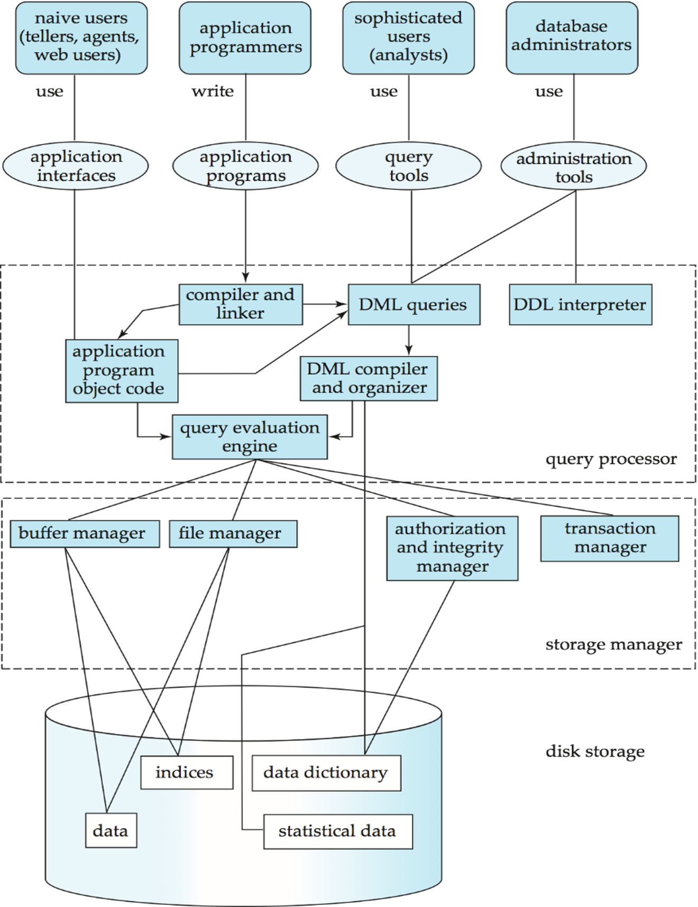

# Relational models 2

Thursday - Jan 30, 2025

## Housekeeping

<div class="columns">

<div class="column" width="9%">

</div>

<div class="column" width="45%">

### Discussion items

- [Deliverable 3 - Harmonize
  Ideation](https://virginiacommonwealth.instructure.com/courses/113813/assignments/1072358) -
  due Sun, 2/2

- [Deliverable 4 - Video
  Pitch](https://virginiacommonwealth.instructure.com/courses/113813/assignments/1075768) -
  due Sun, 2/9

- [Quiz 1 - ER
  Models](https://virginiacommonwealth.instructure.com/courses/113813/quizzes/211165) -
  due THU, 1/30

- [Homework 2 - ER
  Diagrams](https://virginiacommonwealth.instructure.com/courses/113813/assignments/1072335) -
  due Tue, 2/4

  <p>

   

  </p>

- [Deliverable 2 - Team
  Formation](https://virginiacommonwealth.instructure.com/courses/113813/quizzes/218307) -
  Due Sun, 1/26

- [Practice Quiz 1 - ER
  Models](https://virginiacommonwealth.instructure.com/courses/113813/quizzes/211170) -
  Start now!

</div>

<div class="column" width="40%">

### Lecture topics

- [Taking stock](#taking-stock)

- [Databases and DBMS](#databases-and-dbms)

- [Intro to SQL](#intro-to-sql)

- [Brief intro to relational models](#brief-intro-to-relational-models)

</div>

</div>

<div style="margin-top:25px">

 

</div>

    <style></style>
    <div class='upcoming-calendar'>

| Module | Week | Date | Day | Notes and Lectures | Activities and due dates |
|:--:|:--:|:--:|:--:|----|----|
| ER Models | 3 | 1/30 | Thu | L6:Relational models 2 | Q1:Entity-relation models |
| ER Models | 3 | 2/2 | Sun |  | Prj3:Ideation |
| Relational Alg. | 4 | 2/4 | Tue | L7:Relational Algebra 1 | PQ2:Relational Algebra; HW2:Entity Relation Models |
| Relational Alg. | 4 | 2/6 | Thu | L8:Relational Algebra 2 |  |
| Relational Alg. | 4 | 2/9 | Sun |  | Prj4:Video Pitch; Dis2:Relational Alg. |
| Relational Alg. | 5 | 2/10 | Mon | Last day for progress reports |  |
| Relational Alg. | 5 | 2/11 | Tue | L9:Analysis and Normal Forms 1 |  |
| Relational Alg. | 5 | 2/12 | Wed | Career Fair (10am-3pm) |  |

</div>

<!-- lecture-block-begin -->

# Taking stock

<!-- # Catching our collective breaths and taking stock -->

## Course to date

<div class="columns">

<div class="column">

### Topics

- Database design
- Conceptual design
  - entities, attributes and relationships
  - Chen diagrams
- Logical design
  - Cardinality and Participation
  - Crow’s foot diagrams

</div>

<div class="column">

### Skills and tools

- Quarto workflow and output formats
- GITHUB and git
- graphviz (not just for ER diagrams!)
- mermaid (not just for ER diagrams!)
- Zoom videos and Kaltura

</div>

</div>

### Next up:

- DBMS, SQL and the Relational Model
  - Understanding the DBMS platform
  - Interacting with a DBMS
  - Bridging the gap between ER-diagrams and SQL

# Databases and DBMS

<!-- # Databases and Database Management Systems -->

## A database ecosystem

<div class="columns">

<div class="column">

*A heck of a lot more than just data!*

- Users and their needs
- Storage manager
- Query manager
- Physical storage
- Ways to connect

### Designing a database

Good design requires that we develop a better understanding of the
database itself, so that we can more smoothly translate the conceptual
and logical designs into a physical design.

The choice of database and DBMS may constrain or shape our final design.

</div>

<div class="column">



</div>

</div>

## Users and their needs

End user  
Uses application interfaces to access database

Application programmer  
Develops application interfaces (e.g., Web, API, mobile)

Business Analyst  
Uses query tools to directly access the data base (e.g. statistical
business analyst)

Database Administrator (DBA)  
Designs logical and physical schemas

Handles security and authorization

Oversees data availability, crash recovery, software updates

Monitors performance and tunes database as needs evolve

Manages users and access control

## Storage manager

**Storage manager**

- a program that provides the interface between the low-level data
  stored in the database and the application programs and queries
  submitted to the system.

**Responsible for**

- Interaction with the file manager
- Efficient storing, retrieving and updating of data

**Considerations**

- Types of storage access
- Types of file organization
- Types of indexing and hashing
- Types of authorization and access control
- Data integritity

## Query manager

<div class="columns">

<div class="column">

*Lots going on in between request and response!*

- REQUEST (query)
  - query parser
  - relational algebraic evaluationr
  - optimizer
  - planner (detailed code)
  - evaluator
- RESPONSE (query output)

</div>

<div class="column">


</div>

</div>

## Transaction example

A **transaction** is a collection of operations that performs a single
logical function in a database application

**Transaction-manager** ensures that the database remains in a
consistent (correct) state despite system failures (e.g., power failures
and operating system crashes) and transaction failures.

**Concurrency-control manager** controls the interaction among the
concurrent transactions, to ensure the consistency of the database.


## ACID properties

Atomicity  
Either all operations of the transaction are properly reflected in the
database or none are

Consistency  
Execution of a transaction in isolation preserves the consistency of the
database

Isolation  
Although multiple transactions may execute concurrently, each
transaction must be unaware of other concurrently executing
transactions. *For every pair of transactions Ti and Tj, it appears to
Ti that either Tj, finished execution before Ti started, or Tj started
execution after Ti finished*

Durability  
After a transaction completes successfully, the changes it has made to
the database persist, even if there are system failures

## Accessing the DBMS

Using a command line  
SSH into server to script creation and population of the databases.

Using a *connector*

Using an API  
ODBC, REST, graphQL or other approaches to manipulate aspects of the
data base.

Using PHPMyAdmin  
Usually through a web browser to manage, monitor and tune the overall
system.

Using a PHP full stack  
To run the application and use the database.

- LAMP Linux : Apache : MySQL : PHP/Perl/Python

Using NodeJS full stack  
To run the application and use the data base

- MEAN Mongo/MySQL : Express : Angular : Node

- MERN Mondo/MySQL : Express : React : Node

## DBMS used in CMSC 508

<div class="columns">

<div class="column">

### MySQL

MySQL is a prominent open-source relational database management system
that operates on a client-server model, making it a great choice for
handling large-scale database applications and supporting multi-user
environments.

Deployment and Setup  
Requires a separate server setup, involving a more complex installation
process and server maintenance.

Concurrent Access  
Can handle multiple users and applications simultaneously, making it a
better fit for web applications or systems with high concurrency
requirements.

Storage and Performance  
Often better suited for large datasets and offers higher performance for
complex queries, thanks to optimization features and more expansive
indexing options.

</div>

<div class="column">

### SQLLite

SQLite is a self-contained, serverless, and zero-configuration database
engine commonly embedded into mobile and desktop applications for local
storage and capable of handling smaller-scale database needs with ease.

Deployment and Setup  
Extremely lightweight and easy to set up, with no server to install or
configure.

Concurrent Access  
Generally supports single-user systems better, and might encounter locks
or bottlenecks with multiple concurrent accesses.

Storage and Performance  
Optimized for local storage with smaller databases, with a file-based
storage system that might be less efficient for large datasets or
complex queries.

</div>

</div>

# Intro to SQL

<!-- # Intro to SQL -->

## Interacting with the database

A **DBMS** is software that manages databases, providing an interface
between users, applications, and the database. The DBMS handles the
internal mechanics of data storage, querying, transaction management,
and access control. When users or applications issue commands, the DBMS
processes these commands and ensures that the database remains
consistent, efficient, and secure.

Interacting with a **Database Management System (DBMS)** and a
**database** involves several layers of operations, each designed to
handle a specific aspect of how data is stored, managed, secured, and
retrieved.

*SQL* (structured query language) is the computer language we use to
interact with the DBMS.

## SQL (Structured Query Language )

**SQL (Structured Query Language)**: is a standardized language used for
managing and querying relational databases. It provides commands for
defining, manipulating, controlling, and retrieving data in databases.

- **ANSI SQL Standard**: ANSI (American National Standards Institute)
  defines the core SQL standard, ensuring a common foundation for
  relational database operations across different systems, though
  specific features may vary by vendor. The most recent version of the
  SQL standard is SQL:2023, formally adopted in June 2023.

- **SQL Dialects by Vendor**: While adhering to ANSI SQL, many database
  vendors (like **MySQL**, **PostgreSQL**, **Oracle**, **SQL Server**)
  extend SQL with proprietary features (e.g., Oracle’s PL/SQL,
  Microsoft’s T-SQL) to support additional functionalities unique to
  their systems.

## SQL command groups

SQL commands are grouped based on what they do to/for the DBMS. We
sometimes refer to these groups as separate *languages*: **DDL**,
**DML**, **DCL**, and **TCL**.

- **Design and Structure (DDL)**: When building a database, DDL is the
  first interaction, defining how data will be stored and structured.
  This foundational step ensures the database can efficiently support
  future operations.

- **Manipulating and Retrieving Data (DML)**: The core daily
  interactions with the database happen through DML. Whether adding new
  entries, retrieving data, or updating records, these operations are
  what end-users experience.

- **Security and Permissions (DCL)**: Modern databases are often
  accessed by multiple users and applications. Ensuring that data access
  is controlled and secure is essential, and DCL ensures that only the
  right users have the appropriate access levels.

- **Maintaining Data Integrity (TCL)**: In multi-user environments or
  where transactions involve complex steps (e.g., financial
  transactions, inventory updates), TCL ensures that the database
  remains in a consistent state even when failures or conflicts occur.

## DDL (Data Definition Language)

- **Purpose**: Defines the structure and organization of the database.
- **Role**: DDL commands interact directly with the **DBMS** to create,
  modify, or delete database objects such as tables, indexes, and
  schemas.
- **Example**: When creating a new table, the **DBMS** allocates the
  necessary storage and manages the metadata that defines the table
  structure. DDL commands ensure that the database schema evolves as the
  application grows.
- **Use Cases**:
  - Creating a new table to store user data.
  - Altering the structure of an existing table to accommodate new
    fields.

## DDL (Data Definition Language)

Key DDL commands include:

1.  **`CREATE`**: Used to create new database objects like tables,
    indexes, views, or databases.
2.  **`ALTER`**: Used to modify the structure of an existing database
    object (e.g., adding or removing columns in a table).
3.  **`DROP`**: Used to delete database objects like tables, indexes, or
    entire databases.
4.  **`TRUNCATE`**: Removes all records from a table, but keeps the
    table structure intact.
5.  **`RENAME`**: Used to rename database objects.

DDL commands define and change the structure or schema of a database,
unlike DML, which focuses on manipulating the data within those
structures.

## DDL (Data Definition Language)

<div class="columns">

<div class="column">

- DDL compiler generates a set of tables stored in a data dictionary
- Data dictionary contains metadata about:
  - Database tables, fields and data types
  - Primary and foreign keys
  - Data integrity constrants
  - Referential integrity
  - Access and authorization rules

</div>

<div class="column">

### Example

``` {sql}
CREATE TABLE person (
    person_id INT PRIMARY KEY,
    person_first_name VARCHAR(50),
    person_last_name VARCHAR(50),
    person_city VARCHAR(50)
);
```

### Notes

1.  Fields are strongly typed,
2.  INT, VARCHAR(width), (lots more!)
3.  Additional attributed can be defined:
    - PRIMARY KEY, FOREIGN KEY, etc.

</div>

</div>

## DML (Data Manipulation Language)

- **Purpose**: Manages the actual data within the database.
- **Role**: DML commands interact with the **DB** to insert, retrieve,
  update, and delete data. The **DBMS** processes these requests and
  ensures the data is accessed efficiently and accurately.
- **Example**: When querying data (e.g., `SELECT`), the **DBMS**
  retrieves the requested information from the database, handles the
  query optimizations, and returns results to the user or application.
- **Use Cases**:
  - Retrieving customer data for an e-commerce application.
  - Inserting new product information into a database.

## DCL (Data Control Language)

- **Purpose**: Controls access to the data within the database.
- **Role**: DCL commands interact with the **DBMS** to manage user
  permissions and security. This ensures that only authorized users can
  access or modify specific parts of the database.
- **Example**: Granting access to a developer to only read the data
  while restricting their ability to modify or delete it.
- **Use Cases**:
  - Granting access to specific tables for an application.
  - Revoking permissions from users who should no longer access the
    database.

## TCL (Transaction Control Language)

- **Purpose**: Manages and controls database transactions.
- **Role**: TCL commands work closely with the **DBMS** to ensure that
  changes made to the database maintain **ACID (Atomicity, Consistency,
  Isolation, Durability)** properties. This ensures that transactions
  are processed reliably.
- **Example**: When performing a `COMMIT` after multiple `INSERT`
  operations, the **DBMS** makes the changes permanent. If any part of
  the transaction fails, a `ROLLBACK` can undo all the changes to ensure
  data integrity.
- **Use Cases**:
  - Performing multiple updates to an inventory system and committing
    them only when all changes are successfully made.
  - Rolling back a transaction if a bank transfer fails midway, ensuring
    no partial changes occur.

## SQL Summary

SQL is the overarching language for interacting with the relational
database management system.

SQL commands are organized into *languages* that play a distinct roles
in the overall functioning of the DBMS. Together, they allow the
applications programmer to:

- **Define the structure** (DDL),
- **Manipulate the data** (DML),
- **Secure the database** (DCL), and
- **Ensure reliable transactions** (TCL).

By interacting with these layers, the DBMS provides a seamless, powerful
way to manage data efficiently, ensuring that applications can scale,
users can access information securely, and data integrity is maintained
across transactions.

# Brief intro to relational models

<!-- # Brief intro to relational model -->

## Relational Database Model

<div class="columns">

<div class="column">

- **Tables** represent the fundamental entity for manipulation.
- Tables have multiple columns called **fields**, each with unique names
  and data types. **Fields** correspond to attributes in our ER model.
- Tables have multiple rows called **records** that represent individual
  instances of the data stored in the table. These are sometimes called
  *tuples*.
- Relationships between tables are documented as **keys**. Keys are
  simply fields in a table, designated as keys. Keys have special
  properties and the database keeps track of them differently.
- A complete definition entities, attributes and relations, along with
  any data types and constraints is called a **schema**.

</div>

<div class="column">

``` {sql}
CREATE TABLE students (
    student_id INT PRIMARY KEY,
    name VARCHAR(100),
    year INT
);

CREATE TABLE courses (
    course_id INT PRIMARY KEY,
    title VARCHAR(100),
    credit_hours INT
);

CREATE TABLE student_courses (
    student_id INT,
    course_id INT,
    FOREIGN KEY (student_id) REFERENCES students(student_id),
    FOREIGN KEY (course_id) REFERENCES courses(course_id),
    PRIMARY KEY (student_id, course_id)
);
```

<div style="font-size:0.70em;font-style:italic;padding-left:20px;margin-top:10px">

In the example above, we define two entities: students and courses, and
establish a many-to-many relationship between them. The relationships
are documented in a separate table with foreign keys. The individual
rows in the student-courses table represent pairs of students and
courses or “student-course tuples”.

</div>

</div>

</div>

## In the coming weeks

- We’ll spend the next lecture exploring how to translate specific
  logical designs into actual SQL.

- We’ll also explore the fundamentals of relational algebra and how we
  tersly communicate operatings that we can perform on the data and how
  those operations look in SQL.

- Finally, we’ll examine ways to minimize duplication of data by
  *functionally* analyzing our tables and evaluating it’s *normal form*.

<!-- lecture-block-end -->

## Housekeeping

<div class="columns">

<div class="column" width="9%">

</div>

<div class="column" width="45%">

### Discussion items

- [Deliverable 3 - Harmonize
  Ideation](https://virginiacommonwealth.instructure.com/courses/113813/assignments/1072358) -
  due Sun, 2/2

- [Deliverable 4 - Video
  Pitch](https://virginiacommonwealth.instructure.com/courses/113813/assignments/1075768) -
  due Sun, 2/9

- [Quiz 1 - ER
  Models](https://virginiacommonwealth.instructure.com/courses/113813/quizzes/211165) -
  due THU, 1/30

- [Homework 2 - ER
  Diagrams](https://virginiacommonwealth.instructure.com/courses/113813/assignments/1072335) -
  due Tue, 2/4

  <p>

   

  </p>

- [Deliverable 2 - Team
  Formation](https://virginiacommonwealth.instructure.com/courses/113813/quizzes/218307) -
  Due Sun, 1/26

- [Practice Quiz 1 - ER
  Models](https://virginiacommonwealth.instructure.com/courses/113813/quizzes/211170) -
  Start now!

</div>

<div class="column" width="40%">

### Lecture topics

- [Taking stock](#taking-stock)

- [Databases and DBMS](#databases-and-dbms)

- [Intro to SQL](#intro-to-sql)

- [Brief intro to relational models](#brief-intro-to-relational-models)

</div>

</div>

<div style="margin-top:25px">

 

</div>

    <style></style>
    <div class='upcoming-calendar'>

| Module | Week | Date | Day | Notes and Lectures | Activities and due dates |
|:--:|:--:|:--:|:--:|----|----|
| ER Models | 3 | 1/30 | Thu | L6:Relational models 2 | Q1:Entity-relation models |
| ER Models | 3 | 2/2 | Sun |  | Prj3:Ideation |
| Relational Alg. | 4 | 2/4 | Tue | L7:Relational Algebra 1 | PQ2:Relational Algebra; HW2:Entity Relation Models |
| Relational Alg. | 4 | 2/6 | Thu | L8:Relational Algebra 2 |  |
| Relational Alg. | 4 | 2/9 | Sun |  | Prj4:Video Pitch; Dis2:Relational Alg. |
| Relational Alg. | 5 | 2/10 | Mon | Last day for progress reports |  |
| Relational Alg. | 5 | 2/11 | Tue | L9:Analysis and Normal Forms 1 |  |
| Relational Alg. | 5 | 2/12 | Wed | Career Fair (10am-3pm) |  |

</div>
