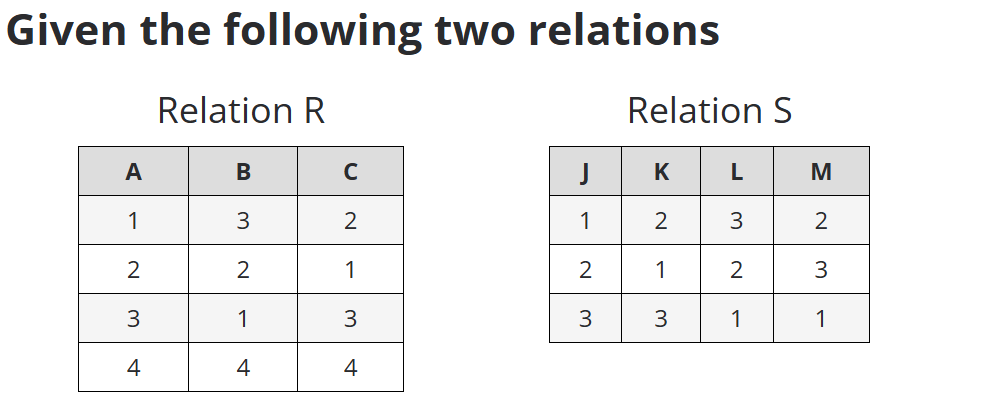
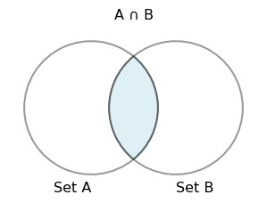
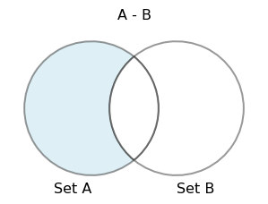

# Relational Algebra 2

Thursday - Feb 6, 2025

## Housekeeping

### Discussion items

- <a href="https://virginiacommonwealth.instructure.com/courses/113813/quizzes/211171">Practice
  Quiz 2 </a> - due Feb. 4, TUE

- <a href="https://virginiacommonwealth.instructure.com/courses/113813/assignments/1072335">Homework
  2 - ER Modeling </a> - due Feb. 4, TUE

- <a href="https://virginiacommonwealth.instructure.com/courses/113813/assignments/1075914">Discussion
  2 - Relational Algebra</a> - due Feb. 9, SUN

- <a href="https://virginiacommonwealth.instructure.com/courses/113813/assignments/1075768">Del.4 -
  Video Pitch</a> - due Feb. 9, SUN

### Lecture topics

- [Deliverable 4 Notes](#deliverable-4-notes)

- [Set Operations](#set-operations)

- [Join Operations](#join-operations)

- [Renaming and Division](#rename-and-division)

 

    
    

| Module | Week | Date | Day | Notes and Lectures | Activities and due dates |
|:--:|:--:|:--:|:--:|----|----|
| Relational Alg. | 4 | 2/4 | Tue | L7:Relational Algebra 1 | PQ2:Relational Algebra; HW2:Entity Relation Models |
| Relational Alg. | 4 | 2/6 | Thu | L8:Relational Algebra 2 |  |
| Relational Alg. | 4 | 2/9 | Sun |  | Prj4:Video Pitch; Dis2:Relational Alg. |
| Relational Alg. | 5 | 2/10 | Mon | Last day for progress reports |  |
| Relational Alg. | 5 | 2/11 | Tue | L9:Analysis and Normal Forms 1 |  |
| Relational Alg. | 5 | 2/12 | Wed | Career Fair (10am-3pm) |  |
| Relational Alg. | 5 | 2/13 | Thu | NO CLASS - Interview Day (10am-3pm) | Q2:Relational Algebra |
| Relational Alg. | 5 | 2/16 | Sun |  | HW3:Modeling Your World |

<!-- lecture-block-begin -->

# Practice Quiz 2 - Relational Algebra

<!-- # Practice Quiz 2 - Relational Algebra SP2025 -->

## Practice Quiz 2 - Relational Algebra

### Practice Quiz 2

- Open now
- 30 multiple choice questions
- Multiple attempts

### Quiz 2 - Relational Algebra

- Due Feb. 18, THU

- 30 multiple choice

- 1 attempt

- Take the Practice Quiz!

We’re applying relational algebra operations to the two sets above.

# Set Operations

<!-- # Set Operations -->

## Introduction to Set Theory and Relational Algebra

Set theory is a fundamental concept in relational algebra, providing the
basis for operations that manipulate relations. These operations enable
combining and filtering data effectively in relational databases.

- Set theory deals with the mathematical concept of sets, collections of
  distinct elements.
- Relational algebra applies set theory to relations (tables) in
  databases.
- Common operations include union, intersection, difference, and
  Cartesian product.
- These operations allow manipulation of data across multiple relations.
- Set operations are performed on relations that have the same schema.

*Set theory is essential for understanding how relational algebra
manipulates and combines relations.*

<!-- -->

## Intersection Operation in Relational Algebra

The intersection operation retrieves rows that are common to two
relations. It is used to find data that appears in both relations,
making it useful when comparing datasets or finding shared entries
between relations.

**∩ - Intersection**

- Intersection finds common tuples between two relations.
- The result includes only those tuples that appear in both relations.
- Denoted as Relation1 ∩ Relation2
- It’s a binary operation, meaning it operates on two relations.
- Both relations must be *union-compatible*, meaning they have the same
  set of attributes and data types.
- Intersection is often used in conjunction with other set-based
  operations like union and difference.

**Examples**

Given two relations *Students(ID,Name,Major)* and
*Registered(ID,Name,Major)*,

The following are valid examples of the $\cap$ in unicode:

1.  Students ∩ Registered

2.  Courses ∩ OfferedCourses

3.  Employees ∩ Managers

<!-- -->

*Intersection is useful for finding commonality between two sets of data
in relational databases.*

## Properties of the Intersection Operator

**Definition**

$$
R_1 \cap R_2 = { t \mid t \in R_1 \text{ and } t \in R_2 }
$$

- where $t$ is a row (tuple),
- $R_1$ and $R_2$ are relations (tables) with the same attributes,
- The intersection operation returns a new relation containing only the
  rows that are present in both $R_1$ and $R_2$,
- The result consists of distinct rows that satisfy the condition of
  being in both relations.

**Properties**

- **Idempotent** – Applying the intersection of a relation with itself
  doesn’t change the result:

$$
R \cap R = R
$$

- **Commutative** – The order of relations in an intersection operation
  doesn’t matter:

$$
R_1 \cap R_2 = R_2 \cap R_1
$$

- **Associative** – The grouping of intersection operations doesn’t
  affect the result:

$$
(R_1 \cap R_2) \cap R_3 = R_1 \cap (R_2 \cap R_3)
$$

- **Intersection with an empty set** – The intersection of a relation
  with an empty set is the empty set:

$$
R \cap \emptyset = \emptyset
$$

- **Intersection distributes over union** – The intersection of two
  relations distributes over their union:

$$
R_1 \cap (R_2 \cup R_3) = (R_1 \cap R_2) \cup (R_1 \cap R_3)
$$

<!-- -->

## Explanation of properties

- **Idempotent**: Combining a relation with itself using intersection
  does not remove any rows, so the result remains the same.
- **Commutative**: The order of the relations in the intersection
  operation does not affect the result.
- **Associative**: You can group intersection operations in any way, and
  the result will be the same.
- **Intersection with an empty set**: Intersecting with an empty
  relation results in an empty set because no rows can be in both the
  original relation and an empty set.
- **Distributed**: Intersection distributes over union, meaning you can
  break down or combine intersections in a structured way over unions.

## Intersection - ∩ - Example 1

Given *Courses1( Course,Term)*:

   

      

         &#10;

| Course  | Term      |
|---------|-----------|
| CMSC301 | Fall 2024 |
| CMSC408 | Fall 2024 |
| CMSC408 | Fall 2023 |

      

   

and *Courses2( Course,Term )*:

   

      

         &#10;

| Course  | Term      |
|---------|-----------|
| CMSC110 | Fall 2024 |
| CMSC201 | Fall 2024 |
| CMSC475 | Fall 2023 |
| CMSC408 | Fall 2024 |

      

   

*Courses1* $\cap$ *Courses2* returns:

   

      

         &#10;

| Course  | Term      |
|---------|-----------|
| CMSC408 | Fall 2024 |

      

   

<!-- -->

## Difference in Relational Algebra

Difference in relational algebra subtracts one relation from another,
returning the rows that are present in the first relation but not the
second.

- The difference operation returns tuples that are in one relation but
  not in the other.
- It is often used to filter out unwanted data from a larger dataset.
- The relations must have the same schema for the difference operation
  to be valid.
- This operation can help isolate unique data points in a relation.
- The result is a relation that includes only the data exclusive to the
  first set.

<!-- -->

*Difference is a powerful tool for excluding data from one relation that
is present in another.*

## Properties of the Difference Operator

**Definition**

$$
R_1 - R_2 = { t \mid t \in R_1 \text{ and } t \notin R_2 }
$$

- where $t$ is a row (tuple),
- $R_1$ and $R_2$ are relations (tables) with the same attributes,
- The difference operation returns a new relation containing only the
  rows that are in $R_1$ but not in $R_2$,
- The result consists of distinct rows that exist in $R_1$ and are
  absent from $R_2$.

**Properties**

- **Non-commutative** – The order of relations in the difference
  operation matters:

$$
R_1 - R_2 \neq R_2 - R_1
$$

- **Not associative** – Grouping difference operations affects the
  result:

$$
(R_1 - R_2) - R_3 \neq R_1 - (R_2 - R_3)
$$

- **Difference with an empty set** – The difference between a relation
  and an empty set is the relation itself:

$$
R_1 - \emptyset = R_1
$$

- **Difference with itself** – The difference between a relation and
  itself is the empty set:

$$
R_1 - R_1 = \emptyset
$$

- **Distributive over intersection** – The difference operation
  distributes over intersection:

$$
R_1 - (R_2 \cap R_3) = (R_1 - R_2) \cap (R_1 - R_3)
$$

<!-- -->

## Explanation of properties

- **Non-commutative**: The order in which the relations are used in the
  difference matters because the result will include rows from $R_1$
  that are not in $R_2$, but not vice versa.
- **Not associative**: The grouping of relations in a difference
  operation affects the outcome since subtracting another relation later
  changes the rows that remain.
- **Difference with an empty set**: Subtracting an empty set from a
  relation has no effect since there are no rows to remove.
- **Difference with itself**: Subtracting a relation from itself results
  in an empty set, as no rows are left.
- **Distributive over intersection**: Difference distributes over
  intersection, allowing you to apply the difference to both parts of
  the intersection separately and then take their intersection.

## Difference - $-$ - Example 1

Given *Courses1( Course,Term)*:

   

      

         &#10;

| Course  | Term      |
|---------|-----------|
| CMSC301 | Fall 2024 |
| CMSC408 | Fall 2024 |
| CMSC408 | Fall 2023 |

      

   

and *Courses2( Course,Term )*:

   

      

         &#10;

| Course  | Term      |
|---------|-----------|
| CMSC110 | Fall 2024 |
| CMSC201 | Fall 2024 |
| CMSC475 | Fall 2023 |
| CMSC408 | Fall 2024 |

      

   

*Courses1* $-$ *Courses2* returns:

   

      

         &#10;

| Course  | Term      |
|---------|-----------|
| CMSC301 | Fall 2024 |
| CMSC408 | Fall 2023 |

      

   

<!-- -->

## Difference - $-$ - Example 2

Given *Courses1( Course,Term)*:

   

      

         &#10;

| Course  | Term      |
|---------|-----------|
| CMSC301 | Fall 2024 |
| CMSC408 | Fall 2024 |
| CMSC408 | Fall 2023 |

      

   

and *Courses2( Course,Term )*:

   

      

         &#10;

| Course  | Term      |
|---------|-----------|
| CMSC110 | Fall 2024 |
| CMSC201 | Fall 2024 |
| CMSC475 | Fall 2023 |
| CMSC408 | Fall 2024 |

      

   

*Courses2* $-$ *Courses1* returns:

   

      

         &#10;

| Course  | Term      |
|---------|-----------|
| CMSC110 | Fall 2024 |
| CMSC201 | Fall 2024 |
| CMSC475 | Fall 2023 |

      

   

<!-- -->

## Combining Relations Using Set Operations

Set operations allow the combination of multiple relations in a variety
of ways, depending on the desired outcome of the query.

- Relational algebra supports various set operations like union,
  intersection, and difference.
- These operations allow filtering and merging data across relations.
- Set operations are only valid when the schemas of the involved
  relations match.
- Use cases include combining multiple tables, finding common data, or
  filtering out specific records.
- Understanding these operations is key to effective data manipulation
  in relational databases.

<!-- -->

*Set operations provide flexible tools for combining and comparing
datasets in relational databases.*

## Set Operation Requirements and Considerations

When performing set operations, it’s essential to ensure that both
relations have compatible schemas and understand how each operation
behaves.

- Set operations can only be performed on relations with identical
  schemas.
- The number of attributes and their types must match for the operation
  to succeed.
- Set operations can return large results, depending on the size of the
  input relations.
- Performance considerations include the size of relations and
  efficiency of the operation.
- Proper indexing can improve the speed of set operations in large
  databases.

<!-- -->

*Understanding the requirements of set operations ensures successful and
efficient data manipulation.*

## Examples of Set Operations in Relational Queries

Relational algebra operations like union, intersection, and difference
can be directly applied in database queries to filter and combine data.

- Example: Union of two employee tables to combine employee records from
  two departments.
- Example: Intersection of student and graduate tables to find students
  who have graduated.
- Example: Difference between a product catalog and inventory to find
  out-of-stock items.
- Cartesian product used to combine customer and order tables for
  further analysis.
- Practical queries often combine set operations with other relational
  algebra operations.

<!-- -->

*Set operations are applied in real-world scenarios to efficiently
manipulate and query data.*

## Set Operations in Real-World Databases

Set operations play a vital role in real-world databases, helping manage
and analyze large datasets effectively.

- Used to merge large datasets across departments or organizations.
- Helpful in financial reporting, where records from different periods
  or regions are combined.
- Set operations can aid in data cleaning by removing duplicates or
  irrelevant records.
- They are fundamental in multi-relational databases where data is
  distributed across tables.
- Often used in cloud environments for large-scale data analysis and
  processing.

<!-- -->

*In practice, set operations streamline data integration and analysis
across various industries.*

## Summary of Set Operations in Relational Algebra

Set operations, including union, intersection, difference, and Cartesian
product, are key tools in relational algebra for manipulating and
combining relations. They enable powerful queries that form the basis of
relational database functionality.

- Set theory provides the foundation for combining and filtering
  relations.
- Intersection finds common records, while difference filters out data
  from one relation.
- Cartesian product creates all possible combinations of tuples from two
  relations.
- Union merges two relations, removing duplicates.
- These operations are essential for querying and managing relational
  databases.

<!-- -->

*Mastery of set operations in relational algebra allows for complex and
efficient database queries.*

# Join Operations

<!-- # Join Operations -->

## Introduction to Join Operations in Relational Algebra

Join operations allow you to combine data from two or more relations
based on a condition. Understanding these operations is key to querying
relational databases effectively.

- Joins combine related data from different relations.
- A condition (join predicate) specifies how to match tuples from
  different relations.
- Common types of joins include inner and outer joins.
- Joins are fundamental to multi-relation queries.
- Different types of joins solve different query requirements.

<!-- -->

*Joins are essential in connecting data from multiple tables in
relational databases.*

## Inner Join: Definition and Use

Inner join is the most common type of join, which only returns matching
tuples from both relations. It is frequently used in relational
databases.

- Inner join retrieves only the matching tuples from two relations.
- Non-matching tuples are excluded from the result.
- The join condition specifies how tuples are matched.
- Useful when you need to combine data from two relations where all
  entries meet a condition.
- Most common join operation in SQL and relational algebra.

<!-- -->

*Inner join is ideal when you only need rows where data exists in both
relations.*

## Properties of the Inner Join Operator

**Definition**

$$
R_1 \bowtie_{condition} R_2 = { t_1 , t_2 \mid t_1 \in R_1, t_2 \in R_2, \text{ and } condition(t_1, t_2) }
$$

- where $t_1$ is a row (tuple) from relation $R_1$,
- $t_2$ is a row (tuple) from relation $R_2$,
- The **inner join** combines rows from $R_1$ and $R_2$ based on a
  specified **join condition**,
- The result contains only those rows where the condition is true for
  both relations (i.e., rows in $R_1$ and $R_2$ that satisfy the join
  condition).

**Properties**

- **Non-commutative** – The order of relations matters in inner join
  (unless the join condition is symmetric):

$$
R_1 \bowtie_{condition} R_2 \neq R_2 \bowtie_{condition} R_1
$$ (Unless $condition(t_1, t_2) = condition(t_2, t_1)$)

- **Associative** – Grouping inner join operations doesn’t affect the
  result:

$$
(R_1 \bowtie_{condition1} R_2) \bowtie_{condition2} R_3 = R_1 \bowtie_{condition1} (R_2 \bowtie_{condition2} R_3)
$$

- **Inner join with an empty set** – The inner join with an empty
  relation results in an empty set:

$$
R_1 \bowtie_{condition} \emptyset = \emptyset
$$

- **Distributive over selection** – Inner join distributes over
  selection:

$$
\sigma_{condition}(R_1 \bowtie R_2) = (\sigma_{condition}(R_1)) \bowtie R_2
$$ (if the selection condition applies to $R_1$ only)

- **Size of result** – The number of rows in the result depends on how
  many rows from $R_1$ match rows in $R_2$ under the join condition.

<!-- -->

## Explanation of properties

- **Non-commutative**: The order of the relations in the inner join may
  affect the result unless the join condition is symmetric (e.g.,
  $A = B$ is the same as $B = A$).
- **Associative**: Grouping inner joins differently doesn’t change the
  result as long as the conditions are applied consistently.
- **Inner join with an empty set**: If either relation is empty, the
  result is an empty set because no rows can satisfy the join condition.
- **Distributive over selection**: You can first apply a selection
  condition to one of the relations and then join it with the other
  relation without affecting the outcome, assuming the selection
  condition applies to that relation only.
- **Size of result**: The size of the result is determined by the number
  of matching rows in $R_1$ and $R_2$ that satisfy the join condition.

This structure mirrors the other relational algebra operations and
highlights the key properties of the inner join.

## Inner Join - ⋈ - Example 1

Given *Students(VID,Name,Major)*:

   

      

         &#10;

| VID    | Name  | Major   |
|--------|-------|---------|
| V10101 | Alice | CS      |
| V10102 | Bob   | Math    |
| V10103 | Carol | CS      |
| V10104 | Dave  | Physics |

      

   

and *Enrollments(VID,Course,Term,Enrl)*:

   

      

         &#10;

| VID    | Course  | Term        | Enrl |
|--------|---------|-------------|------|
| V10101 | CMSC460 | Spring 2024 | 100  |
| V10103 | CMSC455 | Spring 2024 | 150  |
| V10105 | CMSC420 | Spring 2024 | 120  |

      

   

**Find all the data for students enrolled in classes**

*Students* ⋈ (*VID*) *Enrollments*;

   

      

         &#10;

| VID    | Name  | Major | Course  | Term        | Enrl |
|--------|-------|-------|---------|-------------|------|
| V10101 | Alice | CS    | CMSC460 | Spring 2024 | 100  |
| V10103 | Carol | CS    | CMSC455 | Spring 2024 | 150  |

      

   

- This list does not include students who don’t have enrollments, nor
  enrollments with students not found in the relation.

- What is the cardinality and participation?

<!-- -->

## Inner Join - ⋈ - Example 2

Given *Menu(DishID, Dish, Price)*:

   

      

         &#10;

| DishID | Dish           | Price |
|--------|----------------|-------|
| D001   | Samosa         | 2.5   |
| D002   | Butter Chicken | 10.0  |
| D003   | Naan           | 1.5   |
| D004   | Paneer Tikka   | 8.0   |

      

   

and *Orders(OrderID, DishID, Quantity)*:

   

      

         &#10;

| OrderID | DishID | Quantity |
|---------|--------|----------|
| O1001   | D001   | 2        |
| O1002   | D003   | 3        |
| O1003   | D005   | 1        |

      

   

*Menu* ⋈ (*DishID*) *Orders* returns:

   

      

         &#10;

| DishID | Dish   | Price | OrderID | Quantity |
|--------|--------|-------|---------|----------|
| D001   | Samosa | 2.5   | O1001   | 2        |
| D003   | Naan   | 1.5   | O1002   | 3        |

      

   

This example demonstrates how an inner join will return only the dishes
from the `orders` that exist in the `menu`, leaving out any ordered
dishes that are not on the menu (like `DishID: D005`).

<!-- -->

## Outer Join: Introduction and Types

Outer join returns all tuples from one or both relations, filling in
missing values with NULLs. It allows for more inclusive queries.

- Outer join returns matching and non-matching tuples.
- NULL values are used for missing data.
- There are three types: left, right, and full outer join.
- Left outer join returns all tuples from the left relation and matches
  from the right.
- Right outer join does the reverse: all from the right relation and
  matches from the left.

<!-- -->

*Outer joins are useful when you need to retain non-matching data from
one or both relations.*

## Properties of the Outer Join Operator

**Definition**

$$
\begin{aligned}
R_1 \text{⟕}_{condition} R_2 = &{ t_1 , t_2 \mid (t_1 \in R_1 \text{ and } t_2 \in R_2 \text{ and } condition(t_1, t_2)) } \
&\cup { t_1 \mid t_1 \in R_1 \text{ and no match in } R_2 } \
&\cup { t_2 \mid t_2 \in R_2 \text{ and no match in } R_1 }
\end{aligned}
$$

- where $t_1$ is a row (tuple) from relation $R_1$,
- $t_2$ is a row (tuple) from relation $R_2$,
- The **outer join** combines rows from $R_1$ and $R_2$ based on a
  specified **join condition**,
- Unlike the inner join, the result includes all matching rows from both
  relations as well as non-matching rows, which are padded with `NULL`
  values where no match is found.

**Types of outer join:**

- **Left outer join**: Keeps all rows from $R_1$ and matches from $R_2$.
- **Right outer join**: Keeps all rows from $R_2$ and matches from
  $R_1$.
- **Full outer join**: Keeps all rows from both $R_1$ and $R_2$,
  including unmatched rows from both sides.

**Properties**

- **Non-commutative** – The order of relations matters for left and
  right outer joins:

$$
R_1 \text{⟕}_{condition} R_2 \neq R_2 \text{⟕}_{condition} R_1
$$ (unless using a **full outer join**)

- **Associative** – Grouping outer joins can depend on the type of join
  but generally holds true for full outer joins:

$$
(R_1 \text{⟕}_{condition1} R_2) \text{⟕}_{condition2} R_3 = R_1 \text{⟕}_{condition1} (R_2 \text{⟕}_{condition2} R_3)
$$ (applies to full outer joins)

- **Outer join with an empty set** – The outer join with an empty
  relation depends on the type of outer join:

  - **Left outer join**: Returns all rows from $R_1$ with `NULL` for
    $R_2$:

  $$
  R_1 \text{⟕} \emptyset = R_1
  $$

  - **Right outer join**: Returns all rows from $R_2$ with `NULL` for
    $R_1$:

  $$
  \emptyset  \text{⟕}  R_2 = R_2
  $$

  - **Full outer join**: Results in both relations with unmatched rows
    being padded with `NULL`:

  $$
  R_1  \text{⟕}  \emptyset = R_1 \quad \text{and} \quad \emptyset  \text{⟕}  R_2 = R_2
  $$

- **Distributive over selection** – Outer join is not generally
  distributive over selection, as selection might remove rows that would
  otherwise be included with `NULL` values.

<!-- -->

## Explanation of properties

- **Non-commutative**: The order of relations in left and right outer
  joins affects the result, but for full outer joins, the order does not
  matter.
- **Associative**: Full outer joins are associative, meaning you can
  group them in different ways and still get the same result.
- **Outer join with an empty set**: In left and right outer joins, the
  non-empty relation is returned with `NULL` values in place of the
  missing relation. For full outer joins, both relations contribute to
  the result, filling unmatched rows with `NULL`.
- **Distributive over selection**: Unlike the inner join, selection does
  not distribute cleanly over outer joins because rows with `NULL`
  values might be incorrectly excluded if the selection is applied
  beforehand.

## Left Outer Join - ⟕ - Example

Given *Menu(DishID, Dish, Price)*:

   

      

         &#10;

| DishID | Dish        | Price |
|--------|-------------|-------|
| A001   | Spring Roll | 5.0   |
| A002   | Pad Thai    | 12.0  |
| A003   | Sushi       | 10.0  |
| A004   | Ramen       | 8.0   |

      

   

and *Orders(OrderID, DishID, Quantity)*:

   

      

         &#10;

| OrderID | DishID | Quantity |
|---------|--------|----------|
| O2001   | A001   | 1        |
| O2002   | A003   | 2        |
| O2003   | A005   | 1        |

      

   

*Menu* ⟕ *Orders* on *DishID* returns:

   

      

         &#10;

| DishID | Dish        | Price | OrderID | Quantity |
|--------|-------------|-------|---------|----------|
| A001   | Spring Roll | 5.0   | O2001   | 1.0      |
| A002   | Pad Thai    | 12.0  | NaN     | NaN      |
| A003   | Sushi       | 10.0  | O2002   | 2.0      |
| A004   | Ramen       | 8.0   | NaN     | NaN      |

      

   

This example shows how a left outer join includes **all rows from the
left table** (`Menu`), and the matching rows from the right table
(`Orders`). If there is no match, `NULL` (or `NaN` in pandas) values are
returned for the columns from the right table. Here, the `DishID: A005`
from the `Orders` table does not exist in the `Menu`, so it is not
included in the result, but all menu items are shown, regardless of
whether they are ordered.

<!-- -->

## Right Outer Join - ⟖ - Example

Given *Menu(DishID, Dish, Price)*:

   

      

         &#10;

| DishID | Dish        | Price |
|--------|-------------|-------|
| A001   | Spring Roll | 5.0   |
| A002   | Pad Thai    | 12.0  |
| A003   | Sushi       | 10.0  |
| A004   | Ramen       | 8.0   |

      

   

and *Orders(OrderID, DishID, Quantity)*:

   

      

         &#10;

| OrderID | DishID | Quantity |
|---------|--------|----------|
| O2001   | A001   | 1        |
| O2002   | A003   | 2        |
| O2003   | A005   | 1        |

      

   

*Menu* ⟖ *Orders* on *DishID* returns:

   

      

         &#10;

| DishID | Dish        | Price | OrderID | Quantity |
|--------|-------------|-------|---------|----------|
| A001   | Spring Roll | 5.0   | O2001   | 1        |
| A003   | Sushi       | 10.0  | O2002   | 2        |
| A005   | NaN         | NaN   | O2003   | 1        |

      

   

This example demonstrates how a right outer join includes **all rows
from the right table** (`Orders`), and the matching rows from the left
table (`Menu`). If there is no match, `NULL` (or `NaN` in pandas) values
are returned for the columns from the left table. Here, the
`DishID: A005` from the `Orders` table does not exist in the `Menu`, so
its corresponding `Dish` and `Price` columns have `NaN` values, but all
orders are shown, even if the dish is not found on the menu.

<!-- -->

## Full Outer Join: Combining Data

Full outer join returns all tuples from both relations, filling missing
values with NULLs. It is the most inclusive join operation.

- Full outer join returns all rows from both relations.
- Non-matching rows from both sides are included.
- Missing values are filled with NULLs for unmatched tuples.
- This join is used when you need a complete set of data from both
  relations.
- A powerful operation when analyzing two datasets with partial overlap.

<!-- -->

*Full outer join helps combine datasets completely, even if some data is
missing.*

## Properties of the Full Outer Join Operator

**Definition**

$$
\begin{aligned}
R_1  \text{⟗}_{condition}  R_2 = &{ t_1 , t_2 \mid t_1 \in R_1 \text{ and } t_2 \in R_2 \text{ and } condition(t_1, t_2) } \
&\cup { t_1 \mid t_1 \in R_1 \text{ and no match in } R_2 } \
&\cup { t_2 \mid t_2 \in R_2 \text{ and no match in } R_1 }
\end{aligned}
$$

- where $t_1$ is a row (tuple) from relation $R_1$,
- $t_2$ is a row (tuple) from relation $R_2$,
- The **full outer join** combines rows from $R_1$ and $R_2$ based on a
  specified **join condition**,
- The result includes:
  - Rows where the join condition holds for both relations (matching
    rows),
  - Rows from $R_1$ with no matching rows in $R_2$ (padded with `NULL`
    values),
  - Rows from $R_2$ with no matching rows in $R_1$ (padded with `NULL`
    values).

**Properties**

- **Commutative** – The order of relations in a full outer join does not
  affect the result:

$$
R_1  \text{⟗}_{condition}  R_2 = R_2  \text{⟗}_{condition}  R_1
$$

- **Associative** – Grouping full outer join operations does not affect
  the result:

$$
(R_1  \text{⟗}_{condition1}  R_2)  \text{⟗}_{condition2}  R_3 = R_1  \text{⟗}_{condition1}  (R_2  \text{⟗}_{condition2}  R_3)
$$

- **Full outer join with an empty set** – The full outer join with an
  empty relation includes all rows from the non-empty relation, padded
  with `NULL` values for the other side:

$$
R_1  \text{⟗}  \emptyset = R_1 \quad \text{(padded with `NULL` for } R_2\text{)}
$$

$$
\emptyset  \text{⟗}  R_2 = R_2 \quad \text{(padded with `NULL` for } R_1\text{)}
$$

- **Distributive over union** – The full outer join is distributive over
  union:

$$
R_1  \text{⟗}  (R_2 \cup R_3) = (R_1  \text{⟗}  R_2) \cup (R_1  \text{⟗}  R_3)
$$

- **Size of result** – The size of the result is at most the sum of the
  rows in both relations, since all rows from both $R_1$ and $R_2$ are
  included, with unmatched rows padded with `NULL`.

<!-- -->

## Explanation of properties

- **Commutative**: The order in which the relations are combined in a
  full outer join does not matter, as the result includes all rows from
  both relations.
- **Associative**: Grouping full outer joins differently does not affect
  the result, allowing the operation to be applied in stages.
- **Full outer join with an empty set**: If either relation is empty,
  the result includes all rows from the non-empty relation, with the
  other side padded with `NULL`.
- **Distributive over union**: Full outer join distributes over union,
  meaning you can break the join into smaller unions and join them
  separately.
- **Size of result**: The result contains all rows from both relations,
  so the number of rows is at most the sum of rows in $R_1$ and $R_2$,
  with `NULL` values used for non-matching rows.

Here’s an example using a soccer team to demonstrate a **Full Outer
Join**:

## Full Outer Join - ⋈ - Example

Given *Players(PlayerID, PlayerName, Position)*:

   

      

         &#10;

| PlayerID | PlayerName | Position   |
|----------|------------|------------|
| P001     | John       | Forward    |
| P002     | Alex       | Midfielder |
| P003     | Max        | Defender   |
| P004     | Luke       | Goalkeeper |

      

   

and *Teams(TeamID, PlayerID, TeamName)*:

   

      

         &#10;

| TeamID | PlayerID | TeamName |
|--------|----------|----------|
| T001   | P001     | Tigers   |
| T002   | P003     | Lions    |
| T003   | P005     | Bears    |
| T004   | P006     | Wolves   |

      

   

*Players* ⋈ *Teams* on *PlayerID* returns:

   

      

         &#10;

| PlayerID | PlayerName | Position   | TeamID | TeamName |
|----------|------------|------------|--------|----------|
| P001     | John       | Forward    | T001   | Tigers   |
| P002     | Alex       | Midfielder | NaN    | NaN      |
| P003     | Max        | Defender   | T002   | Lions    |
| P004     | Luke       | Goalkeeper | NaN    | NaN      |
| P005     | NaN        | NaN        | T003   | Bears    |
| P006     | NaN        | NaN        | T004   | Wolves   |

      

   

This example demonstrates how a full outer join combines all rows from
both tables (`Players` and `Teams`), with matches being displayed where
available. If a player does not belong to a team or a team does not have
a listed player, `NULL` (or `NaN` in pandas) values are filled in for
missing information. For example, players `P005` and `P006` exist only
in the `Teams` table, and players `P002` and `P004` exist only in the
`Players` table. The full outer join will include all records from both
tables.

<!-- -->

Here’s another example using cameras and images to demonstrate a **Full
Outer Join**:

## Full Outer Join - ⋈ - Example

Given *Cameras(CameraID, CameraModel, LensType)*:

   

      

         &#10;

| CameraID | CameraModel  | LensType |
|----------|--------------|----------|
| C001     | Canon EOS    | 50mm     |
| C002     | Nikon D3500  | 18-55mm  |
| C003     | Sony Alpha   | 35mm     |
| C004     | Fujifilm XT3 | 24-70mm  |

      

   

and *Images(ImageID, CameraID, ImageDescription)*:

   

      

         &#10;

| ImageID | CameraID | ImageDescription |
|---------|----------|------------------|
| I001    | C001     | Landscape        |
| I002    | C003     | Portrait         |
| I003    | C005     | Macro            |
| I004    | C006     | Night Sky        |

      

   

*Cameras* ⋈ (*CameraID*) *Images* returns:

   

      

         &#10;

| CameraID | CameraModel  | LensType | ImageID | ImageDescription |
|----------|--------------|----------|---------|------------------|
| C001     | Canon EOS    | 50mm     | I001    | Landscape        |
| C002     | Nikon D3500  | 18-55mm  | NaN     | NaN              |
| C003     | Sony Alpha   | 35mm     | I002    | Portrait         |
| C004     | Fujifilm XT3 | 24-70mm  | NaN     | NaN              |
| C005     | NaN          | NaN      | I003    | Macro            |
| C006     | NaN          | NaN      | I004    | Night Sky        |

      

   

This full outer join combines all rows from both the `Cameras` and
`Images` tables. Where there is a matching `CameraID`, the corresponding
camera and image details are shown. For unmatched `CameraID`s (such as
`C005` and `C006` from the `Images` table and `C002` and `C004` from the
`Cameras` table), `NULL` (or `NaN`) values fill in the missing data.
This query provides a complete view of all cameras and all images,
regardless of whether they have a match in the other table.

<!-- -->

## Natural Join: Definition and Application

A natural join automatically matches attributes with the same name in
both relations, simplifying queries when attribute names align.

- Natural join matches tuples based on attributes with the same name.
- No explicit join condition is needed.
- Automatically merges common columns.
- Useful when attribute names are consistent across relations.
- Simplifies queries by eliminating the need for specifying the join
  condition.

<!-- -->

*Natural join is a convenient way to join relations when common
attribute names are used.*

## Properties of the Natural Join Operator

**Definition**

$$
R_1 \bowtie R_2 = { t_1 , t_2 \mid t_1 \in R_1, t_2 \in R_2, \text{ and for all common attributes } A, t_1\[A\] = t_2\[A\] }
$$

- where $t_1$ is a row (tuple) from relation $R_1$,
- $t_2$ is a row (tuple) from relation $R_2$,
- The **natural join** operation joins two relations based on all
  attributes they have in common, combining rows where the values of the
  common attributes are equal,
- The result contains only the attributes from $R_1$ and $R_2$, but
  common attributes appear only once.

**Properties**

- **Commutative** – The order of relations in a natural join does not
  affect the result:

$$
R_1 \bowtie R_2 = R_2 \bowtie R_1
$$

- **Associative** – Grouping natural join operations does not affect the
  result:

$$
(R_1 \bowtie R_2) \bowtie R_3 = R_1 \bowtie (R_2 \bowtie R_3)
$$

- **Natural join with an empty set** – The natural join with an empty
  relation results in an empty set:

$$
R_1 \bowtie \emptyset = \emptyset
$$

- **Natural join distributes over selection** – The natural join
  distributes over selection operations when the selection condition
  involves attributes from one of the relations:

$$
\sigma_{condition}(R_1 \bowtie R_2) = \sigma_{condition}(R_1) \bowtie R_2
$$ (if the selection condition applies to attributes of $R_1$ only)

- **Size of result** – The size of the result depends on how many rows
  in $R_1$ and $R_2$ match based on the values of the common attributes.

<!-- -->

## Explanation of properties

- **Commutative**: The order of relations in the natural join does not
  matter, as the result includes matching rows from both relations based
  on their common attributes.
- **Associative**: Grouping natural joins differently does not affect
  the result, allowing the operation to be applied in stages.
- **Natural join with an empty set**: If either relation is empty, the
  result will also be empty, as there are no rows to match.
- **Natural join distributes over selection**: You can apply a selection
  condition to one relation before performing the natural join without
  affecting the outcome, provided the condition applies only to
  attributes from that relation.
- **Size of result**: The result includes all rows from both relations
  where the values of common attributes match, and the number of
  matching rows determines the size of the result.

Here’s an example using a **Natural Join** with a kennel and dog data
set.

## Natural Join Example

Given *Dogs(DogID, Name, Breed, Age)*:

   

      

         &#10;

| DogID | Name    | Breed    | Age |
|-------|---------|----------|-----|
| D101  | Buddy   | Labrador | 3   |
| D102  | Bella   | Beagle   | 4   |
| D103  | Charlie | Poodle   | 2   |
| D104  | Lucy    | Bulldog  | 5   |

      

   

and *Kennels(DogID, KennelID, ArrivalDate)*:

   

      

         &#10;

| DogID | KennelID | ArrivalDate |
|-------|----------|-------------|
| D101  | K001     | 2024-01-10  |
| D103  | K002     | 2024-02-15  |
| D105  | K003     | 2024-03-20  |

      

   

*Dogs* $\bowtie$ *Kennels* on *DogID* returns:

   

      

         &#10;

| DogID | Name    | Breed    | Age | KennelID | ArrivalDate |
|-------|---------|----------|-----|----------|-------------|
| D101  | Buddy   | Labrador | 3   | K001     | 2024-01-10  |
| D103  | Charlie | Poodle   | 2   | K002     | 2024-02-15  |

      

   

In a **Natural Join**, the join is based on columns with the same name
and automatically combines rows with matching values in those columns.
In this case, both tables have the column `DogID`, so a natural join
combines the `dogs` and `kennels` data where `DogID` matches. Only the
dogs with a corresponding kennel entry (`DogID: D101` and `D103`) are
included in the result, while unmatched dogs and kennels are excluded.

<!-- -->

## Natural Join - Example with Two Overlapping Columns

Given *Buses(BusID, Route, Capacity, DriverID)*:

   

      

         &#10;

| BusID | Route | Capacity | DriverID |
|-------|-------|----------|----------|
| B001  | 101   | 50       | D001     |
| B002  | 102   | 45       | D002     |
| B003  | 103   | 60       | D003     |
| B004  | 104   | 40       | D004     |

      

   

and *Passengers(PassengerID, BusID, DriverID, Seat)*:

   

      

         &#10;

| PassengerID | BusID | DriverID | Seat |
|-------------|-------|----------|------|
| P101        | B001  | D001     | 12   |
| P102        | B003  | D003     | 18   |
| P103        | B002  | D002     | 9    |
| P104        | B005  | D006     | 5    |

      

   

*Buses* $\bowtie$ *Passengers* on *BusID* and *DriverID* returns:

   

      

         &#10;

| BusID | Route | Capacity | DriverID | PassengerID | Seat |
|-------|-------|----------|----------|-------------|------|
| B001  | 101   | 50       | D001     | P101        | 12   |
| B002  | 102   | 45       | D002     | P103        | 9    |
| B003  | 103   | 60       | D003     | P102        | 18   |

      

   

In this **Natural Join**, we are joining on two columns that both tables
have in common: `BusID` and `DriverID`. The join automatically combines
rows where both the `BusID` **and** `DriverID` match. This natural join
will return only rows where both the bus and passenger data have
matching `BusID` and `DriverID`. In this case, it will exclude any buses
or passengers where these two columns do not match simultaneously.

<!-- -->

## Theta Join: Flexibility with Conditions

Theta join allows the use of arbitrary conditions to combine relations,
offering flexibility beyond just equality conditions.

- Theta join applies a condition other than equality to combine
  relations.
- The condition can be any comparison operator (e.g., \<, \>, =).
- More flexible than natural or inner joins.
- Useful when a relationship between tuples is based on non-equality
  conditions.
- Examples include finding tuples where one attribute is greater than
  another.

<!-- -->

*Theta join provides flexibility in combining relations using complex
conditions.*

## Properties of the Theta Join Operator

**Definition**

$$
R_1 \bowtie_{\theta} R_2 = { t_1 , t_2 \mid t_1 \in R_1, t_2 \in R_2, \text{ and } \theta(t_1, t_2) = \text{true} }
$$

- where $t_1$ is a row (tuple) from relation $R_1$,
- $t_2$ is a row (tuple) from relation $R_2$,
- $\theta$ is a **predicate** (condition) that can be any comparison
  expression involving the attributes of $R_1$ and $R_2$, such as
  $=, \neq, \<, >, \leq, \geq$,
- The **theta join** combines rows from $R_1$ and $R_2$ where the
  condition $\theta$ holds true for both relations.

**Properties**

- **Non-commutative** – The order of relations in a theta join matters
  (unless the predicate is symmetric):

$$
R_1 \bowtie_{\theta} R_2 \neq R_2 \bowtie_{\theta} R_1
$$ (unless $\theta(t_1, t_2) = \theta(t_2, t_1)$)

- **Associative** – Grouping theta join operations depends on the
  predicates but generally holds true:

$$
(R_1 \bowtie_{\theta_1} R_2) \bowtie_{\theta_2} R_3 = R_1 \bowtie_{\theta_1} (R_2 \bowtie_{\theta_2} R_3)
$$ (if the conditions $\theta_1$ and $\theta_2$ are consistent)

- **Theta join with an empty set** – The theta join with an empty
  relation results in an empty set:

$$
R_1 \bowtie_{\theta} \emptyset = \emptyset
$$

- **Theta join distributes over selection** – The theta join distributes
  over selection when the selection condition involves only attributes
  from one of the relations:

$$
\sigma_{condition}(R_1 \bowtie_{\theta} R_2) = \sigma_{condition}(R_1) \bowtie_{\theta} R_2
$$ (if the selection condition applies to attributes of $R_1$ only)

- **Size of result** – The size of the result depends on how many rows
  in $R_1$ and $R_2$ satisfy the predicate $\theta$.

<!-- -->

## Explanation of properties

- **Non-commutative**: The order of relations in the theta join matters
  unless the predicate $\theta$ is symmetric, meaning
  $R_1 \bowtie_{\theta} R_2$ will not necessarily equal
  $R_2 \bowtie_{\theta} R_1$.
- **Associative**: Grouping theta joins with different predicates can
  affect the result, but when consistent conditions are applied,
  associativity holds.
- **Theta join with an empty set**: If either relation is empty, the
  result of the theta join is empty because there are no rows to
  compare.
- **Theta join distributes over selection**: You can apply a selection
  condition to one relation before performing the theta join without
  affecting the result, provided the selection applies only to that
  relation.
- **Size of result**: The number of rows in the result depends on how
  many rows from $R_1$ and $R_2$ satisfy the condition $\theta$.

This structure mirrors the format of previous relational algebra
operations, focusing on the flexibility and behavior of the theta join,
where any comparison operator can be used in the join condition.

Here’s an example of a **Theta Join** using an authors and books model.
In this case, the Theta Join will be based on a condition, such as
comparing the number of books an author has written to a certain
threshold.

## Theta Join Example

Given *Authors(AuthorID, AuthorName, BooksWritten)*:

   

      

         &#10;

| AuthorID | AuthorName | BooksWritten |
|----------|------------|--------------|
| A001     | Alice      | 5            |
| A002     | Bob        | 2            |
| A003     | Charlie    | 8            |
| A004     | Diana      | 3            |

      

   

and *Books(BookID, AuthorID, Title)*:

   

      

         &#10;

| BookID | AuthorID | Title             |
|--------|----------|-------------------|
| B001   | A001     | Data Science 101  |
| B002   | A002     | Math Fundamentals |
| B003   | A003     | Advanced Python   |
| B004   | A003     | Machine Learning  |

      

   

*Authors* ⨝ θ *Books* where *BooksWritten \> 3*:

   

      

         &#10;

| AuthorID | AuthorName | BooksWritten | BookID | Title            |
|----------|------------|--------------|--------|------------------|
| A001     | Alice      | 5            | B001   | Data Science 101 |
| A003     | Charlie    | 8            | B003   | Advanced Python  |
| A003     | Charlie    | 8            | B004   | Machine Learning |

      

   

In this **Theta Join**, we apply a condition (`BooksWritten > 3`) to
filter the authors, then join the result with the `Books` table on the
common column `AuthorID`. This example only includes authors who have
written more than 3 books and returns their associated books.

<!-- -->

Here’s another example of a **Theta Join** using a video game store and
video game model. This Theta Join will be based on a condition, such as
comparing the price of video games to a certain threshold.

## Theta Join Example 2

Given *Stores(StoreID, StoreName, Location)*:

   

      

         &#10;

| StoreID | StoreName      | Location    |
|---------|----------------|-------------|
| S001    | Game Galaxy    | Downtown    |
| S002    | Retro Station  | Suburbs     |
| S003    | Pixel Paradise | City Center |

      

   

and *Games(GameID, StoreID, GameTitle, Price)*:

   

      

         &#10;

| GameID | StoreID | GameTitle   | Price |
|--------|---------|-------------|-------|
| G001   | S001    | Super Smash | 60    |
| G002   | S001    | Zelda Quest | 50    |
| G003   | S002    | Mario Kart  | 55    |
| G004   | S003    | Fortnite    | 20    |

      

   

*Stores* ⨝ θ (*Price \> 50*) *Games* return :

   

      

         &#10;

| StoreID | StoreName     | Location | GameID | GameTitle   | Price |
|---------|---------------|----------|--------|-------------|-------|
| S001    | Game Galaxy   | Downtown | G001   | Super Smash | 60    |
| S002    | Retro Station | Suburbs  | G003   | Mario Kart  | 55    |

      

   

In this **Theta Join**, we apply a condition (`Price > 50`) to filter
the video games, then join the result with the `Stores` table on the
common column `StoreID`. This example only includes games that are
priced above \$50 and returns the store details for those games.

For instance, only games like `Super Smash` and `Mario Kart` will be
included in the result, along with the corresponding stores. Games
priced \$50 or below (like `Fortnite`) are excluded from the result.

<!-- -->

## Use Cases: Inner Join

Inner join is commonly used in scenarios where you only need matching
data from two relations. It’s ideal for combining related data.

- Frequently used when matching foreign keys with primary keys.
- Example: retrieving student records with matching course
  registrations.
- Ideal for filtering data to include only relevant, connected records.
- Used when non-matching data is not important for the query.
- Popular in most applications like finance, HR, and inventory systems.

<!-- -->

*Inner join is ideal when you only care about related records from two
relations.*

## Use Cases: Left and Right Outer Joins

Outer joins are useful when you want to keep all records from one side,
even if they don’t have a match in the other relation.

- Left outer join is often used in master-detail relationships.
- Example: retrieving all customers and their orders, including
  customers without orders.
- Right outer join can be used when focusing on all records from a
  detail table.
- Used when incomplete data is acceptable, such as optional
  relationships.
- Often used in customer management systems to track unfilled orders.

<!-- -->

*Left and right outer joins are valuable when you need non-matching data
from one side.*

## Use Cases: Full Outer Join

Full outer join is used in scenarios where you need to retain all data,
even if some entries don’t match. This join is comprehensive.

- Often used in data integration tasks.
- Example: merging two datasets where both may contain unmatched
  records.
- Used in scenarios like combining employee records from different
  departments.
- Useful in data warehousing and analytics to ensure no data is lost.
- Common in reconciling data from different sources with partial
  overlap.

<!-- -->

*Full outer join ensures no data is lost when combining two relations
with missing matches.*

## Combining Joins for Complex Queries

Different join types can be combined to solve complex queries involving
multiple relations. This is often used in real-world database systems.

- Inner and outer joins can be combined in complex queries.
- Example: joining multiple relations with inner joins, then an outer
  join to fill gaps.
- Different join types solve different parts of the same query.
- Used in multi-table queries for comprehensive data retrieval.
- Often seen in reporting systems that need complete data coverage.

<!-- -->

*Combining join operations allows complex queries that satisfy multiple
data needs.*

# Renaming and Division

<!-- # Renaming and Division -->

## Renaming in Relational Algebra

Renaming allows the assignment of new names to relations or attributes,
making complex queries easier to understand. This operation helps avoid
ambiguities, especially in self-joins or when handling multiple
relations.

- Renaming provides a way to assign new names to relations and their
  attributes.
- The `ρ` (rho) operator is used for renaming in relational algebra.
- Syntax: `ρ(new_name(old_name))` for renaming relations.
- Renaming is essential when performing self-joins to avoid confusion.
- It allows for clearer queries when dealing with complex or long
  attribute names.

<!-- -->

*Renaming enhances clarity in query design, especially when handling
multiple relations.*

Here’s the definition and properties of the **renaming** operation in
relational algebra, formatted similarly to the template you provided:

## Properties of the Renaming Operator

**Definition**

$$
\rho_{new_name}(R) = { t \mid t \in R }
$$

- where $R$ is a relation (table),
- $new_name$ is the new name assigned to relation $R$ or one or more of
  its attributes,
- The **renaming** operation is used to assign a new name to either the
  entire relation or to individual attributes in the relation,
  preserving the structure and data,
- It allows us to avoid ambiguity in cases where relations have
  overlapping attribute names or when working with complex queries.

The renaming operation can be used in three forms:

- Renaming the entire relation: $\rho_{S}(R)$ renames relation $R$ to
  $S$,
- Renaming attributes:
  $\rho_{(A_1 \rightarrow B_1, A_2 \rightarrow B_2, \dots)}(R)$ renames
  the attributes $A_1, A_2, \dots$ in $R$ to $B_1, B_2, \dots$,
- Renaming both the relation and its attributes:
  $\rho_{S(A_1 \rightarrow B_1, A_2 \rightarrow B_2, \dots)}(R)$.

**Properties**

- **Idempotent** – Renaming a relation or attribute multiple times with
  the same name does not change the result:

$$
\rho_{new_name}(\rho_{new_name}(R)) = \rho_{new_name}(R)
$$

- **Non-commutative** – The order of renaming different attributes
  matters:

$$
\rho_{(A \rightarrow B)}(\rho_{(B \rightarrow C)}(R)) \neq \rho_{(B \rightarrow C)}(\rho_{(A \rightarrow B)}(R))
$$

- **Associative** – Renaming operations can be grouped without affecting
  the result:

$$
\rho_{new_name_1}(\rho_{new_name_2}(R)) = \rho_{new_name_2}(\rho_{new_name_1}(R))
$$

- **Renaming with an empty set** – Renaming an empty relation still
  results in an empty set:

$$
\rho_{new_name}(\emptyset) = \emptyset
$$

- **Renaming preserves all rows and attributes** – The renaming
  operation only changes names and does not affect the content or
  structure of the relation:

$$
|R| = |\rho_{new_name}(R)|
$$

<!-- -->

## Explanation of properties

- **Idempotent**: Renaming a relation or attribute multiple times with
  the same name has no additional effect.
- **Non-commutative**: The order in which you rename attributes matters,
  especially if the renaming involves the same attribute multiple times.
- **Associative**: Renaming operations can be applied in any order,
  provided they refer to different attributes or relation names.
- **Renaming with an empty set**: If the relation is empty, renaming it
  will still result in an empty relation.
- **Renaming preserves all rows and attributes**: The renaming operation
  only affects the labels of relations and attributes, not their content
  or structure, so the number of rows and attributes remains unchanged.

## Example of Renaming in Queries

Renaming becomes critical when performing operations like joins,
ensuring that attribute names are distinct. This slide provides a simple
renaming example to illustrate its importance.

- Example: `ρ(S(Age -> StudentAge))` renames the attribute `Age` to
  `StudentAge` in relation `S`.
- Used to avoid name clashes during operations such as joins.
- Provides a way to clarify attribute roles in a query.
- Enables more readable queries in complex databases.
- Essential when working with relations that have identical attribute
  names.

<!-- -->

*Renaming is a flexible tool for improving query readability and
structure.*

## Introduction to Division in Relational Algebra

Division is a specialized relational operation used to retrieve tuples
that match all combinations of a related set. It is particularly useful
when you need to find records related to every value in another
relation.

- Division is used to query for entities that are related to all values
  in a subset.
- The operation works on two relations: a dividend and a divisor.
- It returns tuples from the dividend that are associated with all
  tuples in the divisor.
- Typically used in “all” queries, such as “students enrolled in all
  courses.”
- Not as common as basic operations but vital in certain query types.

<!-- -->

*Division is a powerful but specific operation that allows querying for
“all related” records.*

## Properties of the Division Operator

**Definition**

$$
R_1 \div R_2 = { t_1 \mid t_1 \in \pi_{A}(R_1) \text{ and for every } t_2 \in R_2, (t_1, t_2) \in R_1 }
$$

- where $R_1$ is a relation with attributes $A \cup B$,
- $R_2$ is a relation with attributes $B$ (a subset of $R_1$’s
  attributes),
- The **division** operation returns a new relation consisting of the
  values of $A$ from $R_1$ that match every tuple in $R_2$,
- Essentially, division finds the tuples in $R_1$ that have a
  corresponding match for every tuple in $R_2$.

**Properties**

- **Not commutative** – The order of relations in the division operation
  matters:

$$
R_1 \div R_2 \neq R_2 \div R_1
$$

- **Non-associative** – Division is not associative:

$$
(R_1 \div R_2) \div R_3 \neq R_1 \div (R_2 \div R_3)
$$

- **Division with an empty set** – If $R_2$ is an empty set, the
  division result is the projection of $R_1$ on $A$:

$$
R_1 \div \emptyset = \pi_{A}(R_1)
$$

- **Division with itself** – Dividing a relation by itself results in an
  empty set unless $R_2$ contains only tuples present in $R_1$:

$$
R_1 \div R_1 = \emptyset \quad \text{(if } R_1 \text{ and } R_2 \text{ are identical and non-empty)}
$$

- **Division with a superset** – If $R_2$ is a superset of $B$-values in
  $R_1$, the result is empty:

$$
R_1 \div R_2 = \emptyset \quad \text{(if } \pi_B(R_2) \not\subseteq \pi_B(R_1))
$$

<!-- -->

## Explanation:

- **Not commutative**: The order of relations in the division operation
  matters, as dividing one relation by another is not symmetric.
- **Non-associative**: Division is not associative, meaning that the
  order in which you perform multiple division operations can affect the
  result.
- **Division with an empty set**: If $R_2$ is empty, the result is the
  projection of $R_1$ on $A$, as no conditions exist for $B$ attributes.
- **Division with itself**: Dividing a relation by itself typically
  results in an empty set unless all tuples from $R_2$ are in $R_1$.
- **Division with a superset**: If $R_2$ contains values that don’t
  appear in $R_1$, the result is empty since no $A$-values in $R_1$
  satisfy the matching condition for all tuples in $R_2$.

## Division: Syntax and Example

Division can be represented using the `/` operator between two
relations. Understanding how this operator works in practice will help
you apply it correctly.

- Syntax: `R / S` where `R` is the dividend and `S` is the divisor.
- Example: Find students enrolled in all mandatory courses:
  `StudentCourses / MandatoryCourses`.
- Involves projecting attributes from `R` that do not appear in `S`.
- Often paired with set difference to exclude unwanted tuples.
- Typically used when one relation defines a subset of another
  relation’s attributes.

<!-- -->

*The division operator retrieves records that match a complete set of
conditions across relations.*

Here’s the **division** relational operator example using the template
format you provided earlier:

## Division - ÷ - Example

Given *Customers(CustomerID, DishID)*:

   

      

         &#10;

| CustomerID | DishID |
|------------|--------|
| C001       | D001   |
| C001       | D002   |
| C002       | D001   |
| C002       | D002   |
| C002       | D003   |
| C003       | D001   |

      

   

and *DimSum(DishID, DishName)*:

   

      

         &#10;

| DishID | DishName     |
|--------|--------------|
| D001   | Siu Mai      |
| D002   | Har Gow      |
| D003   | Char Siu Bao |

      

   

Find the customers who have ordered all dim sum dishes:

   

      

         &#10;

| CustomerID |
|------------|
| C002       |

      

   

This query performs a **division** operation to find customers who have
ordered **all** the dim sum dishes listed in the `DimSum` table. The
result shows only those customers (in this case, `CustomerID: C002`) who
have ordered all available dishes.

- The `CustomerID` of the customer(s) who ordered every dim sum dish
  (from the `DimSum` table) will be displayed.

<!-- -->

## Practical Use Case for Division

Division is especially useful in scenarios where a tuple needs to be
related to all tuples in another relation, such as students attending
all classes or employees assigned to all projects.

- Example: “Find suppliers who supply all products in a given category.”
- Applicable in situations where completeness across multiple related
  attributes is required.
- Helps with queries involving all relationships between a set of
  tuples.
- Simplifies queries that would otherwise require multiple joins or
  nested operations.
- Especially common in constraint-related queries, such as project
  assignments.

<!-- -->

*Division is ideal for scenarios where a record must meet all criteria
in a related set.*

## Common Mistakes with Division

Although powerful, division can be misused or misunderstood,
particularly in situations where its requirements aren’t fully met. This
slide highlights common pitfalls to avoid.

- Confusing division with joins, especially in multi-relation queries.
- Forgetting that all tuples in the divisor must match for a result to
  be returned.
- Misinterpreting the need for completeness across tuples in both
  relations.
- Using division in cases where a simple join would suffice.
- Failing to project the correct attributes before performing the
  operation.

<!-- -->

*Avoid these common errors to ensure the correct application of division
in your queries.*

## Renaming and Division in Query Design

Combining renaming and division can lead to highly readable, efficient
queries. This slide demonstrates how these operations complement each
other in practice.

- Renaming helps clarify relations and attributes before applying
  division.
- Avoids ambiguity when the same attributes are present in both
  relations.
- Ensures that division works on correctly named attributes.
- Improves readability of queries, especially in complex database
  structures.
- Example: `ρ(StudentCourses/AllCourses)` can clarify query intent and
  results.

<!-- -->

*Renaming can simplify and clarify the application of division in query
design.*

## Limitations of Division in Relational Algebra

Division, while useful, has limitations and is not appropriate for all
query types. Understanding these constraints will help avoid unnecessary
complexity in queries.

- Division requires exact matching across relations, which may not be
  flexible enough for some queries.
- Not suitable for situations where partial matches are acceptable.
- Can be less intuitive than other relational operations like join or
  projection.
- Often difficult to optimize in large databases due to its complexity.
- Sometimes requires preprocessing or additional operations to work
  effectively.

<!-- -->

*Division is powerful but limited by its strict requirements for
matching across relations.*

## Alternatives to Division

In cases where division is not the best fit, other relational operations
may be more appropriate. This slide explores alternatives such as joins
and nested queries.

- Join operations, including natural and theta joins, often provide more
  flexible alternatives to division.
- Nested queries can sometimes replace division, offering more control
  over specific conditions.
- Set operations like intersection and difference may achieve similar
  results.
- Depending on the database design, a series of joins and selections may
  be more efficient.
- SQL often handles division-like queries using alternative constructs
  like `HAVING` or correlated subqueries.

<!-- -->

*Consider alternatives to division when its strict requirements don’t
fit the query’s needs.*

## Summary of Renaming and Division

Renaming and division are important operations in relational algebra,
each with its own use cases and limitations. Properly applied, these
tools enhance both query design and execution.

- Renaming clarifies queries by giving distinct names to relations and
  attributes.
- Division helps identify tuples related to all members of another
  relation.
- Division is strict and requires complete matching, while renaming aids
  in query readability.
- Both operations are essential for complex query design and practical
  database management.
- Combining these tools can lead to clearer and more efficient
  relational queries.

<!-- -->

*Understanding renaming and division allows for more advanced and
efficient database queries.*

<!-- lecture-block-end -->

## Housekeeping

### Discussion items

- <a href="https://virginiacommonwealth.instructure.com/courses/113813/quizzes/211171">Practice
  Quiz 2 </a> - due Feb. 4, TUE

- <a href="https://virginiacommonwealth.instructure.com/courses/113813/assignments/1072335">Homework
  2 - ER Modeling </a> - due Feb. 4, TUE

- <a href="https://virginiacommonwealth.instructure.com/courses/113813/assignments/1075914">Discussion
  2 - Relational Algebra</a> - due Feb. 9, SUN

- <a href="https://virginiacommonwealth.instructure.com/courses/113813/assignments/1075768">Del.4 -
  Video Pitch</a> - due Feb. 9, SUN

### Lecture topics

- [Deliverable 4 Notes](#deliverable-4-notes)

- [Set Operations](#set-operations)

- [Join Operations](#join-operations)

- [Renaming and Division](#rename-and-division)

 

    
    

| Module | Week | Date | Day | Notes and Lectures | Activities and due dates |
|:--:|:--:|:--:|:--:|----|----|
| Relational Alg. | 4 | 2/4 | Tue | L7:Relational Algebra 1 | PQ2:Relational Algebra; HW2:Entity Relation Models |
| Relational Alg. | 4 | 2/6 | Thu | L8:Relational Algebra 2 |  |
| Relational Alg. | 4 | 2/9 | Sun |  | Prj4:Video Pitch; Dis2:Relational Alg. |
| Relational Alg. | 5 | 2/10 | Mon | Last day for progress reports |  |
| Relational Alg. | 5 | 2/11 | Tue | L9:Analysis and Normal Forms 1 |  |
| Relational Alg. | 5 | 2/12 | Wed | Career Fair (10am-3pm) |  |
| Relational Alg. | 5 | 2/13 | Thu | NO CLASS - Interview Day (10am-3pm) | Q2:Relational Algebra |
| Relational Alg. | 5 | 2/16 | Sun |  | HW3:Modeling Your World |

