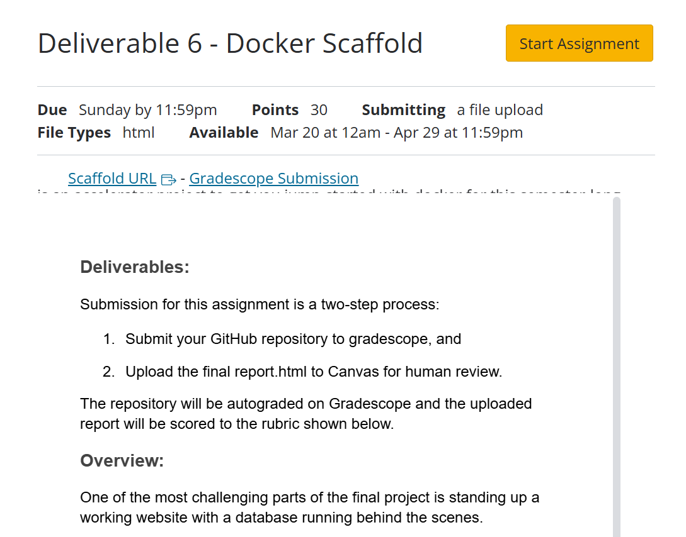

# Deliverable 6 - Getting Started with Docker SP2025

<!-- # Deliverable 6 - Getting Started with Docker SP2025 -->

## 

## Deliverable 6 - Getting started with Docker

### Learning Objectives

 

1.  Install docker

2.  Play with containers

    - Simple
    - More Complex

3.  Gather ideas and code

    - Semester project architecture
    - Web server code
    - Database code
    - (capstone project?)

4.  [See this helper
    site!](https://vcu-ssg.github.io/ssg-quarto-docker-tutorial/)

<!-- _rest-of-class-working-examples.qmd -->

## 

We spend the rest of the class working examples.

Refer to the video for details.

