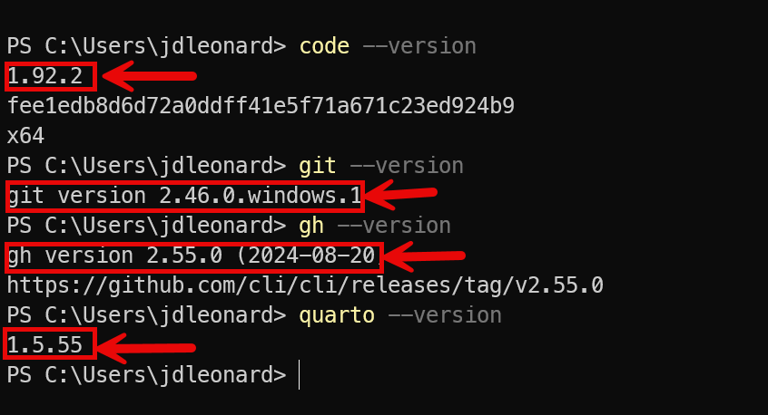

# Homework 1 - Fall 2024

# Homework 1 - Fall 2024

## Homework 1 - Fall 2024

### Overview

- Homeworks 1, 2 and 3 focus on ER diagrams
- Homework 1 focuses on the tools and workflow.
- [Link to Homework
  1](https://virginiacommonwealth.instructure.com/courses/105097/assignments/966515)

### General homework workflow

- Download assignment repository
- Edit files using VS code
- Commit and push changes to GITHUB
  - Submit HTML to Canvas
  - Submit repo to Gradescope

### Notes

- The focus of this assignment is on *installing* and *testing* the
  tools.
- Please allow plenty of time!
- Don’t get frustrated. Use *Discord* to get help.
- Break away from your GUI and try the command line.
- All future assignments will use these same tools.

## Homework 1 - Tools

### Tools used

Below is a list of tools for HW1 and download URLs.

- [Visual Studio Code](https://code.visualstudio.com/download)
- [GIT](https://git-scm.com/downloads)
- [GH CLI](https://cli.github.com/)
- [Quarto](https://quarto.org/docs/get-started/)

When installed properly, all these tools should run directly from the
command line!

### My tool versions

> [!NOTE]
>
> If the tools don’t run from CLI, you need to update your PATH
> environment variable. Ask [ChatGPT](https://chatgpt.com/)!

## Homework 1 - Command line interface

### Windows (Powershell)

<https://www.youtube.com/watch?v=FpRGRLI8Fy8> 
<https://www.youtube.com/watch?v=FpRGRLI8Fy8>

 

### Mac (zsh)

<https://www.youtube.com/watch?v=FfT8OfMpARM> 
<https://www.youtube.com/watch?v=FfT8OfMpARM>

> [!TIP]
>
> *Invest the time to get comfy with the CLI!* Direct use of the command
> line will save you *tons* of confusion in the long run!

## Homework 1 - Quarto and rendering

Quarto is a *document compiler*, MUCH like compiling a source file to
create an executable file. Quarto is a wrapper around *Jupyter* and
*Pandoc*.

For this assignment, you’ll be modifying an existing *qmd* file, adding
your content, rendering the qmd to html and uploading the HTML to
Canvas.

> [!TIP]
>
> I definitely recommend the [Quarto getting started
> tutorial](https://quarto.org/docs/get-started/hello/vscode.html)!
> Don’t forget to *render* the samples I provide in the *repository*.

## Homework 1 - Walkthrough

Use this as a checklist to complete the assignment. Try ALL of the
activities.

### Install the tools

- [Visual Studio Code](https://code.visualstudio.com/download)
- [GIT](https://git-scm.com/downloads)
- [GH CLI](https://cli.github.com/)
- [Quarto](https://quarto.org/docs/get-started/)

### Work the CLI

- Run each tool from the CLI
- Verify versions
- Clone repo using GH
- *cd* into repository
- Render sample QMD files.
- Edit README.md
- Edit *report.qmd* and *render*
- Commit and push changes

### Inside VS code

- Install Quarto extension
- Make a change
- Commit and push changes within VSC
- Render document within VSC

> [!TIP]
>
> ***Spend time experimenting!*** This assignment allows you to focus on
> the tools and workflow. You’ll save time later by investing time now.
