# Subqueries

# Subqueries

## A common database question

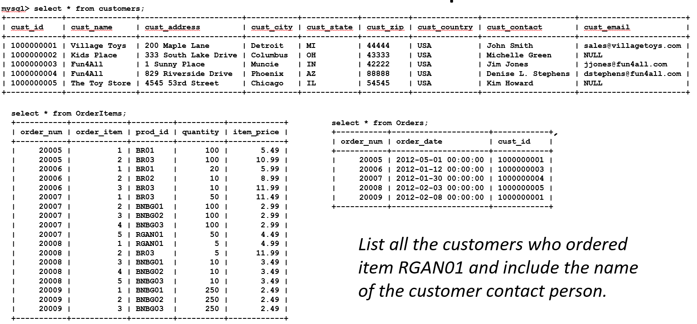

## A common database question

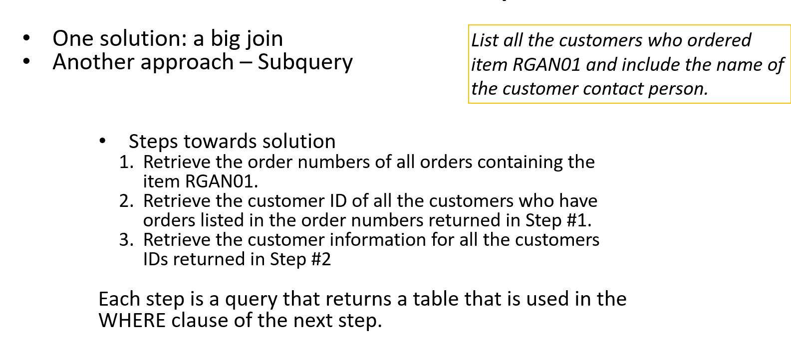

## A common database question

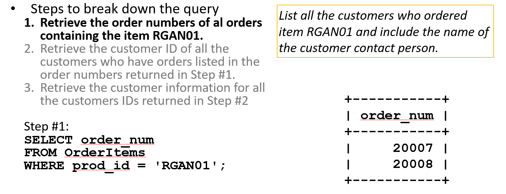

## A common database question

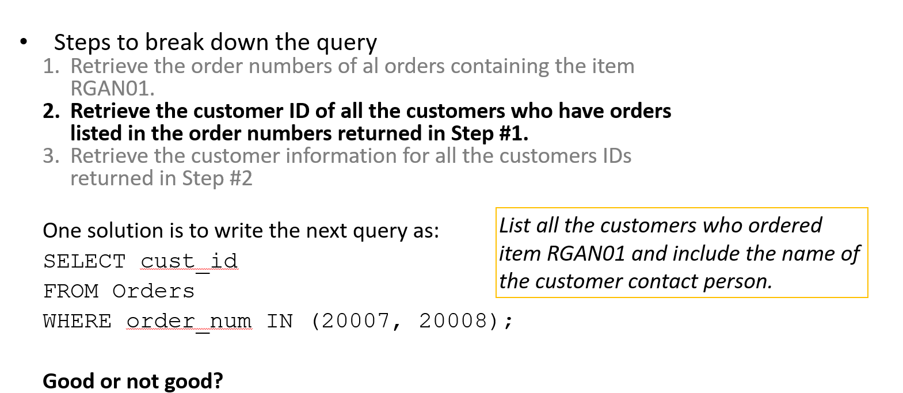

## A common database question

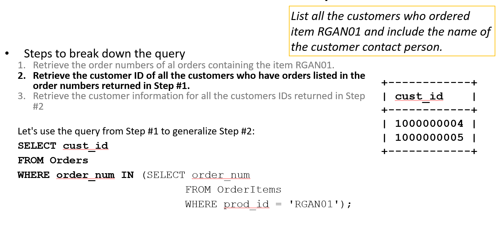

## A common database question

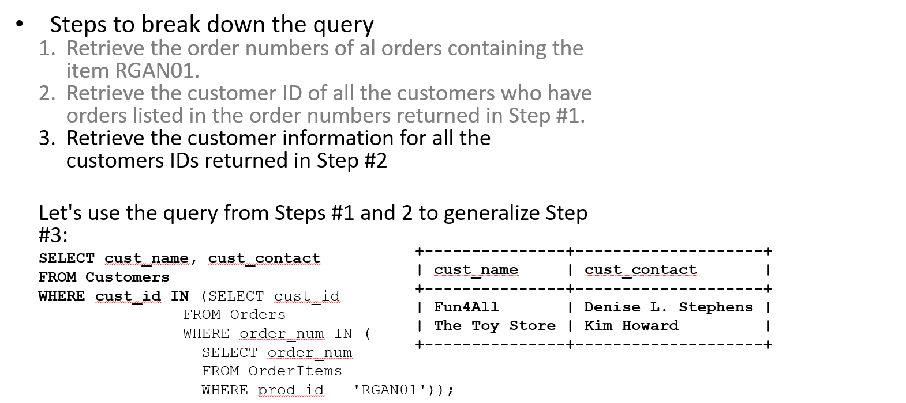

## SELECT statement and order of operations

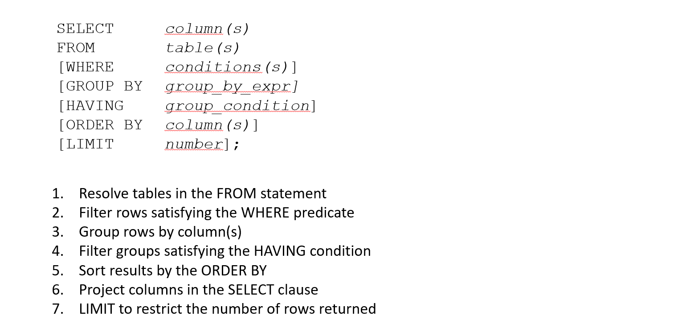

## Subqueries in the SELECT statement

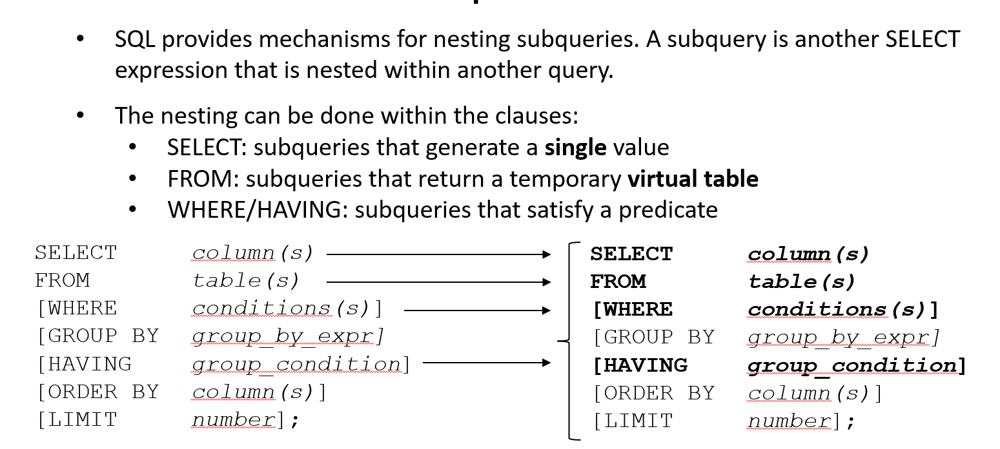

## Example: subquery in the SELECT

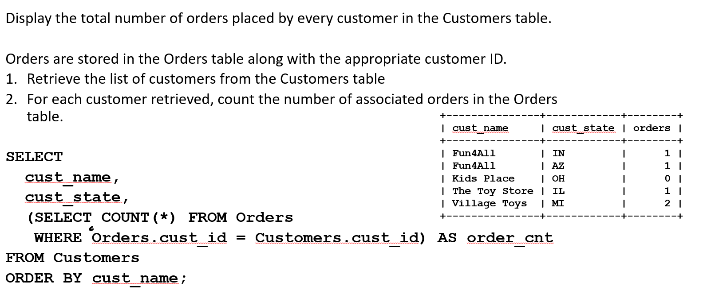

## Example: subquery in the FROM

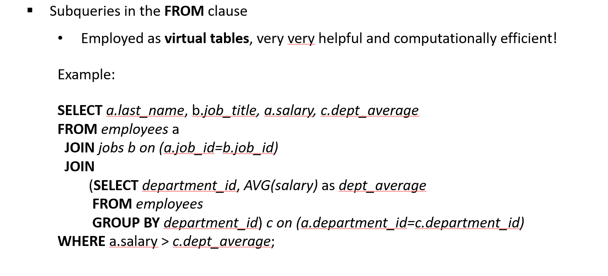

## Example: subquery in the WHERE

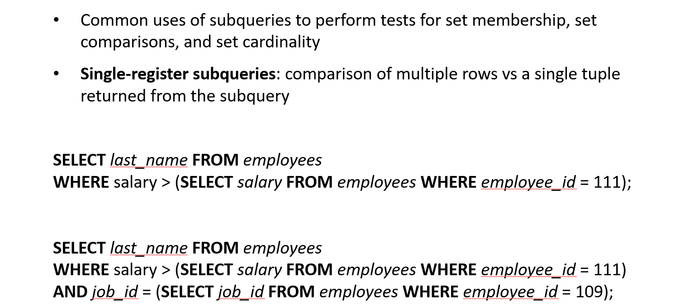

## Example: subquery in the HAVING

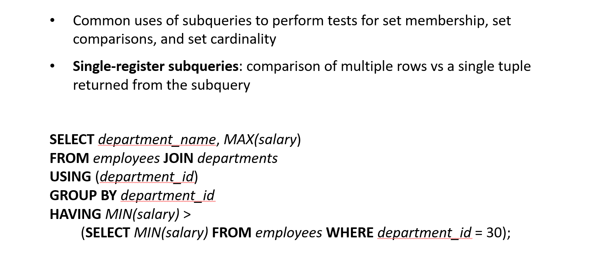

## Example: ANY, ALL, IN and EXISTS operators

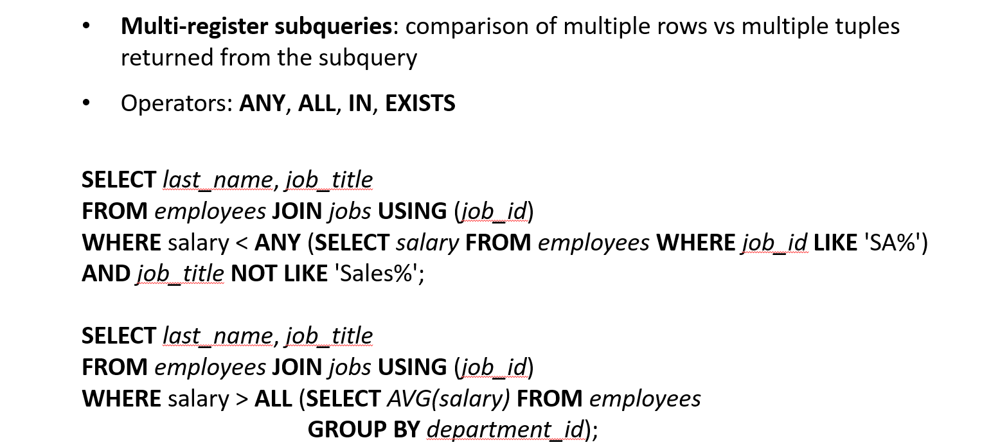

## Example: ANY, ALL, IN and EXISTS operators

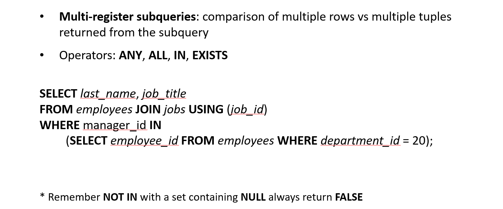

## Correlated subqueries

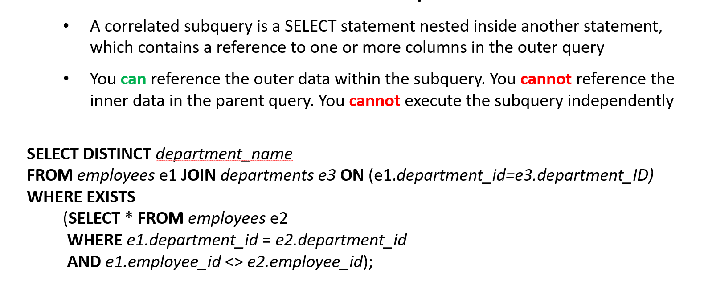

## Common table expressions (CTE)

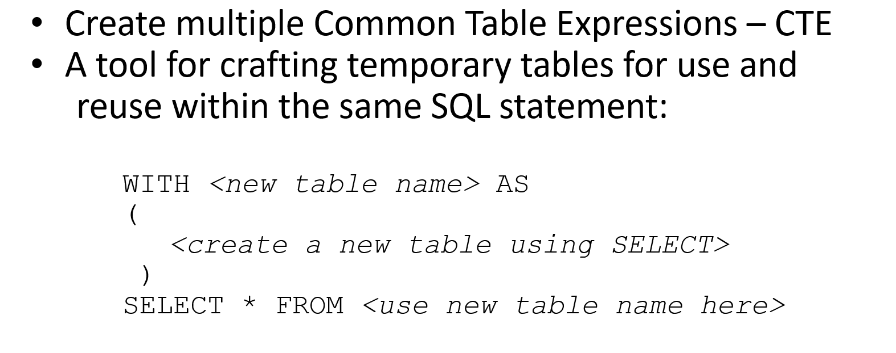

## Example: WITH statement

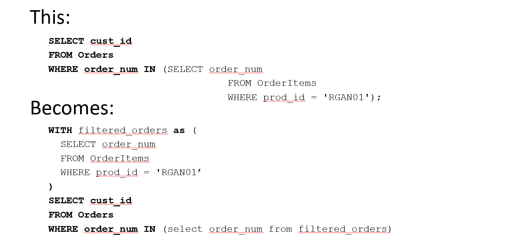
