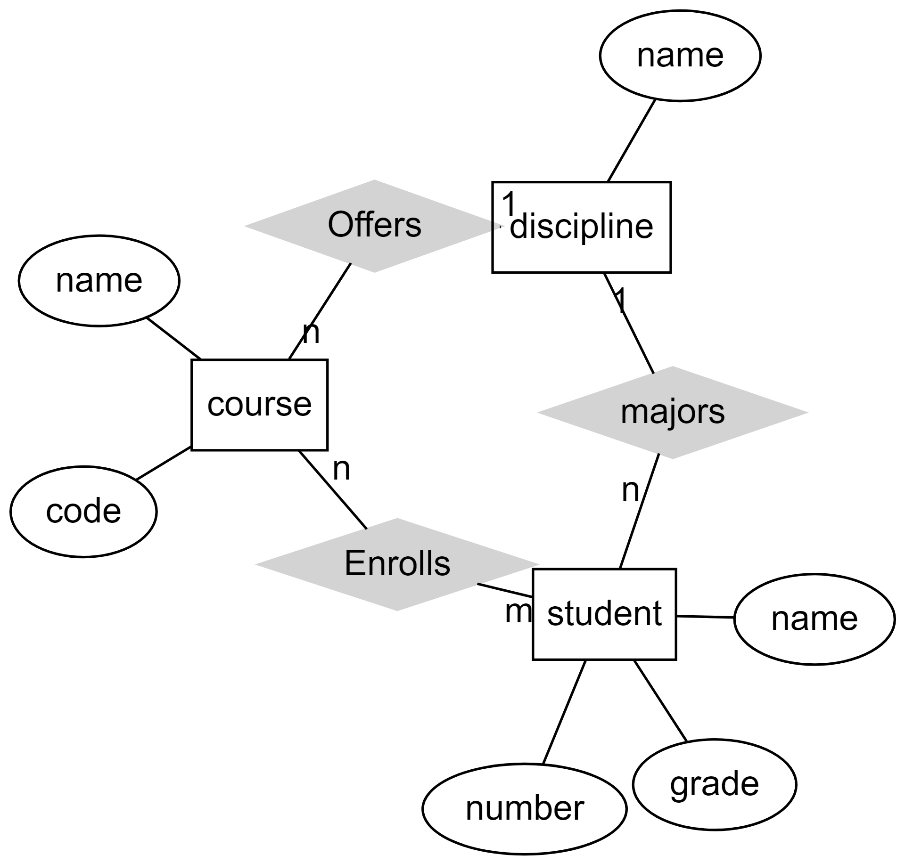

Quiz title: Quiz 1 - Entity Relation Models
Quiz description: This quiz focuses on entity-relation models and diagrams. 

    here is additional text in the description. Instructions, etc. on entity-relation models and diagramson entity-relation models and diagramson entity-relation models and diagramson entity-relation models and diagramson entity-relation models and diagramson entity-relation models and diagramson entity-relation models and diagramson entity-relation models and diagramson entity-relation models and diagramson entity-relation models and diagrams

    here is additional text in the description. Instructions, etc. on entity-relation models and diagramson entity-relation models and diagramson entity-relation models and diagramson entity-relation models and diagramson entity-relation models and diagramson entity-relation models and diagramson entity-relation models and diagramson entity-relation models and diagramson entity-relation models and diagramson entity-relation models and diagrams

1. Sample true or false.
*a) Star Wars
b) Star Trek

1. Sample Multiple choice:
a) answer 1
b) answer 2
*c) answer 3
d) answer 4

1. Sample multiple answer:
[] response 1
[] response 2
[*] response 3
[*] response 4
[] response 5

1. What do the ellipses or circles represent?
* attribute

1. What is the relationship between X and Y
* Z

GROUP
pick: 1
points per question: 1

1.  A question.
*a) true
b)  false

1.  Another question.
*a) true
b)  false

END_GROUP

1. Tell me more.
... general feedback
___

Text: <h1>Chen Diagram</h1>

      

1. how many entities are in the system describe above.
* three
* 3

Text:   <h1>Library management system</h1>
        Imagine a library management system that keeps track of *books*, *authors*, and *publishers*. 

        Each book in the system is identified by its International Standard Book Number (ISBN), which serves as its unique identifier. Books are associated with authors and publishers.

        Authors are individuals who write books. Each author is identified by a unique AuthorID and has a name associated with them.  Authors have written at least one book but can write as many as they are able.

        Publishers are entities responsible for releasing books to the public. Each publisher has a unique PublisherID, a name, and a home city. Publishers have at least one book in their catalog and can publish as many as they are able.

1. how many entities are in the word problem above.
* three
* 3

