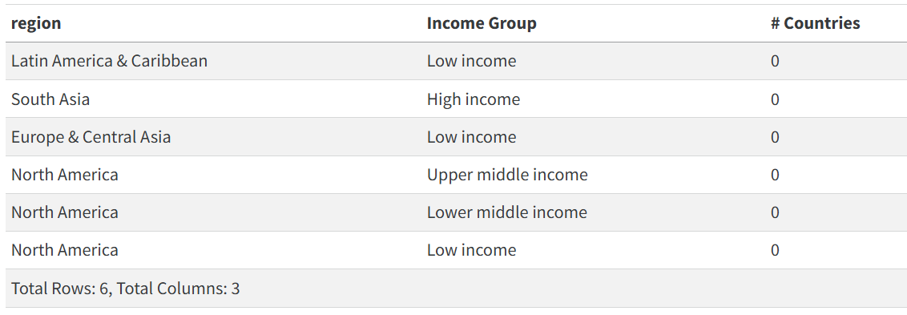
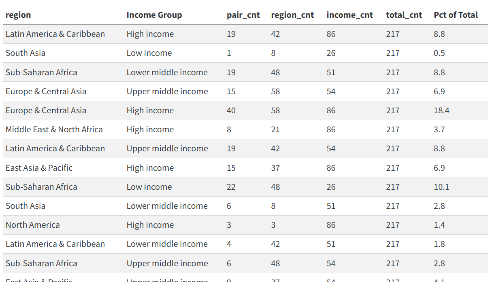
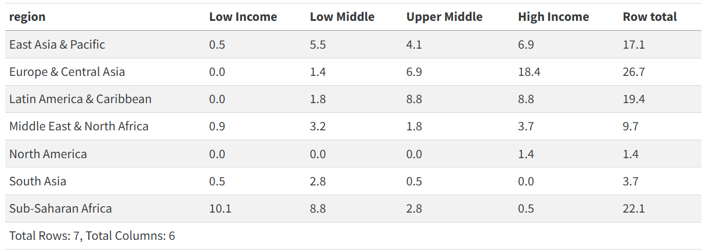
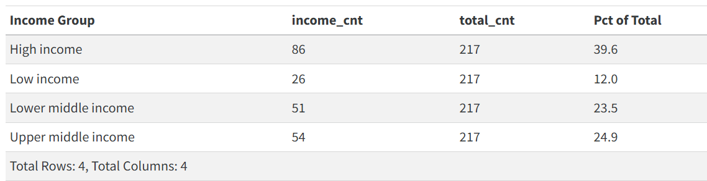

<!-- # Homework 8 Table Examples -->

## Homework 8 - Task 18

Write a single query that returns income-region pairs without countries.

## Homework 8 - Task 19

What is the percentage of all countries in each income-region pair? 

## Homework 8 - Task 20

Craft a table showing percentage of all countries in each income-region pair, with region in rows and income group in columns.

## Homework 8 - Task 21

List percentage of countries in each income group.  (easier than task 20!)

